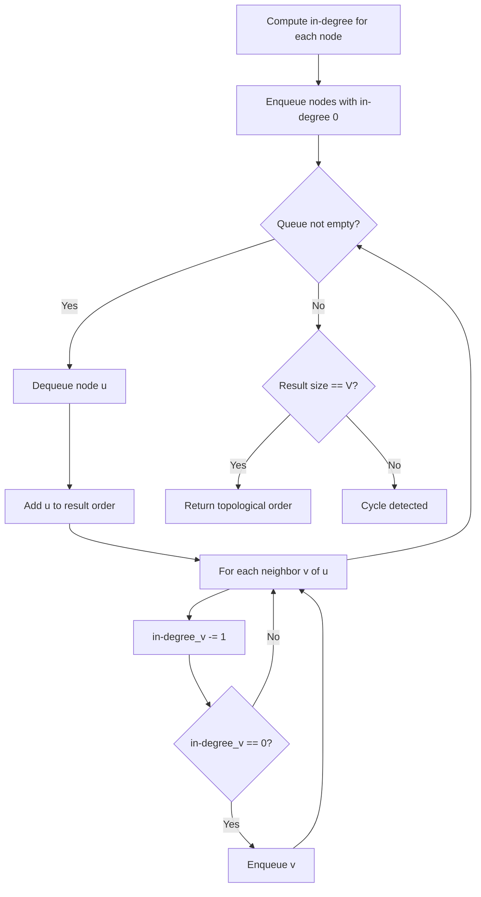
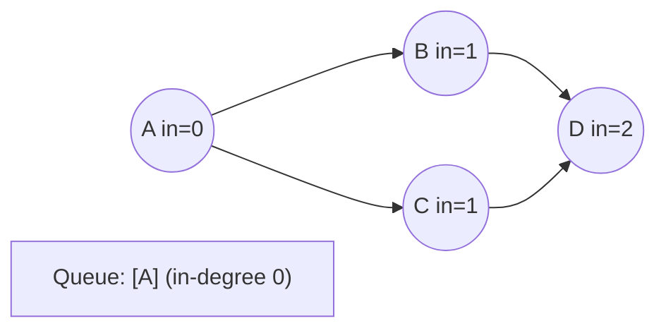
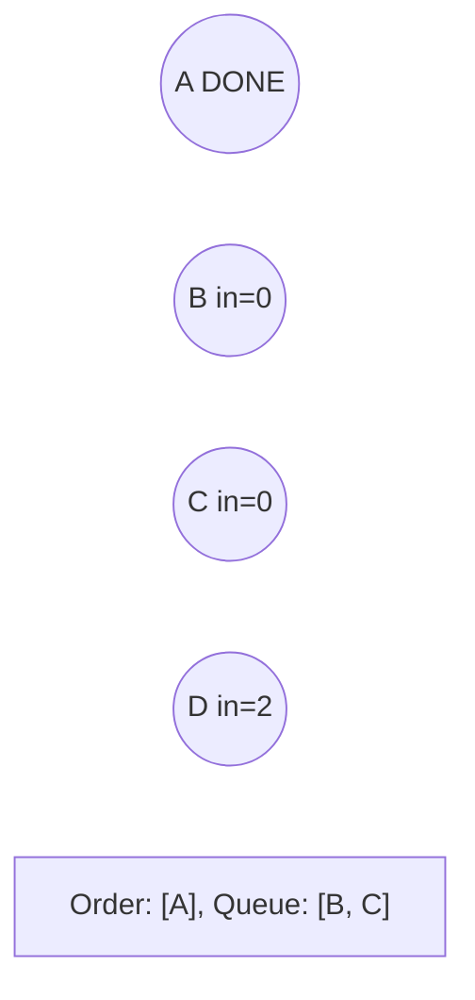
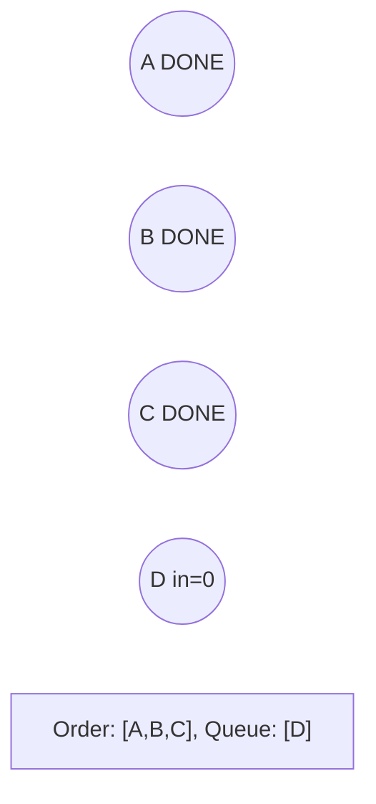
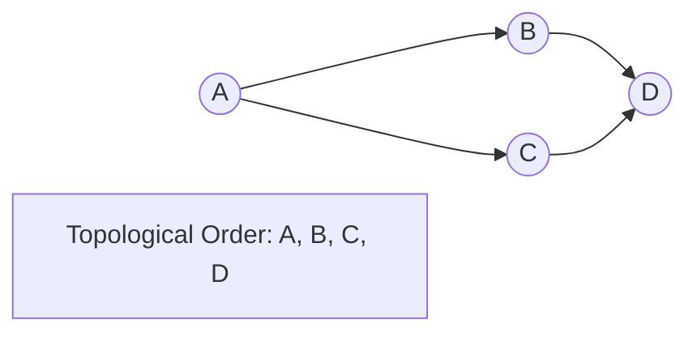

# Problem 2392: Build a Matrix With Conditions

**Difficulty:** Hard  
**Tags:** Array, Graph Theory, Topological Sort, Matrix  
**Pattern:** Topological Sort  
**Link:** [leetcode.com/problems/build-a-matrix-with-conditions](https://leetcode.com/problems/build-a-matrix-with-conditions/)

## Description

You are given a **positive** integer `k`. You are also given:

	- a 2D integer array `rowConditions` of size `n` where `rowConditions[i] = [abovei, belowi]`, and
	- a 2D integer array `colConditions` of size `m` where `colConditions[i] = [lefti, righti]`.

The two arrays contain integers from `1` to `k`.

You have to build a `k x k` matrix that contains each of the numbers from `1` to `k` **exactly once**. The remaining cells should have the value `0`.

The matrix should also satisfy the following conditions:

	- The number `abovei` should appear in a **row** that is strictly **above** the row at which the number `belowi` appears for all `i` from `0` to `n - 1`.
	- The number `lefti` should appear in a **column** that is strictly **left** of the column at which the number `righti` appears for all `i` from `0` to `m - 1`.

Return ***any** matrix that satisfies the conditions*. If no answer exists, return an empty matrix.

 

Example 1:

```

**Input:** k = 3, rowConditions = [[1,2],[3,2]], colConditions = [[2,1],[3,2]]
**Output:** [[3,0,0],[0,0,1],[0,2,0]]
**Explanation:** The diagram above shows a valid example of a matrix that satisfies all the conditions.
The row conditions are the following:
- Number 1 is in row 1, and number 2 is in row 2, so 1 is above 2 in the matrix.
- Number 3 is in row 0, and number 2 is in row 2, so 3 is above 2 in the matrix.
The column conditions are the following:
- Number 2 is in column 1, and number 1 is in column 2, so 2 is left of 1 in the matrix.
- Number 3 is in column 0, and number 2 is in column 1, so 3 is left of 2 in the matrix.
Note that there may be multiple correct answers.

```

Example 2:

```

**Input:** k = 3, rowConditions = [[1,2],[2,3],[3,1],[2,3]], colConditions = [[2,1]]
**Output:** []
**Explanation:** From the first two conditions, 3 has to be below 1 but the third conditions needs 3 to be above 1 to be satisfied.
No matrix can satisfy all the conditions, so we return the empty matrix.

```

 

**Constraints:**

	- `2 <= k <= 400`
	- `1 <= rowConditions.length, colConditions.length <= 10^4`
	- `rowConditions[i].length == colConditions[i].length == 2`
	- `1 <= abovei, belowi, lefti, righti <= k`
	- `abovei != belowi`
	- `lefti != righti`

## Approach: Topological Sort

Order nodes in a DAG so every edge u->v has u before v. Use Kahn's algorithm (BFS with in-degree tracking) or DFS-based ordering.

## Pseudocode

```
1. Compute in-degree for every node
2. Enqueue all nodes with in-degree 0
3. While queue not empty:
   a. Dequeue node u, add to result order
   b. For each neighbor v of u:
      - Decrease in-degree of v
      - If in-degree becomes 0: enqueue v
4. If result size != V: cycle exists
5. Return topological order
```

## Algorithm Flow



## Visual State Transitions

**Topological Sort (Kahn's Algorithm):**

**Frame 1: Compute in-degrees**


**Frame 2: Process A, reduce neighbors**


**Frame 3: Process B and C**


**Frame 4: Complete**



## Complexity Analysis

- **Time:** O(V + E)
- **Space:** O(V + E)

## Solution (Python3)

```python
class Solution:
    def buildMatrix(self, k: int, rowConditions: List[List[int]], colConditions: List[List[int]]) -> List[List[int]]:
        # Topological sort (Kahn's algorithm) - O(V+E)
        from collections import deque, defaultdict
        graph = defaultdict(list)
        n = k if isinstance(k, int) else len(k)
        indegree = [0] * n
        # Build graph from prerequisites
        prereqs = rowConditions if isinstance(rowConditions, list) else k
        for edge in prereqs:
            if isinstance(edge, (list, tuple)) and len(edge) >= 2:
                graph[edge[1]].append(edge[0])
                indegree[edge[0]] += 1
        queue = deque([i for i in range(n) if indegree[i] == 0])
        order = []
        while queue:
            node = queue.popleft()
            order.append(node)
            for neighbor in graph[node]:
                indegree[neighbor] -= 1
                if indegree[neighbor] == 0:
                    queue.append(neighbor)
        return len(order) == n if isinstance([], bool) else order
```

## Solution (C++)

```cpp
#include <queue>
#include <string>
#include <vector>
using namespace std;

class Solution {
public:
    vector<vector<int>> buildMatrix(int k, vector<vector<int>>& rowConditions, vector<vector<int>>& colConditions) {
        // Topological sort (Kahn's) - O(V+E)
        int n = k;
        vector<vector<int>> graph(n);
        vector<int> indegree(n, 0);
        for (auto& edge : rowConditions) {
            graph[edge[1]].push_back(edge[0]);
            indegree[edge[0]]++;
        }
        queue<int> q;
        for (int i = 0; i < n; i++)
            if (indegree[i] == 0) q.push(i);
        vector<int> order;
        while (!q.empty()) {
            int node = q.front(); q.pop();
            order.push_back(node);
            for (int neighbor : graph[node]) {
                if (--indegree[neighbor] == 0) q.push(neighbor);
            }
        }
        return order.size() == n;
    }
};
```
