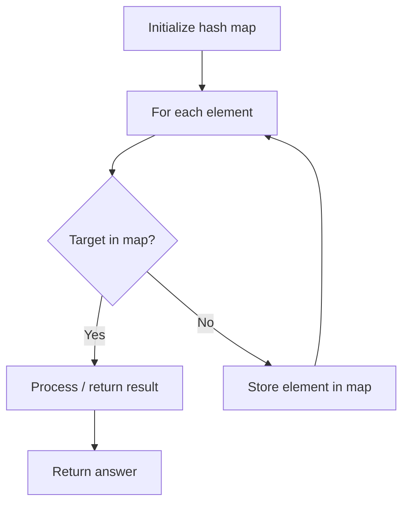

# Problem 2395: Find Subarrays With Equal Sum

**Difficulty:** Easy  
**Tags:** Array, Hash Table  
**Pattern:** Hash Map Lookup  
**Link:** [leetcode.com/problems/find-subarrays-with-equal-sum](https://leetcode.com/problems/find-subarrays-with-equal-sum/)

## Description

Given a **0-indexed** integer array `nums`, determine whether there exist **two** subarrays of length `2` with **equal** sum. Note that the two subarrays must begin at **different** indices.

Return `true`* if these subarrays exist, and *`false`* otherwise.*

A **subarray** is a contiguous non-empty sequence of elements within an array.

 

Example 1:

```

**Input:** nums = [4,2,4]
**Output:** true
**Explanation:** The subarrays with elements [4,2] and [2,4] have the same sum of 6.

```

Example 2:

```

**Input:** nums = [1,2,3,4,5]
**Output:** false
**Explanation:** No two subarrays of size 2 have the same sum.

```

Example 3:

```

**Input:** nums = [0,0,0]
**Output:** true
**Explanation:** The subarrays [nums[0],nums[1]] and [nums[1],nums[2]] have the same sum of 0. 
Note that even though the subarrays have the same content, the two subarrays are considered different because they are in different positions in the original array.

```

 

**Constraints:**

	- `2 <= nums.length <= 1000`
	- `-10^9 <= nums[i] <= 10^9`

## Approach: Hash Map Lookup

Use a hash map (dictionary) to store elements for O(1) lookup. Iterate through the input, checking membership or counting frequencies in the map.

## Pseudocode

```
1. Initialize hash map
2. Iterate through elements:
   a. Check if target/complement exists in map
   b. If found: process result
   c. Otherwise: store element in map
3. Return result
```

## Algorithm Flow



## Complexity Analysis

- **Time:** O(n)
- **Space:** O(n)

## Solution (Python3)

```python
class Solution:
    def findSubarrays(self, nums: List[int]) -> bool:
        # Hash map approach - O(n) time, O(n) space
        seen = {}
        for i, val in enumerate(nums):
            complement = nums - val
            if complement in seen:
                return [seen[complement], i]
            seen[val] = i
        return False
```

## Solution (C++)

```cpp
#include <string>
#include <unordered_map>
#include <vector>
using namespace std;

class Solution {
public:
    bool findSubarrays(vector<int>& nums) {
        // Hash map approach - O(n) time, O(n) space
        unordered_map<int, int> seen;
        for (int i = 0; i < nums.size(); i++) {
            int complement = nums - nums[i];
            if (seen.count(complement)) {
                return {seen[complement], i};
            }
            seen[nums[i]] = i;
        }
        return false;
    }
};
```
