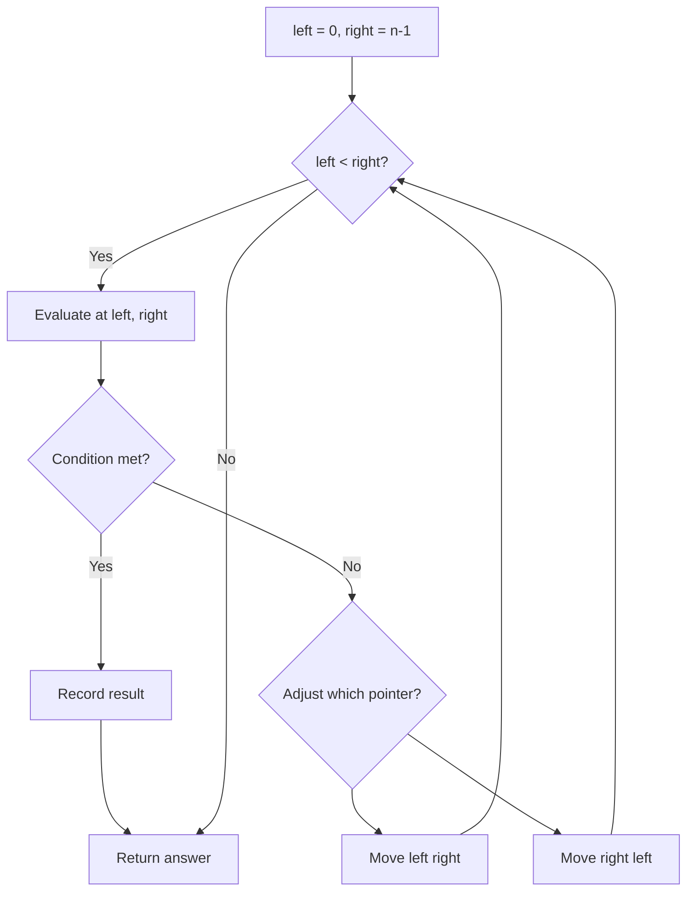
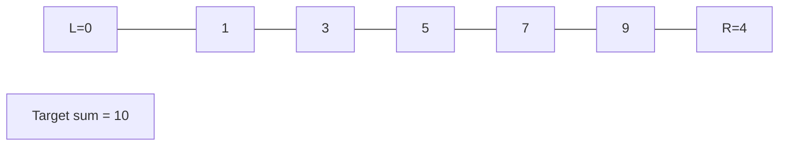
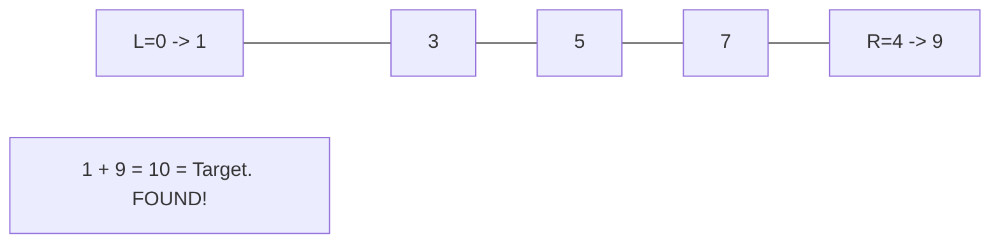

# Problem 2396: Strictly Palindromic Number

**Difficulty:** Medium  
**Tags:** Math, Two Pointers, Brainteaser  
**Pattern:** Two Pointers  
**Link:** [leetcode.com/problems/strictly-palindromic-number](https://leetcode.com/problems/strictly-palindromic-number/)

## Description

An integer `n` is **strictly palindromic** if, for **every** base `b` between `2` and `n - 2` (**inclusive**), the string representation of the integer `n` in base `b` is **palindromic**.

Given an integer `n`, return `true` *if *`n`* is **strictly palindromic** and *`false`* otherwise*.

A string is **palindromic** if it reads the same forward and backward.

 

Example 1:

```

**Input:** n = 9
**Output:** false
**Explanation:** In base 2: 9 = 1001 (base 2), which is palindromic.
In base 3: 9 = 100 (base 3), which is not palindromic.
Therefore, 9 is not strictly palindromic so we return false.
Note that in bases 4, 5, 6, and 7, n = 9 is also not palindromic.

```

Example 2:

```

**Input:** n = 4
**Output:** false
**Explanation:** We only consider base 2: 4 = 100 (base 2), which is not palindromic.
Therefore, we return false.

```

 

**Constraints:**

	- `4 <= n <= 10^5`

## Approach: Two Pointers

Use two pointers moving through the data structure. Depending on the problem, pointers may move toward each other (converging), in the same direction (fast/slow), or independently.

## Pseudocode

```
1. Initialize left = 0, right = n-1 (or two independent pointers)
2. While pointers haven't crossed:
   a. Evaluate condition at pointer positions
   b. Move left pointer right or right pointer left
3. Return result
```

## Algorithm Flow



## Visual State Transitions

**Two Pointer Convergence:**

**Frame 1: Initialize pointers**


**Frame 2: Sum = 1+9 = 10, found!**



## Complexity Analysis

- **Time:** O(n)
- **Space:** O(1)

## Solution (Python3)

```python
class Solution:
    def isStrictlyPalindromic(self, n: int) -> bool:
        # Two pointer approach - O(n) time, O(1) space
        left, right = 0, len(n) - 1
        while left < right:
            curr = n[left] + n[right]
            if curr == n:
                return [left, right]
            elif curr < n:
                left += 1
            else:
                right -= 1
        return False
```

## Solution (C++)

```cpp
#include <string>
#include <vector>
using namespace std;

class Solution {
public:
    bool isStrictlyPalindromic(int n) {
        // Two pointer approach - O(n) time, O(1) space
        int left = 0, right = n.size() - 1;
        while (left < right) {
            int curr = n[left] + n[right];
            if (curr == n) {
                return {left, right};
            } else if (curr < n) {
                left++;
            } else {
                right--;
            }
        }
        return false;
    }
};
```
