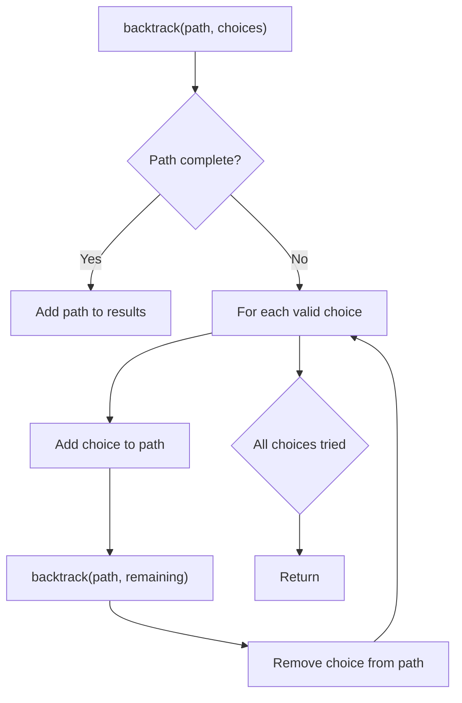
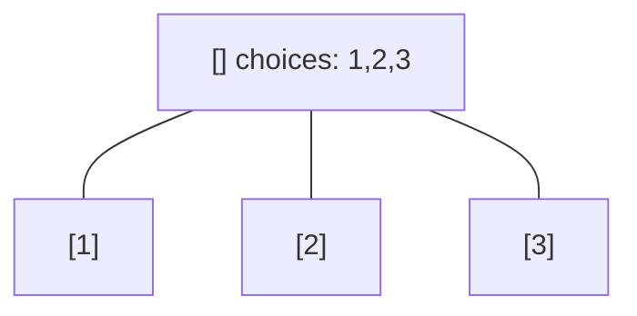
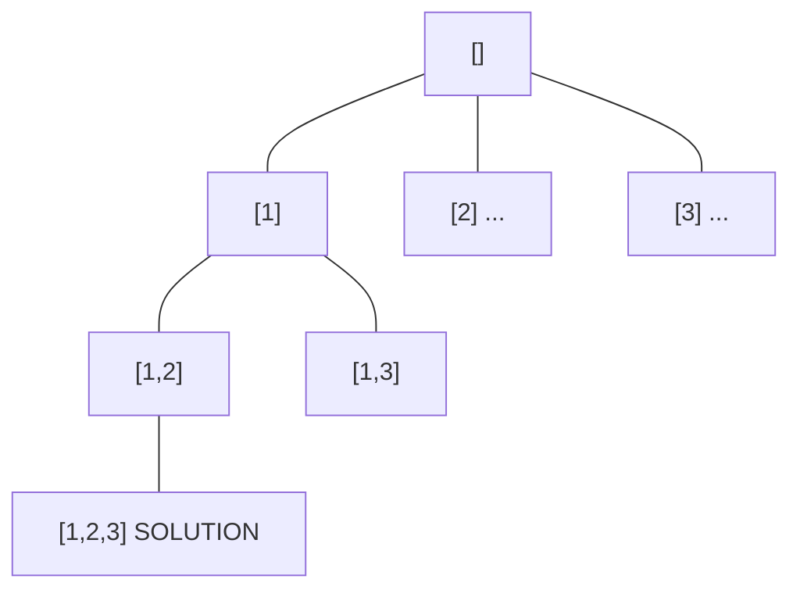
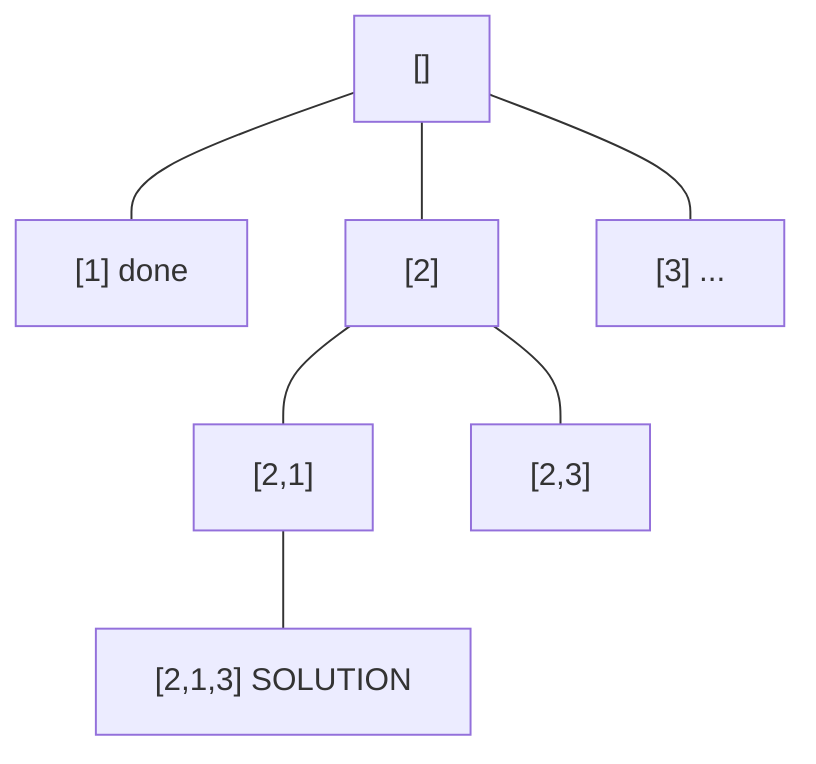
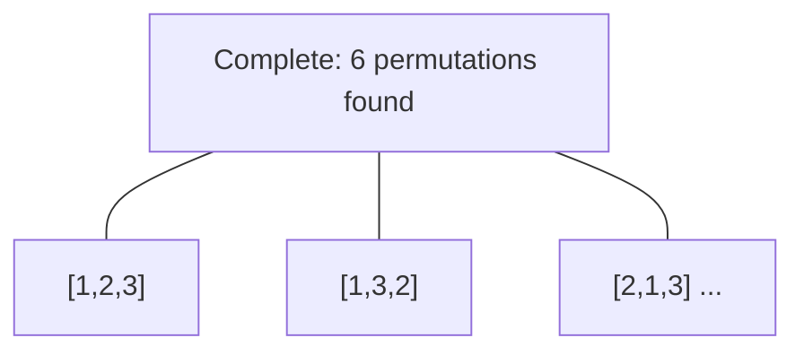

# Problem 2397: Maximum Rows Covered by Columns

**Difficulty:** Medium  
**Tags:** Array, Backtracking, Bit Manipulation, Matrix, Enumeration  
**Pattern:** Backtracking  
**Link:** [leetcode.com/problems/maximum-rows-covered-by-columns](https://leetcode.com/problems/maximum-rows-covered-by-columns/)

## Description

You are given an `m x n` binary matrix `matrix` and an integer `numSelect`.

Your goal is to select exactly `numSelect` **distinct **columns from `matrix` such that you cover as many rows as possible.

A row is considered **covered** if all the `1`'s in that row are also part of a column that you have selected. If a row does not have any `1`s, it is also considered covered.

More formally, let us consider `selected = {c1, c2, ...., cnumSelect}` as the set of columns selected by you. A row `i` is **covered** by `selected` if:

	- For each cell where `matrix[i][j] == 1`, the column `j` is in `selected`.
	- Or, no cell in row `i` has a value of `1`.

Return the **maximum** number of rows that can be **covered** by a set of `numSelect` columns.

 

Example 1:

**Input:** matrix = [[0,0,0],[1,0,1],[0,1,1],[0,0,1]], numSelect = 2

**Output:** 3

**Explanation:**

One possible way to cover 3 rows is shown in the diagram above.

We choose s = {0, 2}.

- Row 0 is covered because it has no occurrences of 1.

- Row 1 is covered because the columns with value 1, i.e. 0 and 2 are present in s.

- Row 2 is not covered because matrix[2][1] == 1 but 1 is not present in s.

- Row 3 is covered because matrix[2][2] == 1 and 2 is present in s.

Thus, we can cover three rows.

Note that s = {1, 2} will also cover 3 rows, but it can be shown that no more than three rows can be covered.

Example 2:

**Input:** matrix = [[1],[0]], numSelect = 1

**Output:** 2

**Explanation:**

Selecting the only column will result in both rows being covered since the entire matrix is selected.

 

**Constraints:**

	- `m == matrix.length`
	- `n == matrix[i].length`
	- `1 <= m, n <= 12`
	- `matrix[i][j]` is either `0` or `1`.
	- `1 <= numSelect <= n`

## Approach: Backtracking

Explore all possible solutions by building candidates incrementally. At each step, make a choice and recurse. If the choice leads to a dead end, undo the choice (backtrack) and try the next option.

## Pseudocode

```
1. Define backtrack(path, choices):
   a. If path is a complete solution: add to results
   b. For each choice in choices:
      - If choice is valid:
        * Add choice to path
        * backtrack(path, remaining_choices)
        * Remove choice from path (backtrack)
2. Call backtrack([], all_choices)
```

## Algorithm Flow



## Visual State Transitions

**Backtracking Decision Tree:**

**Frame 1: Root - start with empty path**


**Frame 2: Explore branch [1]**


**Frame 3: Backtrack, explore [2]**


**Frame 4: All solutions found**



## Complexity Analysis

- **Time:** O(k^n) or O(n!)
- **Space:** O(n)

## Solution (Python3)

```python
class Solution:
    def maximumRows(self, matrix: List[List[int]], numSelect: int) -> int:
        # Backtracking - O(2^n) or O(n!) time
        result = []
        
        def backtrack(path, start):
            result.append(path[:])
            for i in range(start, len(matrix)):
                path.append(matrix[i])
                backtrack(path, i + 1)
                path.pop()
        
        backtrack([], 0)
        return result
```

## Solution (C++)

```cpp
#include <functional>
#include <string>
#include <vector>
using namespace std;

class Solution {
public:
    int maximumRows(vector<vector<int>>& matrix, int numSelect) {
        // Backtracking - O(2^n) or O(n!) time
        vector<vector<int>> result;
        vector<int> path;
        function<void(int)> backtrack = [&](int start) {
            result.push_back(path);
            for (int i = start; i < (int)matrix.size(); i++) {
                path.push_back(matrix[i]);
                backtrack(i + 1);
                path.pop_back();
            }
        };
        backtrack(0);
        return result;
    }
};
```
