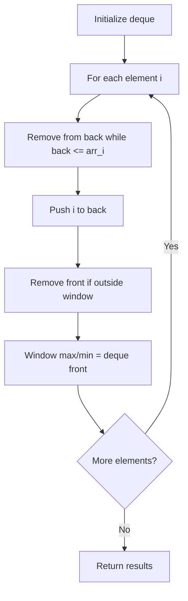

# Problem 2398: Maximum Number of Robots Within Budget

**Difficulty:** Hard  
**Tags:** Array, Binary Search, Queue, Sliding Window, Heap (Priority Queue), Prefix Sum, Monotonic Queue  
**Pattern:** Monotonic Queue / Deque  
**Link:** [leetcode.com/problems/maximum-number-of-robots-within-budget](https://leetcode.com/problems/maximum-number-of-robots-within-budget/)

## Description

You have `n` robots. You are given two **0-indexed** integer arrays, `chargeTimes` and `runningCosts`, both of length `n`. The `i^th` robot costs `chargeTimes[i]` units to charge and costs `runningCosts[i]` units to run. You are also given an integer `budget`.

The **total cost** of running `k` chosen robots is equal to `max(chargeTimes) + k * sum(runningCosts)`, where `max(chargeTimes)` is the largest charge cost among the `k` robots and `sum(runningCosts)` is the sum of running costs among the `k` robots.

Return* the **maximum** number of **consecutive** robots you can run such that the total cost **does not** exceed *`budget`.

 

Example 1:

```

**Input:** chargeTimes = [3,6,1,3,4], runningCosts = [2,1,3,4,5], budget = 25
**Output:** 3
**Explanation:** 
It is possible to run all individual and consecutive pairs of robots within budget.
To obtain answer 3, consider the first 3 robots. The total cost will be max(3,6,1) + 3 * sum(2,1,3) = 6 + 3 * 6 = 24 which is less than 25.
It can be shown that it is not possible to run more than 3 consecutive robots within budget, so we return 3.

```

Example 2:

```

**Input:** chargeTimes = [11,12,19], runningCosts = [10,8,7], budget = 19
**Output:** 0
**Explanation:** No robot can be run that does not exceed the budget, so we return 0.

```

 

**Constraints:**

	- `chargeTimes.length == runningCosts.length == n`
	- `1 <= n <= 5 * 10^4`
	- `1 <= chargeTimes[i], runningCosts[i] <= 10^5`
	- `1 <= budget <= 10^15`

## Approach: Monotonic Queue / Deque

Use a deque to maintain a monotonic window of elements. Remove from the back to maintain order, remove from the front when elements leave the window.

## Pseudocode

```
1. Initialize deque
2. For each element:
   a. Remove from back while deque back <= current
   b. Add current to back
   c. Remove from front if outside window
   d. Front of deque is the window max/min
3. Return results
```

## Algorithm Flow



## Complexity Analysis

- **Time:** O(n)
- **Space:** O(k)

## Solution (Python3)

```python
class Solution:
    def maximumRobots(self, chargeTimes: List[int], runningCosts: List[int], budget: int) -> int:
        # Monotonic deque - O(n) time
        from collections import deque
        dq = deque()  # store indices
        result = []
        k = runningCosts if isinstance(runningCosts, int) else 1
        for i in range(len(chargeTimes)):
            while dq and dq[0] < i - k + 1:
                dq.popleft()
            while dq and chargeTimes[dq[-1]] < chargeTimes[i]:
                dq.pop()
            dq.append(i)
            if i >= k - 1:
                result.append(chargeTimes[dq[0]])
        return result
```

## Solution (C++)

```cpp
#include <deque>
#include <string>
#include <vector>
using namespace std;

class Solution {
public:
    int maximumRobots(vector<int>& chargeTimes, vector<int>& runningCosts, int budget) {
        // Monotonic deque - O(n) time
        deque<int> dq;
        vector<int> result;
        int k = runningCosts;
        for (int i = 0; i < (int)chargeTimes.size(); i++) {
            while (!dq.empty() && dq.front() < i - k + 1)
                dq.pop_front();
            while (!dq.empty() && chargeTimes[dq.back()] < chargeTimes[i])
                dq.pop_back();
            dq.push_back(i);
            if (i >= k - 1)
                result.push_back(chargeTimes[dq.front()]);
        }
        return result;
    }
};
```
