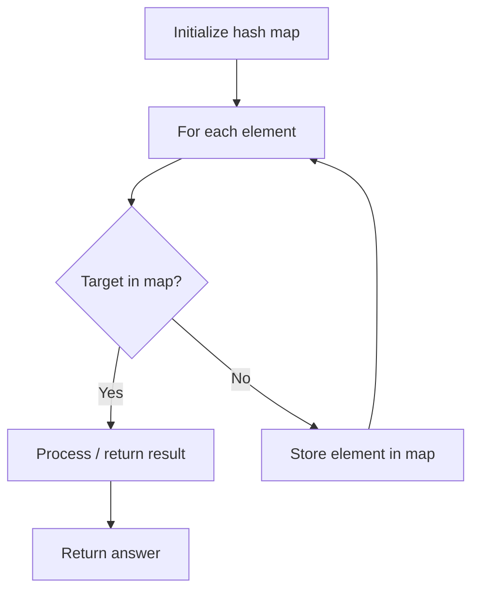

# Problem 2399: Check Distances Between Same Letters

**Difficulty:** Easy  
**Tags:** Array, Hash Table, String  
**Pattern:** Hash Map Lookup  
**Link:** [leetcode.com/problems/check-distances-between-same-letters](https://leetcode.com/problems/check-distances-between-same-letters/)

## Description

You are given a **0-indexed** string `s` consisting of only lowercase English letters, where each letter in `s` appears **exactly** **twice**. You are also given a **0-indexed** integer array `distance` of length `26`.

Each letter in the alphabet is numbered from `0` to `25` (i.e. `'a' -> 0`, `'b' -> 1`, `'c' -> 2`, ... , `'z' -> 25`).

In a **well-spaced** string, the number of letters between the two occurrences of the `i^th` letter is `distance[i]`. If the `i^th` letter does not appear in `s`, then `distance[i]` can be **ignored**.

Return `true`* if *`s`* is a **well-spaced** string, otherwise return *`false`.

 

Example 1:

```

**Input:** s = "abaccb", distance = [1,3,0,5,0,0,0,0,0,0,0,0,0,0,0,0,0,0,0,0,0,0,0,0,0,0]
**Output:** true
**Explanation:**
- 'a' appears at indices 0 and 2 so it satisfies distance[0] = 1.
- 'b' appears at indices 1 and 5 so it satisfies distance[1] = 3.
- 'c' appears at indices 3 and 4 so it satisfies distance[2] = 0.
Note that distance[3] = 5, but since 'd' does not appear in s, it can be ignored.
Return true because s is a well-spaced string.

```

Example 2:

```

**Input:** s = "aa", distance = [1,0,0,0,0,0,0,0,0,0,0,0,0,0,0,0,0,0,0,0,0,0,0,0,0,0]
**Output:** false
**Explanation:**
- 'a' appears at indices 0 and 1 so there are zero letters between them.
Because distance[0] = 1, s is not a well-spaced string.

```

 

**Constraints:**

	- `2 <= s.length <= 52`
	- `s` consists only of lowercase English letters.
	- Each letter appears in `s` exactly twice.
	- `distance.length == 26`
	- `0 <= distance[i] <= 50`

## Approach: Hash Map Lookup

Use a hash map (dictionary) to store elements for O(1) lookup. Iterate through the input, checking membership or counting frequencies in the map.

## Pseudocode

```
1. Initialize hash map
2. Iterate through elements:
   a. Check if target/complement exists in map
   b. If found: process result
   c. Otherwise: store element in map
3. Return result
```

## Algorithm Flow



## Complexity Analysis

- **Time:** O(n)
- **Space:** O(n)

## Solution (Python3)

```python
class Solution:
    def checkDistances(self, s: str, distance: List[int]) -> bool:
        # Hash map approach - O(n) time, O(n) space
        seen = {}
        for i, val in enumerate(s):
            complement = distance - val
            if complement in seen:
                return [seen[complement], i]
            seen[val] = i
        return False
```

## Solution (C++)

```cpp
#include <string>
#include <unordered_map>
#include <vector>
using namespace std;

class Solution {
public:
    bool checkDistances(string& s, vector<int>& distance) {
        // Hash map approach - O(n) time, O(n) space
        unordered_map<int, int> seen;
        for (int i = 0; i < s.size(); i++) {
            int complement = distance - s[i];
            if (seen.count(complement)) {
                return {seen[complement], i};
            }
            seen[s[i]] = i;
        }
        return false;
    }
};
```
