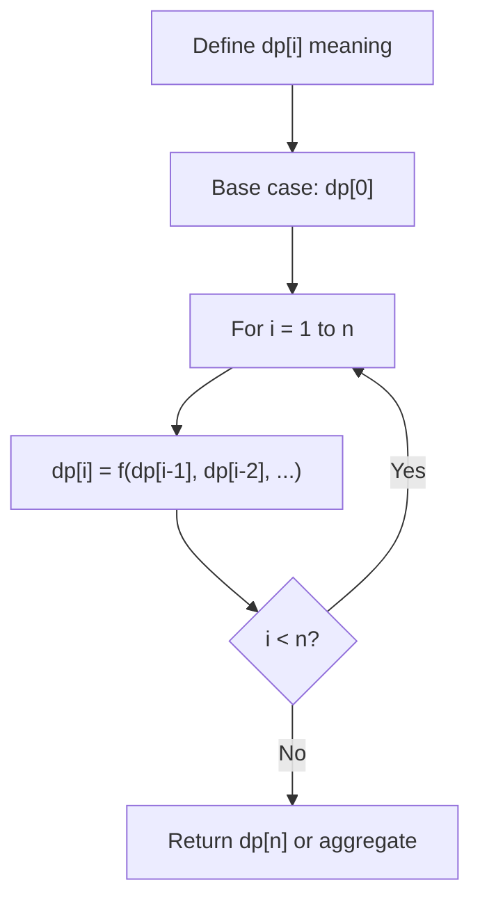
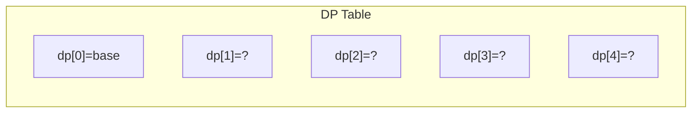
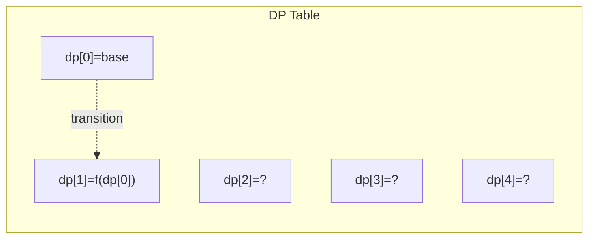
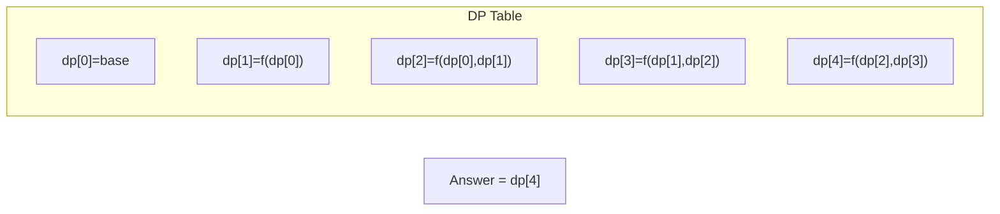

# Problem 2400: Number of Ways to Reach a Position After Exactly k Steps

**Difficulty:** Medium  
**Tags:** Math, Dynamic Programming, Combinatorics  
**Pattern:** Dynamic Programming (1D)  
**Link:** [leetcode.com/problems/number-of-ways-to-reach-a-position-after-exactly-k-steps](https://leetcode.com/problems/number-of-ways-to-reach-a-position-after-exactly-k-steps/)

## Description

You are given two **positive** integers `startPos` and `endPos`. Initially, you are standing at position `startPos` on an **infinite** number line. With one step, you can move either one position to the left, or one position to the right.

Given a positive integer `k`, return *the number of **different** ways to reach the position *`endPos`* starting from *`startPos`*, such that you perform **exactly** *`k`* steps*. Since the answer may be very large, return it **modulo** `10^9 + 7`.

Two ways are considered different if the order of the steps made is not exactly the same.

**Note** that the number line includes negative integers.

 

Example 1:

```

**Input:** startPos = 1, endPos = 2, k = 3
**Output:** 3
**Explanation:** We can reach position 2 from 1 in exactly 3 steps in three ways:
- 1 -> 2 -> 3 -> 2.
- 1 -> 2 -> 1 -> 2.
- 1 -> 0 -> 1 -> 2.
It can be proven that no other way is possible, so we return 3.
```

Example 2:

```

**Input:** startPos = 2, endPos = 5, k = 10
**Output:** 0
**Explanation:** It is impossible to reach position 5 from position 2 in exactly 10 steps.

```

 

**Constraints:**

	- `1 <= startPos, endPos, k <= 1000`

## Approach: Dynamic Programming (1D)

Break the problem into overlapping subproblems. Define dp[i] as the optimal value for the subproblem ending at or considering index i. Build the solution bottom-up, using previously computed dp values.

## Pseudocode

```
1. Define dp[i] = optimal value for subproblem i
2. Base case: dp[0] = initial value
3. For i from 1 to n:
   a. dp[i] = recurrence(dp[i-1], dp[i-2], ...)
4. Return dp[n] or max/min of dp
```

## Algorithm Flow



## Visual State Transitions

**1D Dynamic Programming Table Build:**

**Frame 1: Initialize base cases**


**Frame 2: Fill dp[1] from dp[0]**


**Frame 3: Fill remaining cells**



## Complexity Analysis

- **Time:** O(n)
- **Space:** O(n)

## Solution (Python3)

```python
class Solution:
    def numberOfWays(self, startPos: int, endPos: int, k: int) -> int:
        # Dynamic programming (1D) - O(n) time, O(n) space
        if not startPos:
            return 0
        n = len(startPos) if isinstance(startPos, list) else startPos
        dp = [0] * (n + 1)
        dp[0] = 1  # base case
        for i in range(1, n + 1):
            dp[i] = dp[i-1]  # transition (customize per problem)
            if i >= 2:
                dp[i] += dp[i-2]
        return dp[n]
```

## Solution (C++)

```cpp
#include <string>
#include <vector>
using namespace std;

class Solution {
public:
    int numberOfWays(int startPos, int endPos, int k) {
        // Dynamic programming (1D) - O(n) time, O(n) space
        int n = startPos;
        if (n <= 0) return 0;
        vector<int> dp(n + 1, 0);
        dp[0] = 1;
        for (int i = 1; i <= n; i++) {
            dp[i] = dp[i-1];
            if (i >= 2) dp[i] += dp[i-2];
        }
        return dp[n];
    }
};
```
