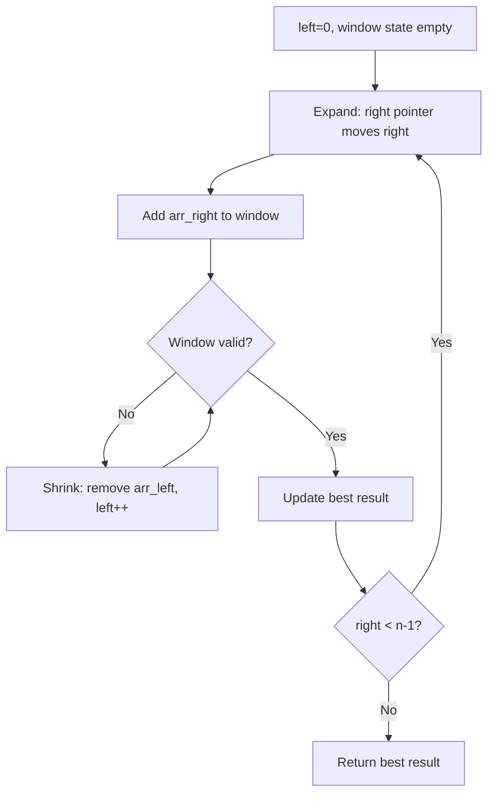
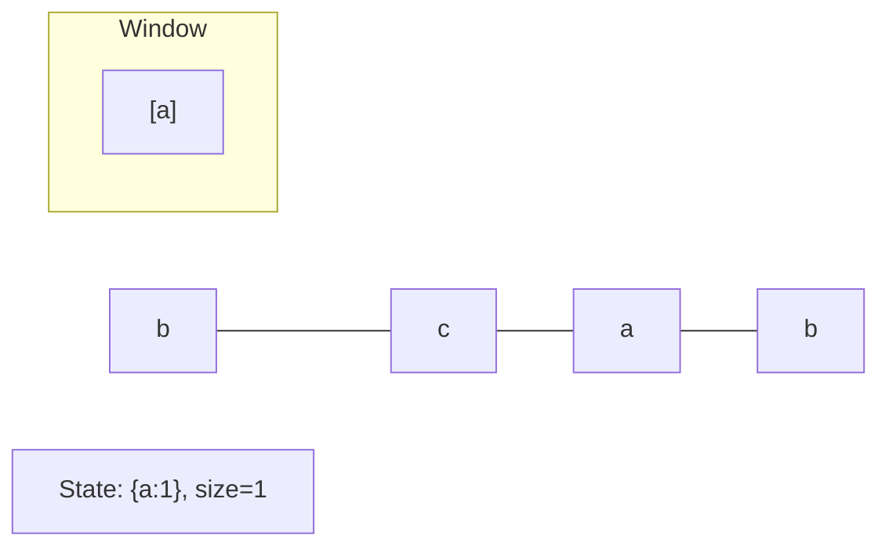
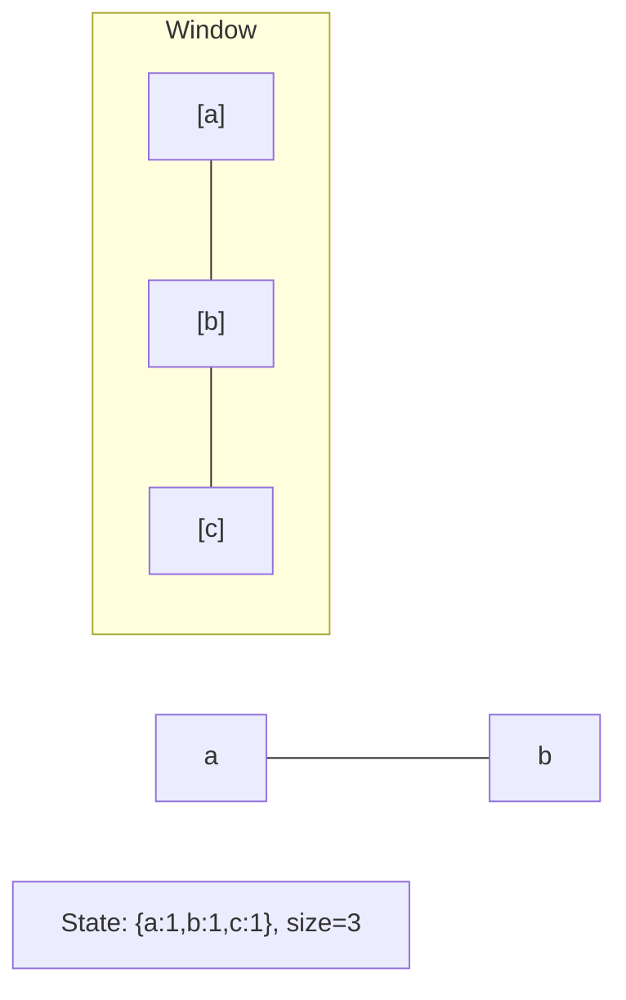
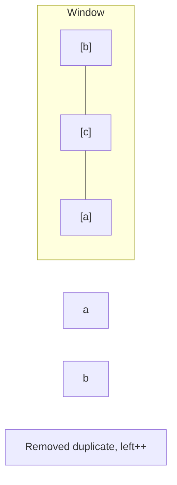
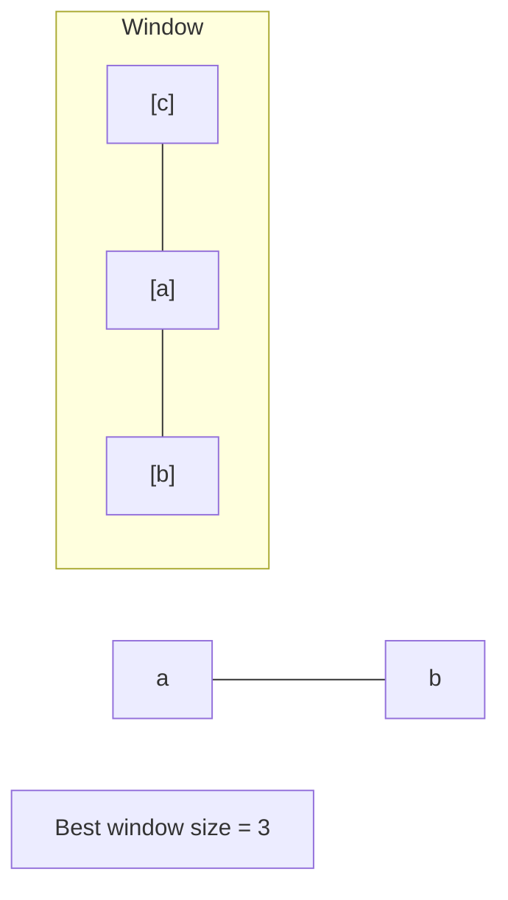

# Problem 2401: Longest Nice Subarray

**Difficulty:** Medium  
**Tags:** Array, Bit Manipulation, Sliding Window  
**Pattern:** Sliding Window  
**Link:** [leetcode.com/problems/longest-nice-subarray](https://leetcode.com/problems/longest-nice-subarray/)

## Description

You are given an array `nums` consisting of **positive** integers.

We call a subarray of `nums` **nice** if the bitwise **AND** of every pair of elements that are in **different** positions in the subarray is equal to `0`.

Return *the length of the **longest** nice subarray*.

A **subarray** is a **contiguous** part of an array.

**Note** that subarrays of length `1` are always considered nice.

 

Example 1:

```

**Input:** nums = [1,3,8,48,10]
**Output:** 3
**Explanation:** The longest nice subarray is [3,8,48]. This subarray satisfies the conditions:
- 3 AND 8 = 0.
- 3 AND 48 = 0.
- 8 AND 48 = 0.
It can be proven that no longer nice subarray can be obtained, so we return 3.
```

Example 2:

```

**Input:** nums = [3,1,5,11,13]
**Output:** 1
**Explanation:** The length of the longest nice subarray is 1. Any subarray of length 1 can be chosen.

```

 

**Constraints:**

	- `1 <= nums.length <= 10^5`
	- `1 <= nums[i] <= 10^9`

## Approach: Sliding Window

Maintain a window over the data using two pointers. Expand the right boundary to include new elements, and shrink the left boundary when the window constraint is violated. Track the optimal window.

## Pseudocode

```
1. Initialize left = 0, result = initial_value
2. For right in range(n):
   a. Add element at right to window state
   b. While window is invalid:
      - Remove element at left from window state
      - left++
   c. Update result = best of (result, window size/value)
3. Return result
```

## Algorithm Flow



## Visual State Transitions

**Sliding Window Step-by-Step:**

**Frame 1: Initial window (left=0, right=0)**


**Frame 2: Expand right (right=2)**


**Frame 3: Violation - shrink left**


**Frame 4: Continue expanding**



## Complexity Analysis

- **Time:** O(n)
- **Space:** O(k)

## Solution (Python3)

```python
class Solution:
    def longestNiceSubarray(self, nums: List[int]) -> int:
        # Sliding window approach - O(n) time, O(k) space
        from collections import defaultdict
        window = defaultdict(int)
        left = 0
        result = 0
        for right in range(len(nums)):
            window[nums[right]] += 1
            while len(window) > (nums if isinstance(nums, int) else len(nums)):
                window[nums[left]] -= 1
                if window[nums[left]] == 0:
                    del window[nums[left]]
                left += 1
            result = max(result, right - left + 1)
        return result
```

## Solution (C++)

```cpp
#include <algorithm>
#include <string>
#include <unordered_map>
#include <vector>
using namespace std;

class Solution {
public:
    int longestNiceSubarray(vector<int>& nums) {
        // Sliding window approach - O(n) time, O(k) space
        unordered_map<char, int> window;
        int left = 0, result = 0;
        for (int right = 0; right < nums.size(); right++) {
            window[nums[right]]++;
            while ((int)window.size() > nums) {
                window[nums[left]]--;
                if (window[nums[left]] == 0)
                    window.erase(nums[left]);
                left++;
            }
            result = max(result, right - left + 1);
        }
        return result;
    }
};
```
