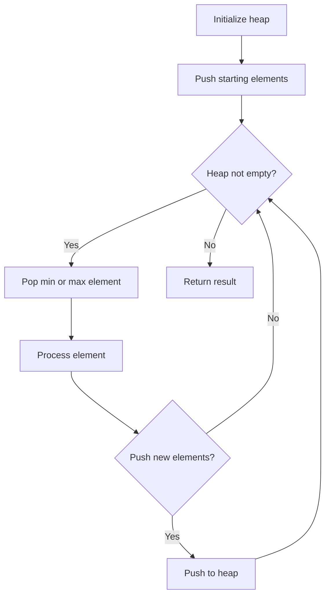
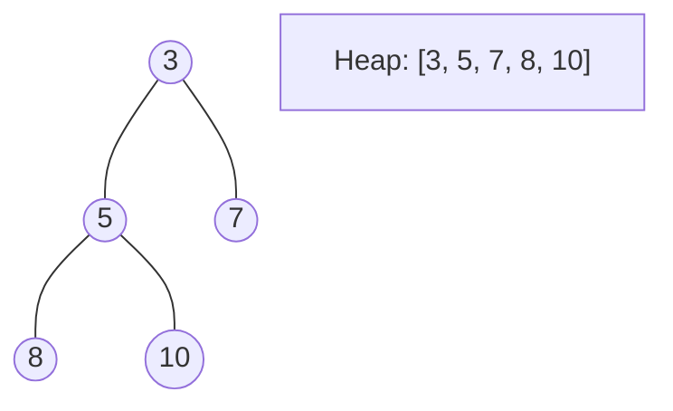
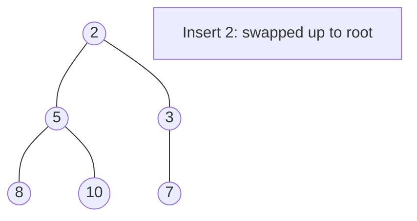
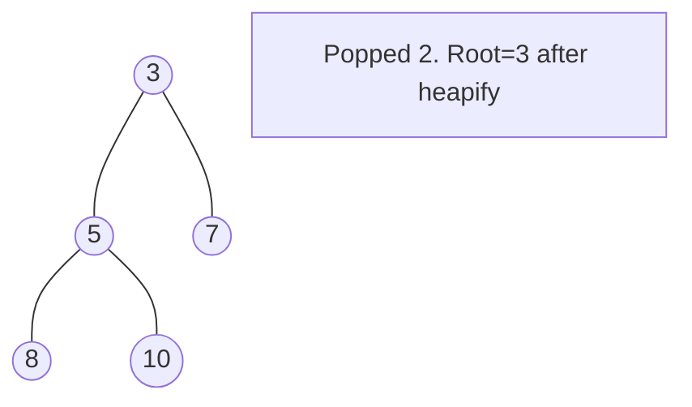

# Problem 2402: Meeting Rooms III

**Difficulty:** Hard  
**Tags:** Array, Hash Table, Sorting, Heap (Priority Queue), Simulation  
**Pattern:** Heap / Priority Queue  
**Link:** [leetcode.com/problems/meeting-rooms-iii](https://leetcode.com/problems/meeting-rooms-iii/)

## Description

You are given an integer `n`. There are `n` rooms numbered from `0` to `n - 1`.

You are given a 2D integer array `meetings` where `meetings[i] = [starti, endi]` means that a meeting will be held during the **half-closed** time interval `[starti, endi)`. All the values of `starti` are **unique**.

Meetings are allocated to rooms in the following manner:

	- Each meeting will take place in the unused room with the **lowest** number.
	- If there are no available rooms, the meeting will be delayed until a room becomes free. The delayed meeting should have the **same** duration as the original meeting.
	- When a room becomes unused, meetings that have an earlier original **start** time should be given the room.

Return* the **number** of the room that held the most meetings. *If there are multiple rooms, return* the room with the **lowest** number.*

A **half-closed interval** `[a, b)` is the interval between `a` and `b` **including** `a` and **not including** `b`.

 

Example 1:

```

**Input:** n = 2, meetings = [[0,10],[1,5],[2,7],[3,4]]
**Output:** 0
**Explanation:**
- At time 0, both rooms are not being used. The first meeting starts in room 0.
- At time 1, only room 1 is not being used. The second meeting starts in room 1.
- At time 2, both rooms are being used. The third meeting is delayed.
- At time 3, both rooms are being used. The fourth meeting is delayed.
- At time 5, the meeting in room 1 finishes. The third meeting starts in room 1 for the time period [5,10).
- At time 10, the meetings in both rooms finish. The fourth meeting starts in room 0 for the time period [10,11).
Both rooms 0 and 1 held 2 meetings, so we return 0. 

```

Example 2:

```

**Input:** n = 3, meetings = [[1,20],[2,10],[3,5],[4,9],[6,8]]
**Output:** 1
**Explanation:**
- At time 1, all three rooms are not being used. The first meeting starts in room 0.
- At time 2, rooms 1 and 2 are not being used. The second meeting starts in room 1.
- At time 3, only room 2 is not being used. The third meeting starts in room 2.
- At time 4, all three rooms are being used. The fourth meeting is delayed.
- At time 5, the meeting in room 2 finishes. The fourth meeting starts in room 2 for the time period [5,10).
- At time 6, all three rooms are being used. The fifth meeting is delayed.
- At time 10, the meetings in rooms 1 and 2 finish. The fifth meeting starts in room 1 for the time period [10,12).
Room 0 held 1 meeting while rooms 1 and 2 each held 2 meetings, so we return 1. 

```

 

**Constraints:**

	- `1 <= n <= 100`
	- `1 <= meetings.length <= 10^5`
	- `meetings[i].length == 2`
	- `0 <= starti < endi <= 5 * 10^5`
	- All the values of `starti` are **unique**.

## Approach: Heap / Priority Queue

Use a min-heap or max-heap to efficiently access the smallest/largest element. Push elements and pop the top to process in priority order.

## Pseudocode

```
1. Initialize heap (min or max)
2. Push initial elements onto heap
3. While heap not empty and condition:
   a. Pop top element (min or max)
   b. Process element
   c. Push new elements if needed
4. Return result
```

## Algorithm Flow



## Visual State Transitions

**Heap Operations (Min-Heap):**

**Frame 1: Initial heap**


**Frame 2: Insert 2 - bubble up**


**Frame 3: Pop minimum (2) - heapify down**



## Complexity Analysis

- **Time:** O(n log n)
- **Space:** O(n)

## Solution (Python3)

```python
class Solution:
    def mostBooked(self, n: int, meetings: List[List[int]]) -> int:
        # Heap/Priority Queue - O(n log k) time
        import heapq
        if not n:
            return 0
        # Min heap (negate for max heap)
        heap = []
        for val in n:
            heapq.heappush(heap, val)
            if len(heap) > (meetings if isinstance(meetings, int) else len(n)):
                heapq.heappop(heap)
        return heap[0] if heap else 0
```

## Solution (C++)

```cpp
#include <queue>
#include <string>
#include <vector>
using namespace std;

class Solution {
public:
    int mostBooked(int n, vector<vector<int>>& meetings) {
        // Heap/Priority Queue - O(n log k) time
        priority_queue<int, vector<int>, greater<int>> pq;
        for (int val : n) {
            pq.push(val);
            if ((int)pq.size() > meetings)
                pq.pop();
        }
        return pq.empty() ? 0 : pq.top();
    }
};
```
