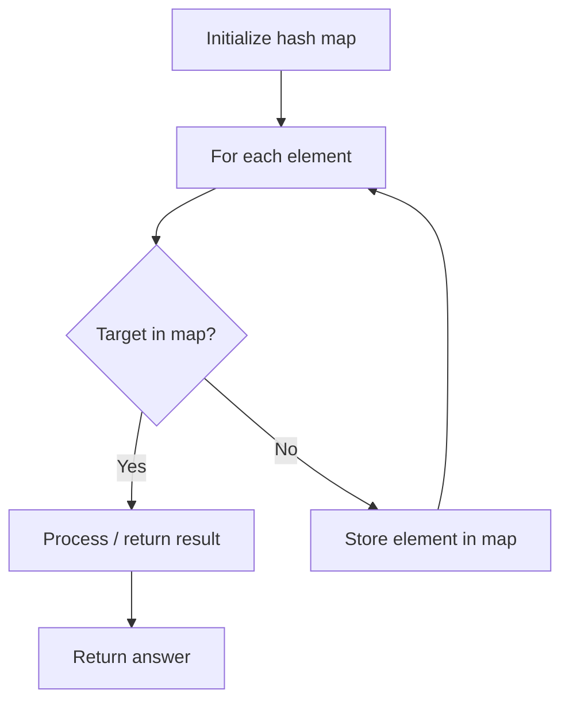

# Problem 2404: Most Frequent Even Element

**Difficulty:** Easy  
**Tags:** Array, Hash Table, Counting  
**Pattern:** Hash Map Lookup  
**Link:** [leetcode.com/problems/most-frequent-even-element](https://leetcode.com/problems/most-frequent-even-element/)

## Description

Given an integer array `nums`, return *the most frequent even element*.

If there is a tie, return the **smallest** one. If there is no such element, return `-1`.

 

Example 1:

```

**Input:** nums = [0,1,2,2,4,4,1]
**Output:** 2
**Explanation:**
The even elements are 0, 2, and 4. Of these, 2 and 4 appear the most.
We return the smallest one, which is 2.
```

Example 2:

```

**Input:** nums = [4,4,4,9,2,4]
**Output:** 4
**Explanation:** 4 is the even element appears the most.

```

Example 3:

```

**Input:** nums = [29,47,21,41,13,37,25,7]
**Output:** -1
**Explanation:** There is no even element.

```

 

**Constraints:**

	- `1 <= nums.length <= 2000`
	- `0 <= nums[i] <= 10^5`

## Approach: Hash Map Lookup

Use a hash map (dictionary) to store elements for O(1) lookup. Iterate through the input, checking membership or counting frequencies in the map.

## Pseudocode

```
1. Initialize hash map
2. Iterate through elements:
   a. Check if target/complement exists in map
   b. If found: process result
   c. Otherwise: store element in map
3. Return result
```

## Algorithm Flow



## Complexity Analysis

- **Time:** O(n)
- **Space:** O(n)

## Solution (Python3)

```python
class Solution:
    def mostFrequentEven(self, nums: List[int]) -> int:
        # Hash map approach - O(n) time, O(n) space
        seen = {}
        for i, val in enumerate(nums):
            complement = nums - val
            if complement in seen:
                return [seen[complement], i]
            seen[val] = i
        return 0
```

## Solution (C++)

```cpp
#include <string>
#include <unordered_map>
#include <vector>
using namespace std;

class Solution {
public:
    int mostFrequentEven(vector<int>& nums) {
        // Hash map approach - O(n) time, O(n) space
        unordered_map<int, int> seen;
        for (int i = 0; i < nums.size(); i++) {
            int complement = nums - nums[i];
            if (seen.count(complement)) {
                return {seen[complement], i};
            }
            seen[nums[i]] = i;
        }
        return 0;
    }
};
```
