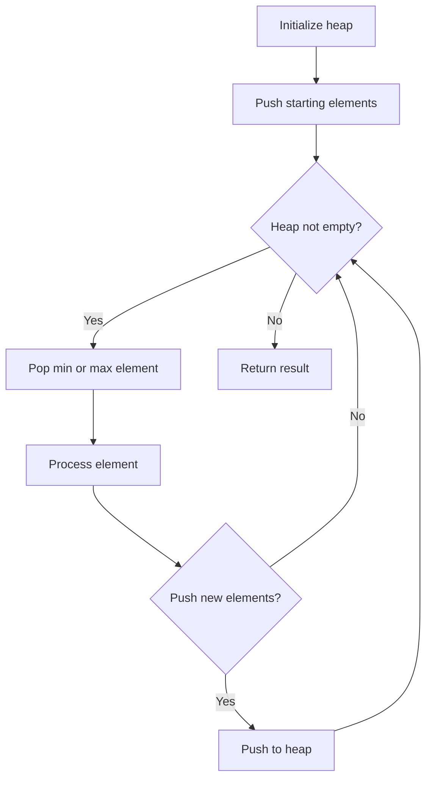
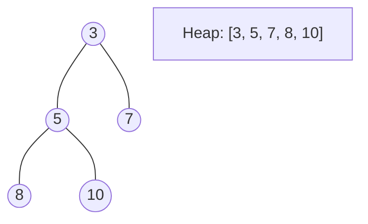
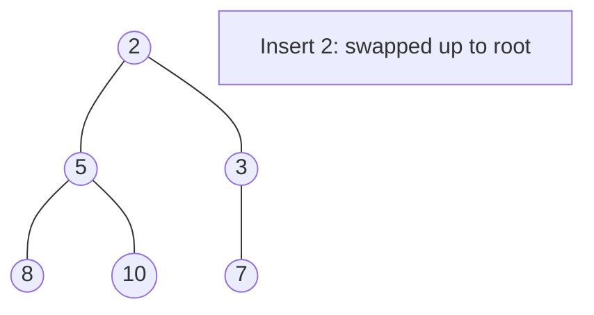
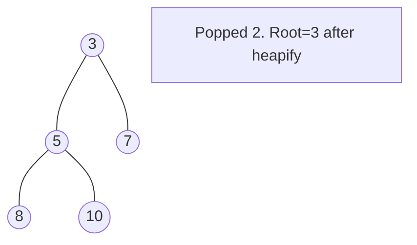

# Problem 2406: Divide Intervals Into Minimum Number of Groups

**Difficulty:** Medium  
**Tags:** Array, Two Pointers, Greedy, Sorting, Heap (Priority Queue), Prefix Sum  
**Pattern:** Heap / Priority Queue  
**Link:** [leetcode.com/problems/divide-intervals-into-minimum-number-of-groups](https://leetcode.com/problems/divide-intervals-into-minimum-number-of-groups/)

## Description

You are given a 2D integer array `intervals` where `intervals[i] = [lefti, righti]` represents the **inclusive** interval `[lefti, righti]`.

You have to divide the intervals into one or more **groups** such that each interval is in **exactly** one group, and no two intervals that are in the same group **intersect** each other.

Return *the **minimum** number of groups you need to make*.

Two intervals **intersect** if there is at least one common number between them. For example, the intervals `[1, 5]` and `[5, 8]` intersect.

 

Example 1:

```

**Input:** intervals = [[5,10],[6,8],[1,5],[2,3],[1,10]]
**Output:** 3
**Explanation:** We can divide the intervals into the following groups:
- Group 1: [1, 5], [6, 8].
- Group 2: [2, 3], [5, 10].
- Group 3: [1, 10].
It can be proven that it is not possible to divide the intervals into fewer than 3 groups.

```

Example 2:

```

**Input:** intervals = [[1,3],[5,6],[8,10],[11,13]]
**Output:** 1
**Explanation:** None of the intervals overlap, so we can put all of them in one group.

```

 

**Constraints:**

	- `1 <= intervals.length <= 10^5`
	- `intervals[i].length == 2`
	- `1 <= lefti <= righti <= 10^6`

## Approach: Heap / Priority Queue

Use a min-heap or max-heap to efficiently access the smallest/largest element. Push elements and pop the top to process in priority order.

## Pseudocode

```
1. Initialize heap (min or max)
2. Push initial elements onto heap
3. While heap not empty and condition:
   a. Pop top element (min or max)
   b. Process element
   c. Push new elements if needed
4. Return result
```

## Algorithm Flow



## Visual State Transitions

**Heap Operations (Min-Heap):**

**Frame 1: Initial heap**


**Frame 2: Insert 2 - bubble up**


**Frame 3: Pop minimum (2) - heapify down**



## Complexity Analysis

- **Time:** O(n log n)
- **Space:** O(n)

## Solution (Python3)

```python
class Solution:
    def minGroups(self, intervals: List[List[int]]) -> int:
        # Heap/Priority Queue - O(n log k) time
        import heapq
        if not intervals:
            return 0
        # Min heap (negate for max heap)
        heap = []
        for val in intervals:
            heapq.heappush(heap, val)
            if len(heap) > (intervals if isinstance(intervals, int) else len(intervals)):
                heapq.heappop(heap)
        return heap[0] if heap else 0
```

## Solution (C++)

```cpp
#include <queue>
#include <string>
#include <vector>
using namespace std;

class Solution {
public:
    int minGroups(vector<vector<int>>& intervals) {
        // Heap/Priority Queue - O(n log k) time
        priority_queue<int, vector<int>, greater<int>> pq;
        for (int val : intervals) {
            pq.push(val);
            if ((int)pq.size() > intervals)
                pq.pop();
        }
        return pq.empty() ? 0 : pq.top();
    }
};
```
