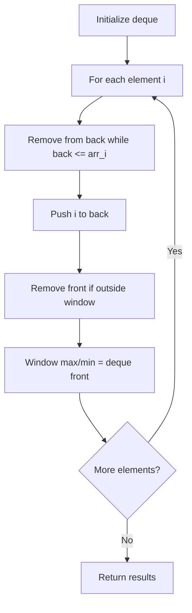

# Problem 2407: Longest Increasing Subsequence II

**Difficulty:** Hard  
**Tags:** Array, Divide and Conquer, Dynamic Programming, Binary Indexed Tree, Segment Tree, Queue, Monotonic Queue  
**Pattern:** Monotonic Queue / Deque  
**Link:** [leetcode.com/problems/longest-increasing-subsequence-ii](https://leetcode.com/problems/longest-increasing-subsequence-ii/)

## Description

You are given an integer array `nums` and an integer `k`.

Find the longest subsequence of `nums` that meets the following requirements:

	- The subsequence is **strictly increasing** and
	- The difference between adjacent elements in the subsequence is **at most** `k`.

Return* the length of the **longest** **subsequence** that meets the requirements.*

A **subsequence** is an array that can be derived from another array by deleting some or no elements without changing the order of the remaining elements.

 

Example 1:

```

**Input:** nums = [4,2,1,4,3,4,5,8,15], k = 3
**Output:** 5
**Explanation:**
The longest subsequence that meets the requirements is [1,3,4,5,8].
The subsequence has a length of 5, so we return 5.
Note that the subsequence [1,3,4,5,8,15] does not meet the requirements because 15 - 8 = 7 is larger than 3.

```

Example 2:

```

**Input:** nums = [7,4,5,1,8,12,4,7], k = 5
**Output:** 4
**Explanation:**
The longest subsequence that meets the requirements is [4,5,8,12].
The subsequence has a length of 4, so we return 4.

```

Example 3:

```

**Input:** nums = [1,5], k = 1
**Output:** 1
**Explanation:**
The longest subsequence that meets the requirements is [1].
The subsequence has a length of 1, so we return 1.

```

 

**Constraints:**

	- `1 <= nums.length <= 10^5`
	- `1 <= nums[i], k <= 10^5`

## Approach: Monotonic Queue / Deque

Use a deque to maintain a monotonic window of elements. Remove from the back to maintain order, remove from the front when elements leave the window.

## Pseudocode

```
1. Initialize deque
2. For each element:
   a. Remove from back while deque back <= current
   b. Add current to back
   c. Remove from front if outside window
   d. Front of deque is the window max/min
3. Return results
```

## Algorithm Flow



## Complexity Analysis

- **Time:** O(n)
- **Space:** O(k)

## Solution (Python3)

```python
class Solution:
    def lengthOfLIS(self, nums: List[int], k: int) -> int:
        # Monotonic deque - O(n) time
        from collections import deque
        dq = deque()  # store indices
        result = []
        k = k if isinstance(k, int) else 1
        for i in range(len(nums)):
            while dq and dq[0] < i - k + 1:
                dq.popleft()
            while dq and nums[dq[-1]] < nums[i]:
                dq.pop()
            dq.append(i)
            if i >= k - 1:
                result.append(nums[dq[0]])
        return result
```

## Solution (C++)

```cpp
#include <deque>
#include <string>
#include <vector>
using namespace std;

class Solution {
public:
    int lengthOfLIS(vector<int>& nums, int k) {
        // Monotonic deque - O(n) time
        deque<int> dq;
        vector<int> result;
        int k = k;
        for (int i = 0; i < (int)nums.size(); i++) {
            while (!dq.empty() && dq.front() < i - k + 1)
                dq.pop_front();
            while (!dq.empty() && nums[dq.back()] < nums[i])
                dq.pop_back();
            dq.push_back(i);
            if (i >= k - 1)
                result.push_back(nums[dq.front()]);
        }
        return result;
    }
};
```
