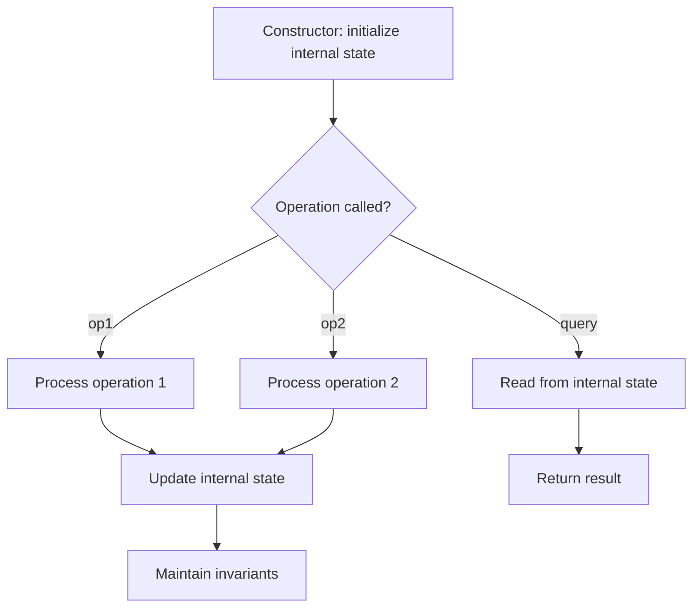

# Problem 2408: Design SQL

**Difficulty:** Medium  
**Tags:** Array, Hash Table, String, Design  
**Pattern:** Design  
**Link:** [leetcode.com/problems/design-sql](https://leetcode.com/problems/design-sql/)

## Description

*(Premium problem -- description requires LeetCode subscription)*

## Approach: Design

Design a data structure or system that supports specific operations efficiently. Choose appropriate underlying data structures (hash map, linked list, heap, etc.).

## Pseudocode

```
1. Choose data structures for internal state
2. Implement constructor: initialize state
3. Implement each operation:
   - Maintain invariants
   - Optimize for target time complexity
4. Handle edge cases
```

## Algorithm Flow



## Complexity Analysis

- **Time:** O(1) per operation
- **Space:** O(n)

## Solution (Python3)

```python
class Solution:
    pass
```

## Solution (C++)

```cpp
class Solution {
public:
    // Design problem stub
};
```
