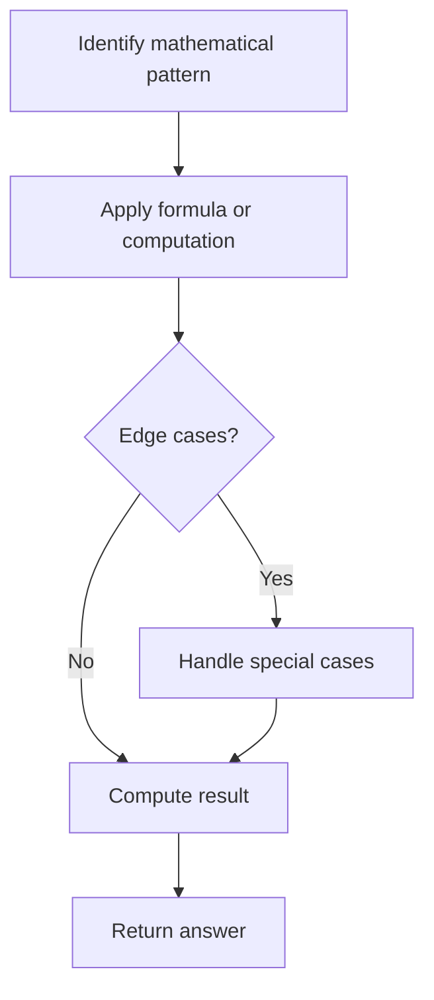

# Problem 2409: Count Days Spent Together

**Difficulty:** Easy  
**Tags:** Math, String  
**Pattern:** Math  
**Link:** [leetcode.com/problems/count-days-spent-together](https://leetcode.com/problems/count-days-spent-together/)

## Description

Alice and Bob are traveling to Rome for separate business meetings.

You are given 4 strings `arriveAlice`, `leaveAlice`, `arriveBob`, and `leaveBob`. Alice will be in the city from the dates `arriveAlice` to `leaveAlice` (**inclusive**), while Bob will be in the city from the dates `arriveBob` to `leaveBob` (**inclusive**). Each will be a 5-character string in the format `"MM-DD"`, corresponding to the month and day of the date.

Return* the total number of days that Alice and Bob are in Rome together.*

You can assume that all dates occur in the **same** calendar year, which is **not** a leap year. Note that the number of days per month can be represented as: `[31, 28, 31, 30, 31, 30, 31, 31, 30, 31, 30, 31]`.

 

Example 1:

```

**Input:** arriveAlice = "08-15", leaveAlice = "08-18", arriveBob = "08-16", leaveBob = "08-19"
**Output:** 3
**Explanation:** Alice will be in Rome from August 15 to August 18. Bob will be in Rome from August 16 to August 19. They are both in Rome together on August 16th, 17th, and 18th, so the answer is 3.

```

Example 2:

```

**Input:** arriveAlice = "10-01", leaveAlice = "10-31", arriveBob = "11-01", leaveBob = "12-31"
**Output:** 0
**Explanation:** There is no day when Alice and Bob are in Rome together, so we return 0.

```

 

**Constraints:**

	- All dates are provided in the format `"MM-DD"`.
	- Alice and Bob's arrival dates are **earlier than or equal to** their leaving dates.
	- The given dates are valid dates of a **non-leap** year.

## Approach: Math

Apply mathematical properties, formulas, or number-theoretic concepts. Look for patterns, modular arithmetic, or closed-form solutions.

## Pseudocode

```
1. Identify the mathematical pattern or formula
2. Apply computation:
   - Modular arithmetic for large numbers
   - GCD/LCM for divisibility
   - Sieve for primes
3. Handle edge cases
4. Return result
```

## Algorithm Flow



## Complexity Analysis

- **Time:** O(n) or O(sqrt(n))
- **Space:** O(1)

## Solution (Python3)

```python
class Solution:
    def countDaysTogether(self, arriveAlice: str, leaveAlice: str, arriveBob: str, leaveBob: str) -> int:
        # Mathematical approach
        result = 0
        x = arriveAlice
        while x != 0:
            result = result * 10 + x % 10
            x //= 10 if isinstance(x, int) else 1
        return result
```

## Solution (C++)

```cpp
#include <string>
#include <vector>
using namespace std;

class Solution {
public:
    int countDaysTogether(string& arriveAlice, string& leaveAlice, string& arriveBob, string& leaveBob) {
        // Mathematical approach
        long long result = 0;
        int x = arriveAlice;
        while (x != 0) {
            result = result * 10 + x % 10;
            x /= 10;
        }
        return (int)result;
    }
};
```
