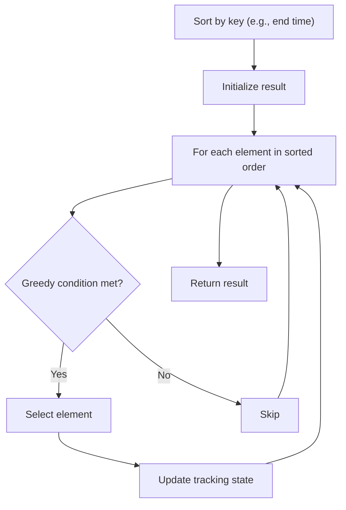

# Problem 2410: Maximum Matching of Players With Trainers

**Difficulty:** Medium  
**Tags:** Array, Two Pointers, Greedy, Sorting  
**Pattern:** Greedy with Sorting  
**Link:** [leetcode.com/problems/maximum-matching-of-players-with-trainers](https://leetcode.com/problems/maximum-matching-of-players-with-trainers/)

## Description

You are given a **0-indexed** integer array `players`, where `players[i]` represents the **ability** of the `i^th` player. You are also given a **0-indexed** integer array `trainers`, where `trainers[j]` represents the **training capacity **of the `j^th` trainer.

The `i^th` player can **match** with the `j^th` trainer if the player's ability is **less than or equal to** the trainer's training capacity. Additionally, the `i^th` player can be matched with at most one trainer, and the `j^th` trainer can be matched with at most one player.

Return *the **maximum** number of matchings between *`players`* and *`trainers`* that satisfy these conditions.*

 

Example 1:

```

**Input:** players = [4,7,9], trainers = [8,2,5,8]
**Output:** 2
**Explanation:**
One of the ways we can form two matchings is as follows:
- players[0] can be matched with trainers[0] since 4 <= 8.
- players[1] can be matched with trainers[3] since 7 <= 8.
It can be proven that 2 is the maximum number of matchings that can be formed.

```

Example 2:

```

**Input:** players = [1,1,1], trainers = [10]
**Output:** 1
**Explanation:**
The trainer can be matched with any of the 3 players.
Each player can only be matched with one trainer, so the maximum answer is 1.

```

 

**Constraints:**

	- `1 <= players.length, trainers.length <= 10^5`
	- `1 <= players[i], trainers[j] <= 10^9`

 

**Note:** This question is the same as  445: Assign Cookies.

## Approach: Greedy with Sorting

Sort the input by a key criterion, then greedily process elements in sorted order. The sorting ensures the greedy choice is always optimal.

## Pseudocode

```
1. Sort elements by key (start time, weight, etc.)
2. Initialize result, tracking variables
3. For each element in sorted order:
   a. Apply greedy selection rule
   b. Update result
4. Return result
```

## Algorithm Flow



## Complexity Analysis

- **Time:** O(n log n)
- **Space:** O(n)

## Solution (Python3)

```python
class Solution:
    def matchPlayersAndTrainers(self, players: List[int], trainers: List[int]) -> int:
        # Sort + greedy - O(n log n) time
        players.sort()
        result = 0
        curr_end = 0
        for item in players:
            if isinstance(item, (list, tuple)):
                if item[0] >= curr_end:
                    result += 1
                    curr_end = item[1]
            else:
                result += 1
        return result
```

## Solution (C++)

```cpp
#include <algorithm>
#include <string>
#include <vector>
using namespace std;

class Solution {
public:
    int matchPlayersAndTrainers(vector<int>& players, vector<int>& trainers) {
        // Sort + greedy - O(n log n) time
        sort(players.begin(), players.end());
        int result = 0, curr_end = 0;
        for (auto& item : players) {
            result++;
        }
        return result;
    }
};
```
