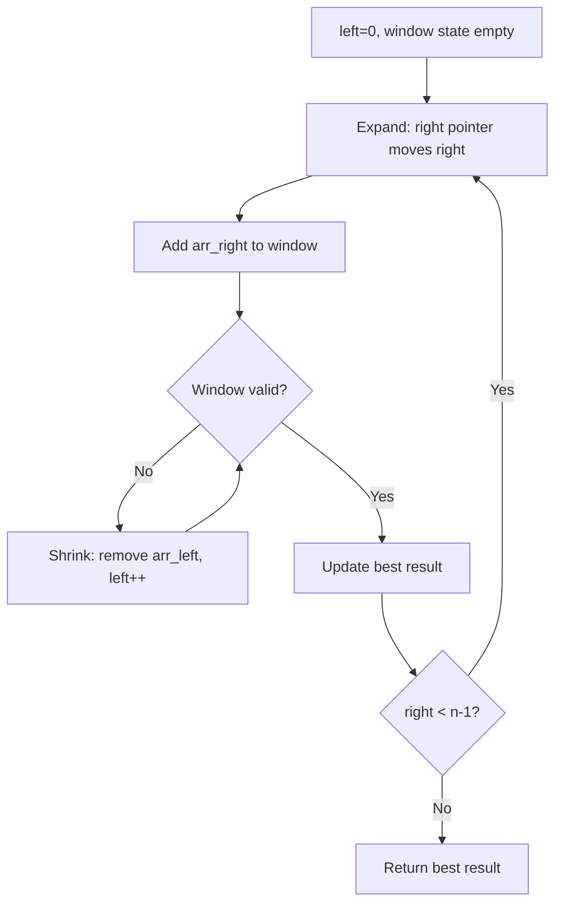
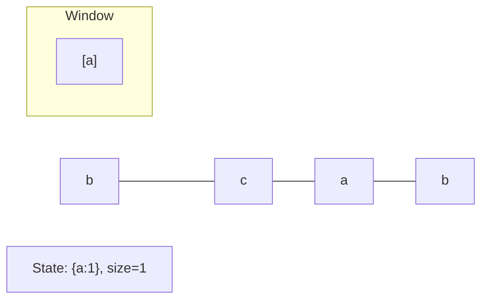
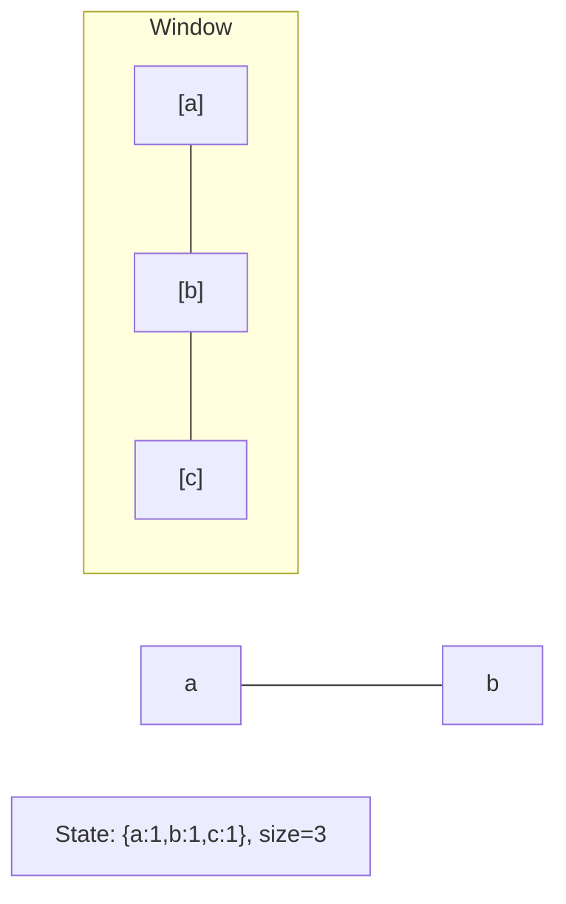
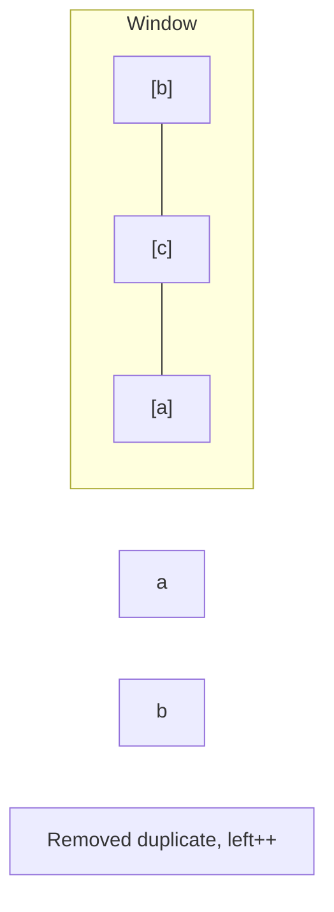
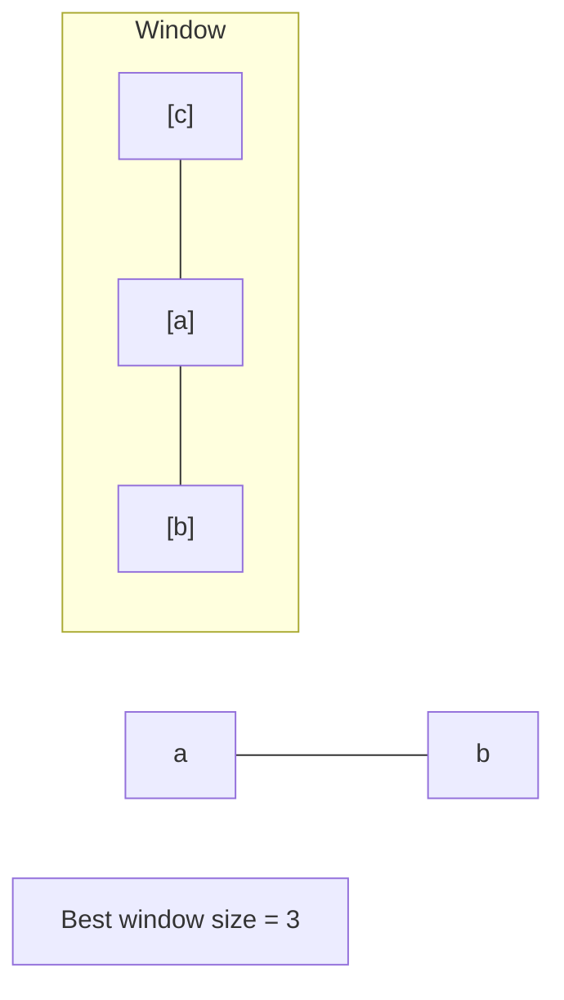

# Problem 2411: Smallest Subarrays With Maximum Bitwise OR

**Difficulty:** Medium  
**Tags:** Array, Binary Search, Bit Manipulation, Sliding Window  
**Pattern:** Sliding Window  
**Link:** [leetcode.com/problems/smallest-subarrays-with-maximum-bitwise-or](https://leetcode.com/problems/smallest-subarrays-with-maximum-bitwise-or/)

## Description

You are given a **0-indexed** array `nums` of length `n`, consisting of non-negative integers. For each index `i` from `0` to `n - 1`, you must determine the size of the **minimum sized** non-empty subarray of `nums` starting at `i` (**inclusive**) that has the **maximum** possible **bitwise OR**.

	- In other words, let `Bij` be the bitwise OR of the subarray `nums[i...j]`. You need to find the smallest subarray starting at `i`, such that bitwise OR of this subarray is equal to `max(Bik)` where `i <= k <= n - 1`.

The bitwise OR of an array is the bitwise OR of all the numbers in it.

Return *an integer array *`answer`* of size *`n`* where *`answer[i]`* is the length of the **minimum** sized subarray starting at *`i`* with **maximum** bitwise OR.*

A **subarray** is a contiguous non-empty sequence of elements within an array.

 

Example 1:

```

**Input:** nums = [1,0,2,1,3]
**Output:** [3,3,2,2,1]
**Explanation:**
The maximum possible bitwise OR starting at any index is 3. 
- Starting at index 0, the shortest subarray that yields it is [1,0,2].
- Starting at index 1, the shortest subarray that yields the maximum bitwise OR is [0,2,1].
- Starting at index 2, the shortest subarray that yields the maximum bitwise OR is [2,1].
- Starting at index 3, the shortest subarray that yields the maximum bitwise OR is [1,3].
- Starting at index 4, the shortest subarray that yields the maximum bitwise OR is [3].
Therefore, we return [3,3,2,2,1]. 

```

Example 2:

```

**Input:** nums = [1,2]
**Output:** [2,1]
Explanation:
Starting at index 0, the shortest subarray that yields the maximum bitwise OR is of length 2.
Starting at index 1, the shortest subarray that yields the maximum bitwise OR is of length 1.
Therefore, we return [2,1].

```

 

**Constraints:**

	- `n == nums.length`
	- `1 <= n <= 10^5`
	- `0 <= nums[i] <= 10^9`

## Approach: Sliding Window

Maintain a window over the data using two pointers. Expand the right boundary to include new elements, and shrink the left boundary when the window constraint is violated. Track the optimal window.

## Pseudocode

```
1. Initialize left = 0, result = initial_value
2. For right in range(n):
   a. Add element at right to window state
   b. While window is invalid:
      - Remove element at left from window state
      - left++
   c. Update result = best of (result, window size/value)
3. Return result
```

## Algorithm Flow



## Visual State Transitions

**Sliding Window Step-by-Step:**

**Frame 1: Initial window (left=0, right=0)**


**Frame 2: Expand right (right=2)**


**Frame 3: Violation - shrink left**


**Frame 4: Continue expanding**



## Complexity Analysis

- **Time:** O(n)
- **Space:** O(k)

## Solution (Python3)

```python
class Solution:
    def smallestSubarrays(self, nums: List[int]) -> List[int]:
        # Sliding window approach - O(n) time, O(k) space
        from collections import defaultdict
        window = defaultdict(int)
        left = 0
        result = 0
        for right in range(len(nums)):
            window[nums[right]] += 1
            while len(window) > (nums if isinstance(nums, int) else len(nums)):
                window[nums[left]] -= 1
                if window[nums[left]] == 0:
                    del window[nums[left]]
                left += 1
            result = max(result, right - left + 1)
        return result
```

## Solution (C++)

```cpp
#include <algorithm>
#include <string>
#include <unordered_map>
#include <vector>
using namespace std;

class Solution {
public:
    vector<int> smallestSubarrays(vector<int>& nums) {
        // Sliding window approach - O(n) time, O(k) space
        unordered_map<char, int> window;
        int left = 0, result = 0;
        for (int right = 0; right < nums.size(); right++) {
            window[nums[right]]++;
            while ((int)window.size() > nums) {
                window[nums[left]]--;
                if (window[nums[left]] == 0)
                    window.erase(nums[left]);
                left++;
            }
            result = max(result, right - left + 1);
        }
        return result;
    }
};
```
