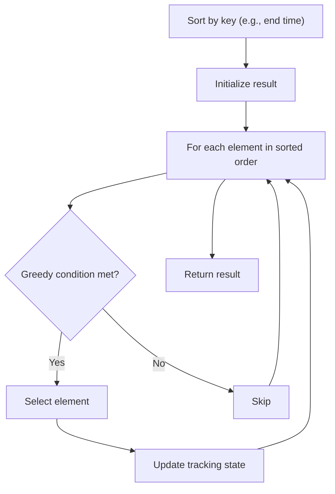

# Problem 2412: Minimum Money Required Before Transactions

**Difficulty:** Hard  
**Tags:** Array, Greedy, Sorting  
**Pattern:** Greedy with Sorting  
**Link:** [leetcode.com/problems/minimum-money-required-before-transactions](https://leetcode.com/problems/minimum-money-required-before-transactions/)

## Description

You are given a **0-indexed** 2D integer array `transactions`, where `transactions[i] = [costi, cashbacki]`.

The array describes transactions, where each transaction must be completed exactly once in **some order**. At any given moment, you have a certain amount of `money`. In order to complete transaction `i`, `money >= costi` must hold true. After performing a transaction, `money` becomes `money - costi + cashbacki`.

Return* the minimum amount of *`money`* required before any transaction so that all of the transactions can be completed **regardless of the order** of the transactions.*

 

Example 1:

```

**Input:** transactions = [[2,1],[5,0],[4,2]]
**Output:** 10
Explanation:
Starting with money = 10, the transactions can be performed in any order.
It can be shown that starting with money < 10 will fail to complete all transactions in some order.

```

Example 2:

```

**Input:** transactions = [[3,0],[0,3]]
**Output:** 3
**Explanation:**
- If transactions are in the order [[3,0],[0,3]], the minimum money required to complete the transactions is 3.
- If transactions are in the order [[0,3],[3,0]], the minimum money required to complete the transactions is 0.
Thus, starting with money = 3, the transactions can be performed in any order.

```

 

**Constraints:**

	- `1 <= transactions.length <= 10^5`
	- `transactions[i].length == 2`
	- `0 <= costi, cashbacki <= 10^9`

## Approach: Greedy with Sorting

Sort the input by a key criterion, then greedily process elements in sorted order. The sorting ensures the greedy choice is always optimal.

## Pseudocode

```
1. Sort elements by key (start time, weight, etc.)
2. Initialize result, tracking variables
3. For each element in sorted order:
   a. Apply greedy selection rule
   b. Update result
4. Return result
```

## Algorithm Flow



## Complexity Analysis

- **Time:** O(n log n)
- **Space:** O(n)

## Solution (Python3)

```python
class Solution:
    def minimumMoney(self, transactions: List[List[int]]) -> int:
        # Sort + greedy - O(n log n) time
        transactions.sort()
        result = 0
        curr_end = 0
        for item in transactions:
            if isinstance(item, (list, tuple)):
                if item[0] >= curr_end:
                    result += 1
                    curr_end = item[1]
            else:
                result += 1
        return result
```

## Solution (C++)

```cpp
#include <algorithm>
#include <string>
#include <vector>
using namespace std;

class Solution {
public:
    int minimumMoney(vector<vector<int>>& transactions) {
        // Sort + greedy - O(n log n) time
        sort(transactions.begin(), transactions.end());
        int result = 0, curr_end = 0;
        for (auto& item : transactions) {
            result++;
        }
        return result;
    }
};
```
