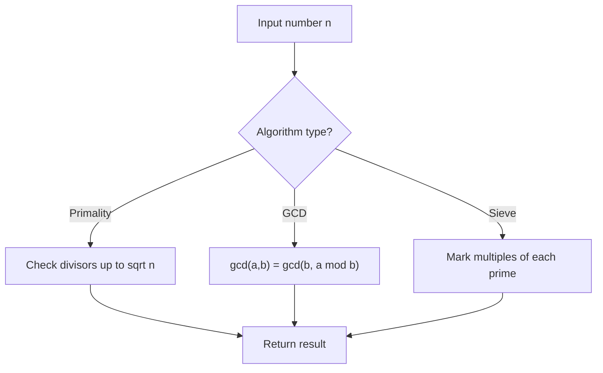

# Problem 2413: Smallest Even Multiple

**Difficulty:** Easy  
**Tags:** Math, Number Theory  
**Pattern:** Number Theory  
**Link:** [leetcode.com/problems/smallest-even-multiple](https://leetcode.com/problems/smallest-even-multiple/)

## Description

Given a **positive** integer `n`, return *the smallest positive integer that is a multiple of **both** *`2`* and *`n`.
 

Example 1:

```

**Input:** n = 5
**Output:** 10
**Explanation:** The smallest multiple of both 5 and 2 is 10.

```

Example 2:

```

**Input:** n = 6
**Output:** 6
**Explanation:** The smallest multiple of both 6 and 2 is 6. Note that a number is a multiple of itself.

```

 

**Constraints:**

	- `1 <= n <= 150`

## Approach: Number Theory

Apply number theory: prime checking, factorization, GCD, modular exponentiation, sieve of Eratosthenes, or Euler's totient.

## Pseudocode

```
1. Apply number-theoretic algorithm:
   - Sieve for primes up to n
   - GCD via Euclidean algorithm
   - Modular exponentiation
2. Process results
3. Return answer
```

## Algorithm Flow



## Complexity Analysis

- **Time:** O(sqrt(n)) or O(n log log n)
- **Space:** O(n)

## Solution (Python3)

```python
class Solution:
    def smallestEvenMultiple(self, n: int) -> int:
        # Number theory approach
        def gcd(a, b):
            while b:
                a, b = b, a % b
            return a
        
        result = n[0] if isinstance(n, list) else n
        if isinstance(n, list):
            for val in n[1:]:
                result = gcd(result, val)
        return result
```

## Solution (C++)

```cpp
#include <string>
#include <vector>
using namespace std;

class Solution {
public:
    int smallestEvenMultiple(int n) {
        // Number theory approach
        auto gcd_func = [](int a, int b) -> int {
            while (b) { int t = b; b = a % b; a = t; }
            return a;
        };
        int result = n[0];
        for (int i = 1; i < (int)n.size(); i++) {
            result = gcd_func(result, n[i]);
        }
        return result;
    }
};
```
