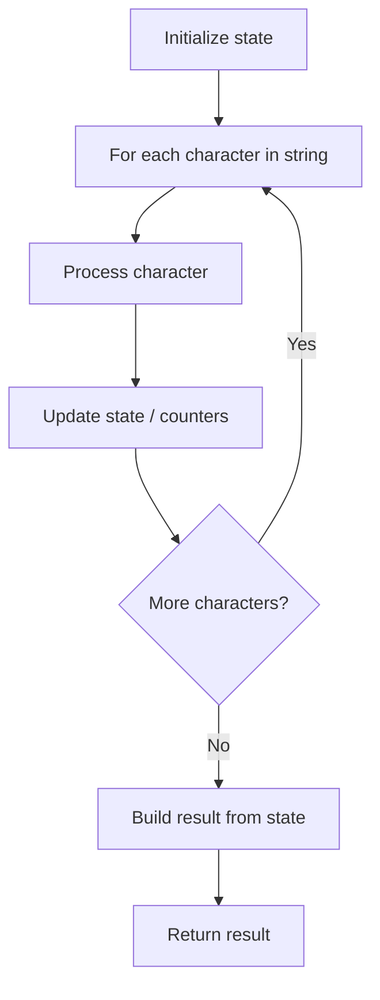

# Problem 2414: Length of the Longest Alphabetical Continuous Substring

**Difficulty:** Medium  
**Tags:** String  
**Pattern:** String Processing  
**Link:** [leetcode.com/problems/length-of-the-longest-alphabetical-continuous-substring](https://leetcode.com/problems/length-of-the-longest-alphabetical-continuous-substring/)

## Description

An **alphabetical continuous string** is a string consisting of consecutive letters in the alphabet. In other words, it is any substring of the string `"abcdefghijklmnopqrstuvwxyz"`.

	- For example, `"abc"` is an alphabetical continuous string, while `"acb"` and `"za"` are not.

Given a string `s` consisting of lowercase letters only, return the *length of the **longest** alphabetical continuous substring.*

 

Example 1:

```

**Input:** s = "abacaba"
**Output:** 2
**Explanation:** There are 4 distinct continuous substrings: "a", "b", "c" and "ab".
"ab" is the longest continuous substring.

```

Example 2:

```

**Input:** s = "abcde"
**Output:** 5
**Explanation:** "abcde" is the longest continuous substring.

```

 

**Constraints:**

	- `1 <= s.length <= 10^5`
	- `s` consists of only English lowercase letters.

## Approach: String Processing

Process the string character by character. Common techniques: two pointers, sliding window, hash map for frequencies, stack for matching.

## Pseudocode

```
1. Initialize result / tracking state
2. Iterate through string characters:
   a. Process character based on rules
   b. Update state (counters, pointers, stack)
3. Build and return result
```

## Algorithm Flow



## Complexity Analysis

- **Time:** O(n)
- **Space:** O(n)

## Solution (Python3)

```python
class Solution:
    def longestContinuousSubstring(self, s: str) -> int:
        # String processing approach - O(n) time
        result = []
        for ch in s:
            if ch.isalnum():
                result.append(ch.lower())
        # Check palindrome or process
        processed = ''.join(result)
        return processed == processed[::-1] if isinstance(0, bool) else processed
```

## Solution (C++)

```cpp
#include <algorithm>
#include <cctype>
#include <string>
#include <vector>
using namespace std;

class Solution {
public:
    int longestContinuousSubstring(string& s) {
        // String processing approach - O(n) time
        string processed;
        for (char ch : s) {
            if (isalnum(ch)) {
                processed += tolower(ch);
            }
        }
        string rev = processed;
        reverse(rev.begin(), rev.end());
        return processed == rev;
    }
};
```
