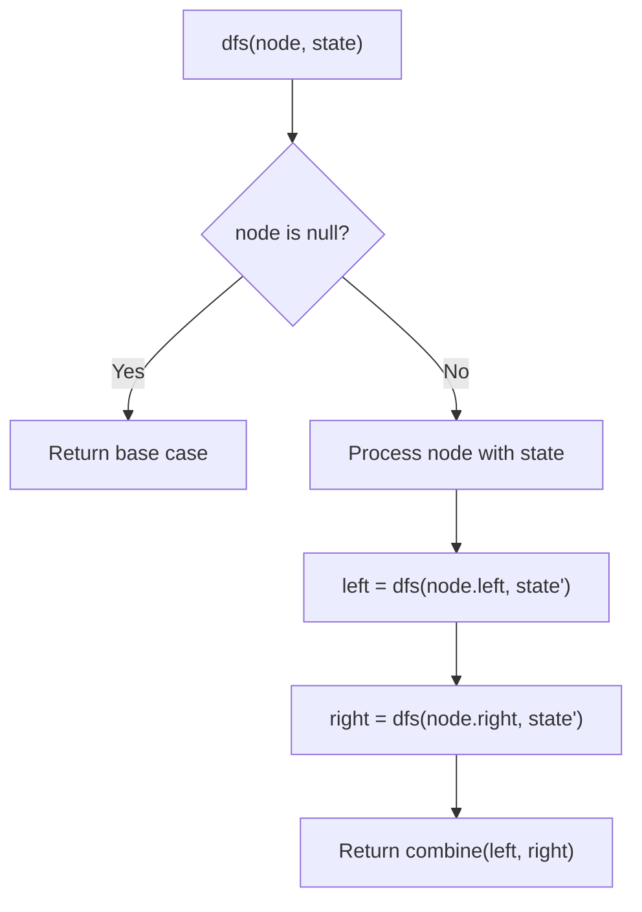
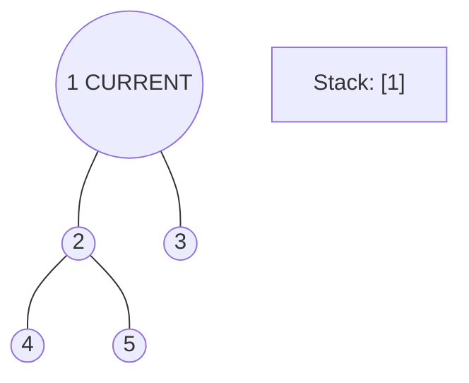
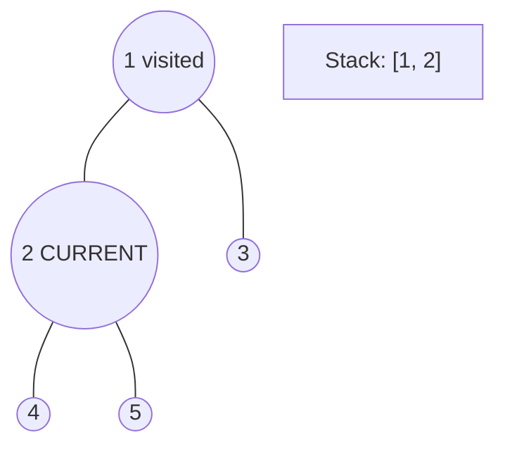
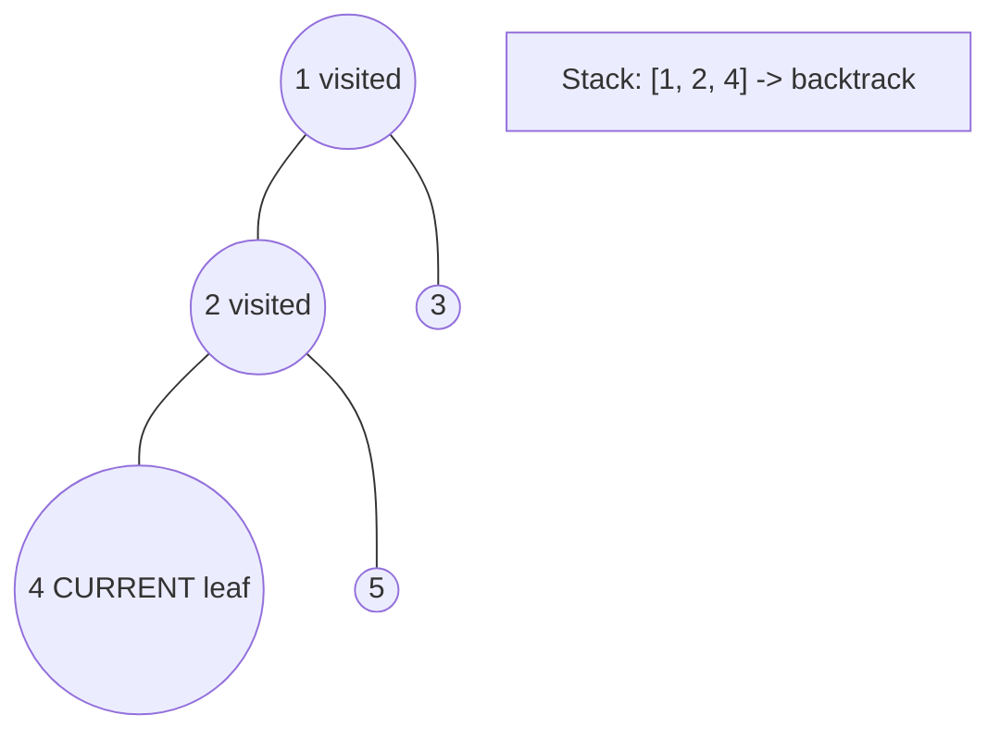
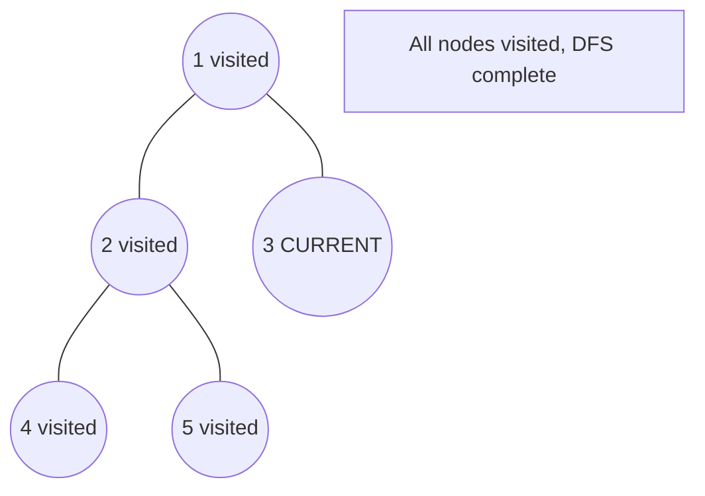

# Problem 2415: Reverse Odd Levels of Binary Tree

**Difficulty:** Medium  
**Tags:** Tree, Depth-First Search, Breadth-First Search, Binary Tree  
**Pattern:** DFS Tree Traversal  
**Link:** [leetcode.com/problems/reverse-odd-levels-of-binary-tree](https://leetcode.com/problems/reverse-odd-levels-of-binary-tree/)

## Description

Given the `root` of a **perfect** binary tree, reverse the node values at each **odd** level of the tree.

	- For example, suppose the node values at level 3 are `[2,1,3,4,7,11,29,18]`, then it should become `[18,29,11,7,4,3,1,2]`.

Return *the root of the reversed tree*.

A binary tree is **perfect** if all parent nodes have two children and all leaves are on the same level.

The **level** of a node is the number of edges along the path between it and the root node.

 

Example 1:

```

**Input:** root = [2,3,5,8,13,21,34]
**Output:** [2,5,3,8,13,21,34]
**Explanation:** 
The tree has only one odd level.
The nodes at level 1 are 3, 5 respectively, which are reversed and become 5, 3.

```

Example 2:

```

**Input:** root = [7,13,11]
**Output:** [7,11,13]
**Explanation:** 
The nodes at level 1 are 13, 11, which are reversed and become 11, 13.

```

Example 3:

```

**Input:** root = [0,1,2,0,0,0,0,1,1,1,1,2,2,2,2]
**Output:** [0,2,1,0,0,0,0,2,2,2,2,1,1,1,1]
**Explanation:** 
The odd levels have non-zero values.
The nodes at level 1 were 1, 2, and are 2, 1 after the reversal.
The nodes at level 3 were 1, 1, 1, 1, 2, 2, 2, 2, and are 2, 2, 2, 2, 1, 1, 1, 1 after the reversal.

```

 

**Constraints:**

	- The number of nodes in the tree is in the range `[1, 2^14]`.
	- `0 <= Node.val <= 10^5`
	- `root` is a **perfect** binary tree.

## Approach: DFS Tree Traversal

Perform depth-first search on the tree. Recurse on left and right subtrees, combining results bottom-up. Track state (path, depth, sum) during traversal.

## Pseudocode

```
1. Define dfs(node, state):
   a. Base case: if null, return default
   b. Process node with current state
   c. left_result = dfs(node.left, updated_state)
   d. right_result = dfs(node.right, updated_state)
   e. Return combine(left_result, right_result)
2. Return dfs(root, initial_state)
```

## Algorithm Flow



## Visual State Transitions

**DFS Tree Traversal Step-by-Step:**

**Frame 1: Start at root**


**Frame 2: Go left - visit node 2**


**Frame 3: Go left - visit node 4 (leaf)**


**Frame 4: Backtrack, visit node 5, then node 3**



## Complexity Analysis

- **Time:** O(n)
- **Space:** O(h)

## Solution (Python3)

```python
class Solution:
    def reverseOddLevels(self, root: Optional[TreeNode]) -> Optional[TreeNode]:
        # DFS on binary tree - O(n) time, O(h) space
        def dfs(node):
            if not node:
                return 0
            left = dfs(node.left)
            right = dfs(node.right)
            return 1 + max(left, right)
        
        result = dfs(root)
        return result
```

## Solution (C++)

```cpp
#include <algorithm>
#include <functional>
#include <string>
#include <vector>
using namespace std;

class Solution {
public:
    TreeNode* reverseOddLevels(TreeNode* root) {
        // DFS on binary tree - O(n) time, O(h) space
        function<int(TreeNode*)> dfs = [&](TreeNode* node) -> int {
            if (!node) return 0;
            int left = dfs(node->left);
            int right = dfs(node->right);
            return 1 + max(left, right);
        };
        return dfs(root);
    }
};
```
