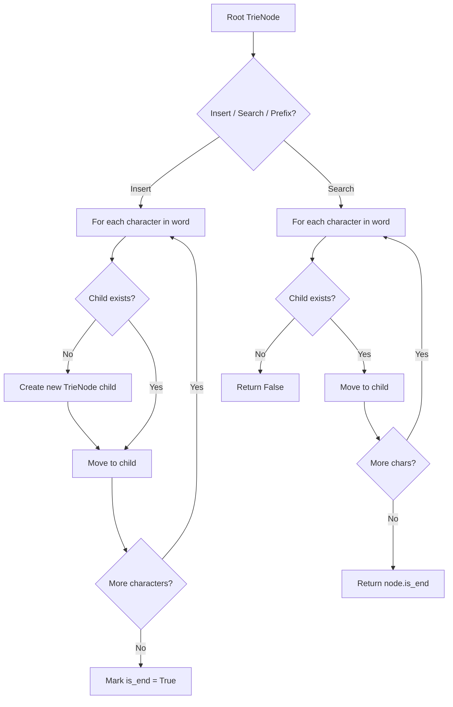
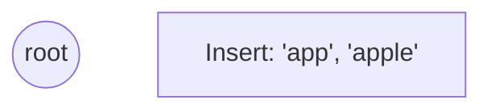
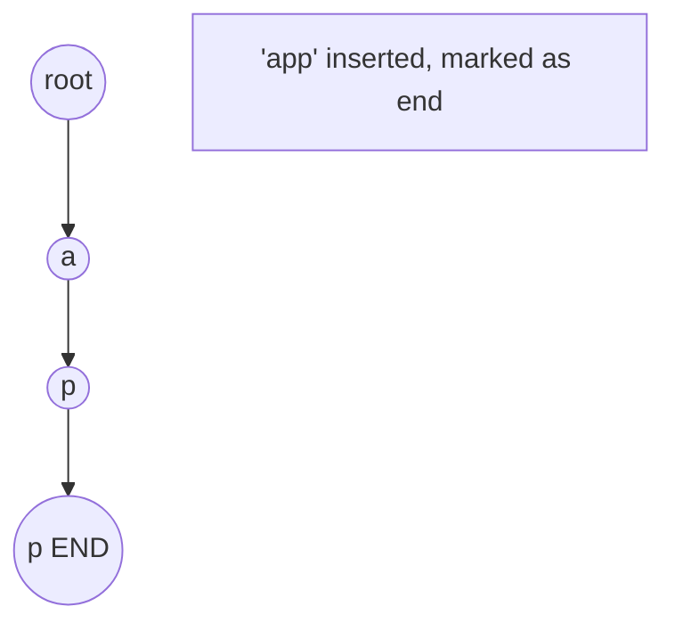
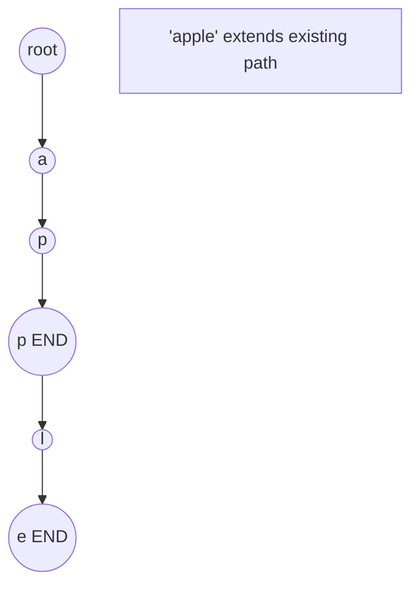
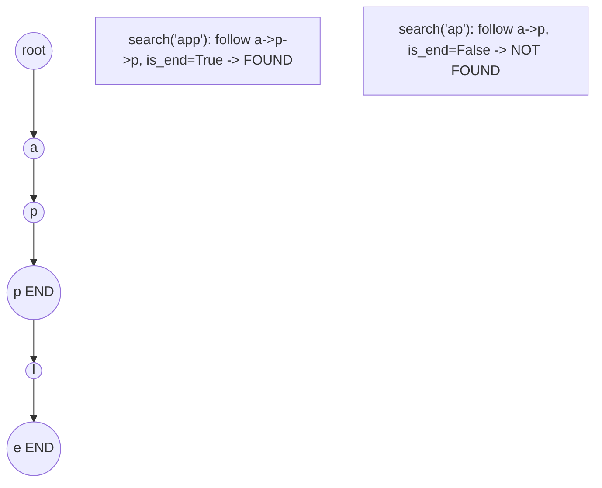

# Problem 2416: Sum of Prefix Scores of Strings

**Difficulty:** Hard  
**Tags:** Array, String, Trie, Counting  
**Pattern:** Trie / Prefix Tree  
**Link:** [leetcode.com/problems/sum-of-prefix-scores-of-strings](https://leetcode.com/problems/sum-of-prefix-scores-of-strings/)

## Description

You are given an array `words` of size `n` consisting of **non-empty** strings.

We define the **score** of a string `term` as the **number** of strings `words[i]` such that `term` is a **prefix** of `words[i]`.

	- For example, if `words = ["a", "ab", "abc", "cab"]`, then the score of `"ab"` is `2`, since `"ab"` is a prefix of both `"ab"` and `"abc"`.

Return *an array *`answer`* of size *`n`* where *`answer[i]`* is the **sum** of scores of every **non-empty** prefix of *`words[i]`.

**Note** that a string is considered as a prefix of itself.

 

Example 1:

```

**Input:** words = ["abc","ab","bc","b"]
**Output:** [5,4,3,2]
**Explanation:** The answer for each string is the following:
- "abc" has 3 prefixes: "a", "ab", and "abc".
- There are 2 strings with the prefix "a", 2 strings with the prefix "ab", and 1 string with the prefix "abc".
The total is answer[0] = 2 + 2 + 1 = 5.
- "ab" has 2 prefixes: "a" and "ab".
- There are 2 strings with the prefix "a", and 2 strings with the prefix "ab".
The total is answer[1] = 2 + 2 = 4.
- "bc" has 2 prefixes: "b" and "bc".
- There are 2 strings with the prefix "b", and 1 string with the prefix "bc".
The total is answer[2] = 2 + 1 = 3.
- "b" has 1 prefix: "b".
- There are 2 strings with the prefix "b".
The total is answer[3] = 2.

```

Example 2:

```

**Input:** words = ["abcd"]
**Output:** [4]
**Explanation:**
"abcd" has 4 prefixes: "a", "ab", "abc", and "abcd".
Each prefix has a score of one, so the total is answer[0] = 1 + 1 + 1 + 1 = 4.

```

 

**Constraints:**

	- `1 <= words.length <= 1000`
	- `1 <= words[i].length <= 1000`
	- `words[i]` consists of lowercase English letters.

## Approach: Trie / Prefix Tree

Build a trie (prefix tree) where each node represents a character. Insert words character by character, and search by following child pointers. Supports efficient prefix matching.

## Pseudocode

```
1. TrieNode: children = {}, is_end = False
2. Insert(word):
   - For each char: create child if absent, move to child
   - Mark last node as end
3. Search(word):
   - For each char: if child absent return False, move to child
   - Return node.is_end
4. StartsWith(prefix): same as search but return True at end
```

## Algorithm Flow



## Visual State Transitions

**Trie Insert and Search:**

**Frame 1: Empty trie**


**Frame 2: Insert 'app'**


**Frame 3: Insert 'apple'**


**Frame 4: Search 'app' = True, 'ap' = False**



## Complexity Analysis

- **Time:** O(L) per operation
- **Space:** O(N * L)

## Solution (Python3)

```python
class Solution:
    def sumPrefixScores(self, words: List[str]) -> List[int]:
        # Trie-based approach
        trie = {}
        # Build trie from word list
        words = words if isinstance(words, list) else [words]
        for word in words:
            node = trie
            for ch in word:
                if ch not in node:
                    node[ch] = {}
                node = node[ch]
            node['#'] = True
        
        # Search in trie
        def search(word):
            node = trie
            for ch in word:
                if ch not in node:
                    return False
                node = node[ch]
            return '#' in node
        
        return []
```

## Solution (C++)

```cpp
#include <string>
#include <vector>
using namespace std;

class Solution {
public:
    vector<int> sumPrefixScores(vector<string>& words) {
        // Trie-based approach
        struct TrieNode {
            TrieNode* children[26] = {};
            bool isEnd = false;
        };
        TrieNode* root = new TrieNode();
        // Build trie
        for (auto& word : words) {
            TrieNode* node = root;
            for (char ch : word) {
                int idx = ch - 'a';
                if (!node->children[idx])
                    node->children[idx] = new TrieNode();
                node = node->children[idx];
            }
            node->isEnd = true;
        }
        return {};
    }
};
```
