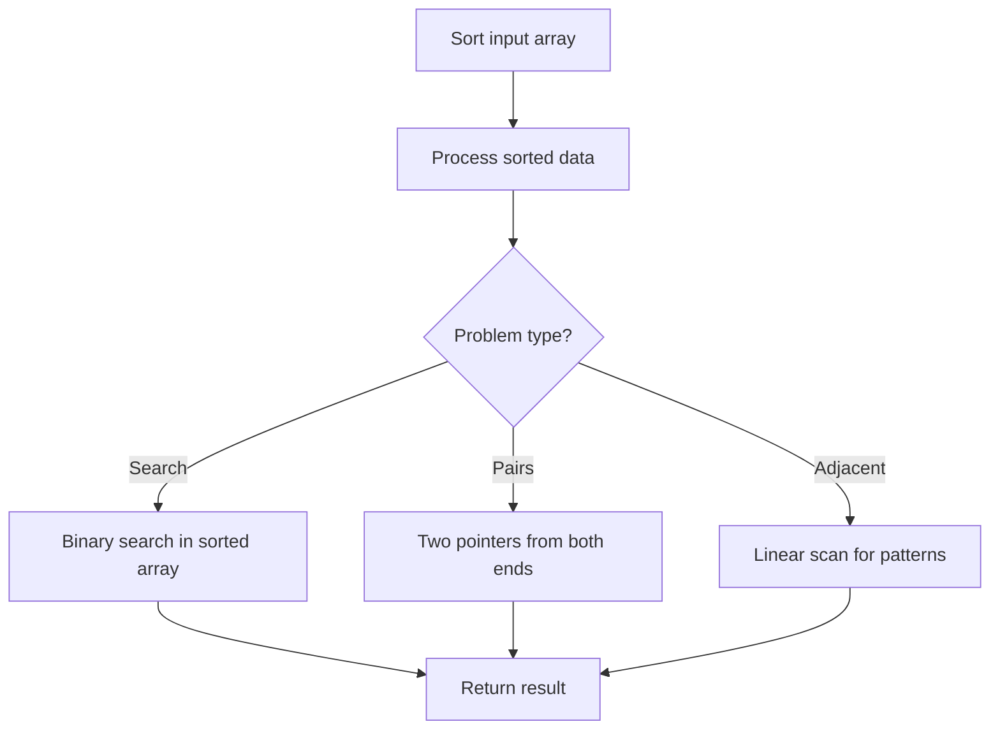

# Problem 2418: Sort the People

**Difficulty:** Easy  
**Tags:** Array, Hash Table, String, Sorting  
**Pattern:** Sorting  
**Link:** [leetcode.com/problems/sort-the-people](https://leetcode.com/problems/sort-the-people/)

## Description

You are given an array of strings `names`, and an array `heights` that consists of **distinct** positive integers. Both arrays are of length `n`.

For each index `i`, `names[i]` and `heights[i]` denote the name and height of the `i^th` person.

Return `names`* sorted in **descending** order by the people's heights*.

 

Example 1:

```

**Input:** names = ["Mary","John","Emma"], heights = [180,165,170]
**Output:** ["Mary","Emma","John"]
**Explanation:** Mary is the tallest, followed by Emma and John.

```

Example 2:

```

**Input:** names = ["Alice","Bob","Bob"], heights = [155,185,150]
**Output:** ["Bob","Alice","Bob"]
**Explanation:** The first Bob is the tallest, followed by Alice and the second Bob.

```

 

**Constraints:**

	- `n == names.length == heights.length`
	- `1 <= n <= 10^3`
	- `1 <= names[i].length <= 20`
	- `1 <= heights[i] <= 10^5`
	- `names[i]` consists of lower and upper case English letters.
	- All the values of `heights` are distinct.

## Approach: Sorting

Sort the data to enable efficient processing. After sorting, use techniques like binary search, two pointers, or linear scan to solve the problem.

## Pseudocode

```
1. Sort the input array
2. Process sorted data:
   - Use binary search for lookups
   - Use two pointers for pair finding
   - Scan for adjacent patterns
3. Return result
```

## Algorithm Flow



## Complexity Analysis

- **Time:** O(n log n)
- **Space:** O(n)

## Solution (Python3)

```python
class Solution:
    def sortPeople(self, names: List[str], heights: List[int]) -> List[str]:
        # Sort-based approach - O(n log n) time
        names.sort(key=lambda x: x[0] if isinstance(x, (list, tuple)) else x)
        result = [names[0]]
        for i in range(1, len(names)):
            curr = names[i]
            if isinstance(curr, (list, tuple)) and isinstance(result[-1], (list, tuple)):
                if curr[0] <= result[-1][1]:
                    result[-1] = [result[-1][0], max(result[-1][1], curr[1])]
                else:
                    result.append(curr)
            else:
                result.append(curr)
        return result
```

## Solution (C++)

```cpp
#include <algorithm>
#include <string>
#include <vector>
using namespace std;

class Solution {
public:
    vector<string> sortPeople(vector<string>& names, vector<int>& heights) {
        // Sort-based approach - O(n log n) time
        sort(names.begin(), names.end());
        vector<vector<int>> result;
        result.push_back(names[0]);
        for (int i = 1; i < (int)names.size(); i++) {
            if (names[i][0] <= result.back()[1]) {
                result.back()[1] = max(result.back()[1], names[i][1]);
            } else {
                result.push_back(names[i]);
            }
        }
        return result;
    }
};
```
