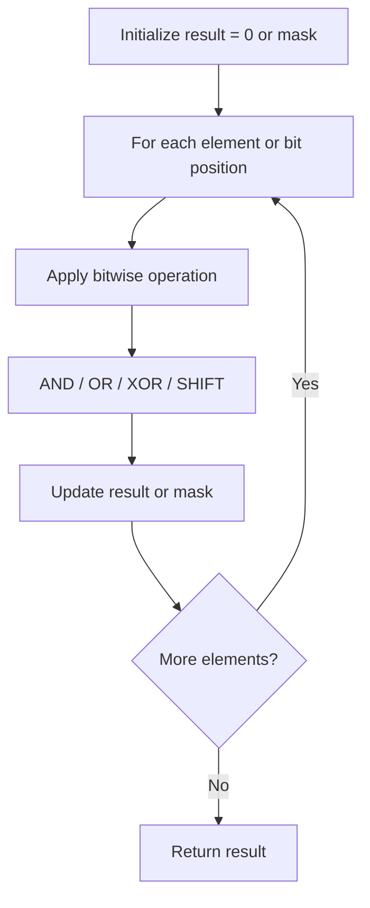

# Problem 2419: Longest Subarray With Maximum Bitwise AND

**Difficulty:** Medium  
**Tags:** Array, Bit Manipulation, Brainteaser  
**Pattern:** Bit Manipulation  
**Link:** [leetcode.com/problems/longest-subarray-with-maximum-bitwise-and](https://leetcode.com/problems/longest-subarray-with-maximum-bitwise-and/)

## Description

You are given an integer array `nums` of size `n`.

Consider a **non-empty** subarray from `nums` that has the **maximum** possible **bitwise AND**.

	- In other words, let `k` be the maximum value of the bitwise AND of **any** subarray of `nums`. Then, only subarrays with a bitwise AND equal to `k` should be considered.

Return *the length of the **longest** such subarray*.

The bitwise AND of an array is the bitwise AND of all the numbers in it.

A **subarray** is a contiguous sequence of elements within an array.

 

Example 1:

```

**Input:** nums = [1,2,3,3,2,2]
**Output:** 2
**Explanation:**
The maximum possible bitwise AND of a subarray is 3.
The longest subarray with that value is [3,3], so we return 2.

```

Example 2:

```

**Input:** nums = [1,2,3,4]
**Output:** 1
**Explanation:**
The maximum possible bitwise AND of a subarray is 4.
The longest subarray with that value is [4], so we return 1.

```

 

**Constraints:**

	- `1 <= nums.length <= 10^5`
	- `1 <= nums[i] <= 10^6`

## Approach: Bit Manipulation

Operate on individual bits using bitwise operators (AND, OR, XOR, shift). Common tricks: x & (x-1) removes lowest set bit, x ^ x = 0, XOR all elements to find unique.

## Pseudocode

```
1. Apply bitwise operations:
   - XOR all elements to cancel paired bits
   - Use bitmask to track state
   - Shift and mask to extract/set individual bits
2. Return result
```

## Algorithm Flow



## Complexity Analysis

- **Time:** O(n) or O(log n)
- **Space:** O(1)

## Solution (Python3)

```python
class Solution:
    def longestSubarray(self, nums: List[int]) -> int:
        # Bit manipulation - O(n) time, O(1) space
        result = 0
        for val in nums:
            result ^= val
        return result
```

## Solution (C++)

```cpp
#include <string>
#include <vector>
using namespace std;

class Solution {
public:
    int longestSubarray(vector<int>& nums) {
        // Bit manipulation - O(n) time, O(1) space
        int result = 0;
        for (int val : nums) {
            result ^= val;
        }
        return result;
    }
};
```
