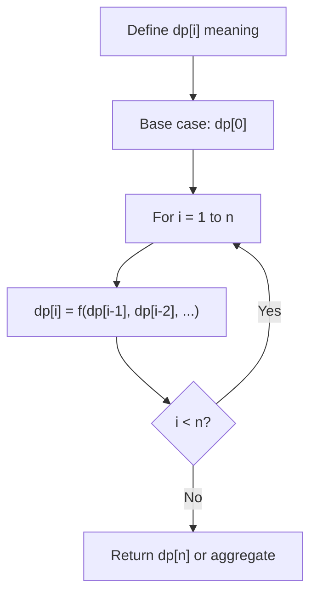
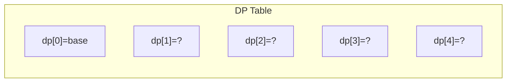
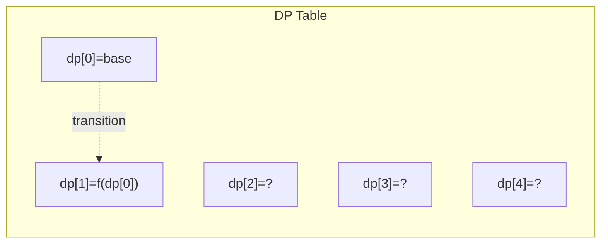
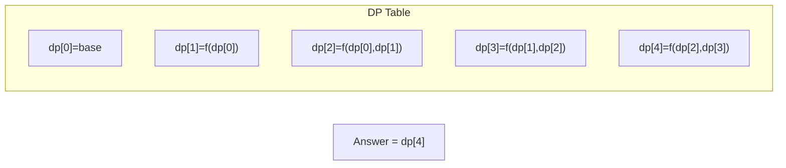

# Problem 2420: Find All Good Indices

**Difficulty:** Medium  
**Tags:** Array, Dynamic Programming, Prefix Sum  
**Pattern:** Dynamic Programming (1D)  
**Link:** [leetcode.com/problems/find-all-good-indices](https://leetcode.com/problems/find-all-good-indices/)

## Description

You are given a **0-indexed** integer array `nums` of size `n` and a positive integer `k`.

We call an index `i` in the range `k <= i < n - k` **good** if the following conditions are satisfied:

	- The `k` elements that are just **before** the index `i` are in **non-increasing** order.
	- The `k` elements that are just **after** the index `i` are in **non-decreasing** order.

Return *an array of all good indices sorted in **increasing** order*.

 

Example 1:

```

**Input:** nums = [2,1,1,1,3,4,1], k = 2
**Output:** [2,3]
**Explanation:** There are two good indices in the array:
- Index 2. The subarray [2,1] is in non-increasing order, and the subarray [1,3] is in non-decreasing order.
- Index 3. The subarray [1,1] is in non-increasing order, and the subarray [3,4] is in non-decreasing order.
Note that the index 4 is not good because [4,1] is not non-decreasing.
```

Example 2:

```

**Input:** nums = [2,1,1,2], k = 2
**Output:** []
**Explanation:** There are no good indices in this array.

```

 

**Constraints:**

	- `n == nums.length`
	- `3 <= n <= 10^5`
	- `1 <= nums[i] <= 10^6`
	- `1 <= k <= n / 2`

## Approach: Dynamic Programming (1D)

Break the problem into overlapping subproblems. Define dp[i] as the optimal value for the subproblem ending at or considering index i. Build the solution bottom-up, using previously computed dp values.

## Pseudocode

```
1. Define dp[i] = optimal value for subproblem i
2. Base case: dp[0] = initial value
3. For i from 1 to n:
   a. dp[i] = recurrence(dp[i-1], dp[i-2], ...)
4. Return dp[n] or max/min of dp
```

## Algorithm Flow



## Visual State Transitions

**1D Dynamic Programming Table Build:**

**Frame 1: Initialize base cases**


**Frame 2: Fill dp[1] from dp[0]**


**Frame 3: Fill remaining cells**



## Complexity Analysis

- **Time:** O(n)
- **Space:** O(n)

## Solution (Python3)

```python
class Solution:
    def goodIndices(self, nums: List[int], k: int) -> List[int]:
        # Dynamic programming (1D) - O(n) time, O(n) space
        if not nums:
            return 0
        n = len(nums) if isinstance(nums, list) else nums
        dp = [0] * (n + 1)
        dp[0] = 1  # base case
        for i in range(1, n + 1):
            dp[i] = dp[i-1]  # transition (customize per problem)
            if i >= 2:
                dp[i] += dp[i-2]
        return dp[n]
```

## Solution (C++)

```cpp
#include <string>
#include <vector>
using namespace std;

class Solution {
public:
    vector<int> goodIndices(vector<int>& nums, int k) {
        // Dynamic programming (1D) - O(n) time, O(n) space
        int n = nums;
        if (n <= 0) return 0;
        vector<int> dp(n + 1, 0);
        dp[0] = 1;
        for (int i = 1; i <= n; i++) {
            dp[i] = dp[i-1];
            if (i >= 2) dp[i] += dp[i-2];
        }
        return dp[n];
    }
};
```
