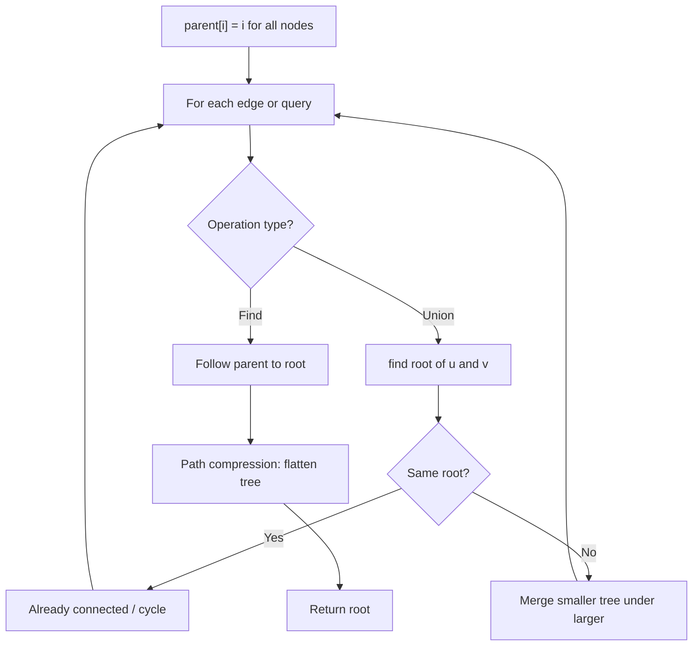
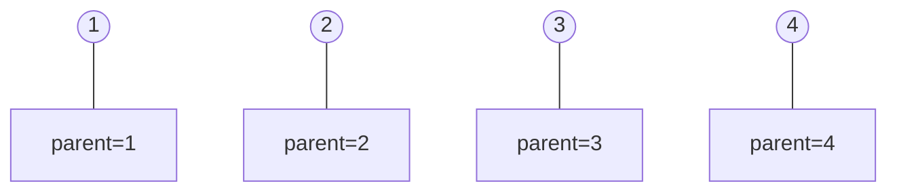
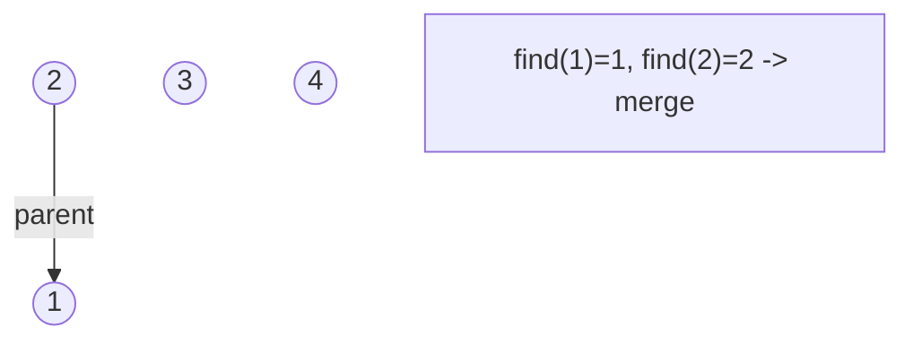
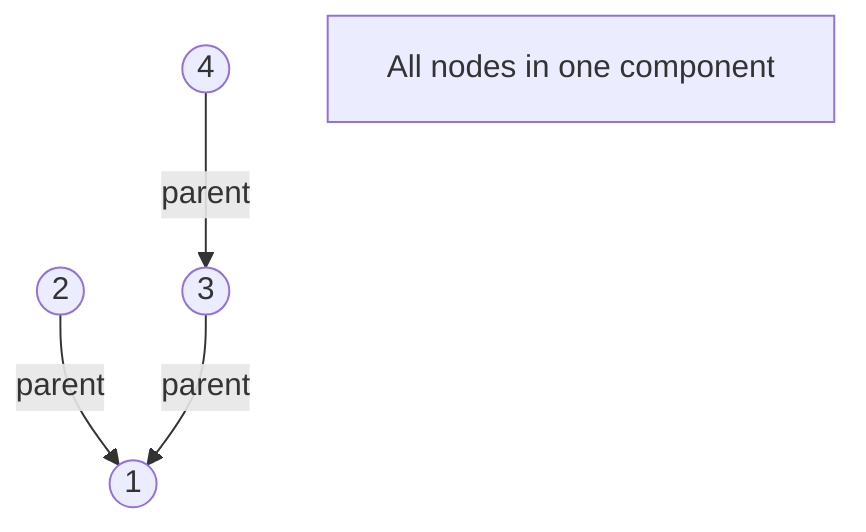
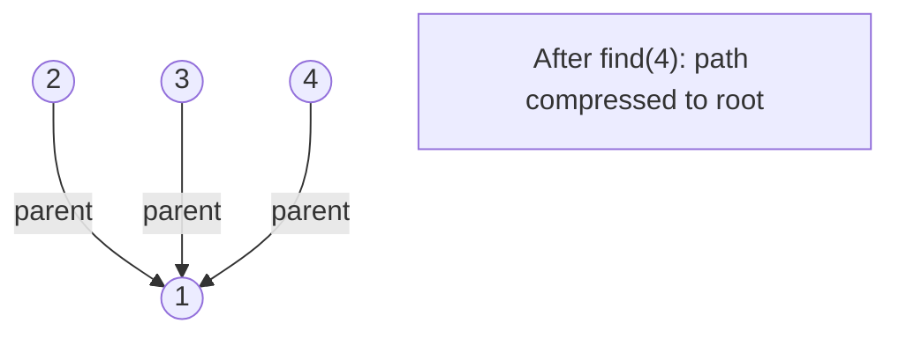

# Problem 2421: Number of Good Paths

**Difficulty:** Hard  
**Tags:** Array, Hash Table, Tree, Union-Find, Graph Theory, Sorting  
**Pattern:** Union-Find / Disjoint Set  
**Link:** [leetcode.com/problems/number-of-good-paths](https://leetcode.com/problems/number-of-good-paths/)

## Description

There is a tree (i.e. a connected, undirected graph with no cycles) consisting of `n` nodes numbered from `0` to `n - 1` and exactly `n - 1` edges.

You are given a **0-indexed** integer array `vals` of length `n` where `vals[i]` denotes the value of the `i^th` node. You are also given a 2D integer array `edges` where `edges[i] = [ai, bi]` denotes that there exists an **undirected** edge connecting nodes `ai` and `bi`.

A **good path** is a simple path that satisfies the following conditions:

	- The starting node and the ending node have the **same** value.
	- All nodes between the starting node and the ending node have values **less than or equal to** the starting node (i.e. the starting node's value should be the maximum value along the path).

Return *the number of distinct good paths*.

Note that a path and its reverse are counted as the **same** path. For example, `0 -> 1` is considered to be the same as `1 -> 0`. A single node is also considered as a valid path.

 

Example 1:

```

**Input:** vals = [1,3,2,1,3], edges = [[0,1],[0,2],[2,3],[2,4]]
**Output:** 6
**Explanation:** There are 5 good paths consisting of a single node.
There is 1 additional good path: 1 -> 0 -> 2 -> 4.
(The reverse path 4 -> 2 -> 0 -> 1 is treated as the same as 1 -> 0 -> 2 -> 4.)
Note that 0 -> 2 -> 3 is not a good path because vals[2] > vals[0].

```

Example 2:

```

**Input:** vals = [1,1,2,2,3], edges = [[0,1],[1,2],[2,3],[2,4]]
**Output:** 7
**Explanation:** There are 5 good paths consisting of a single node.
There are 2 additional good paths: 0 -> 1 and 2 -> 3.

```

Example 3:

```

**Input:** vals = [1], edges = []
**Output:** 1
**Explanation:** The tree consists of only one node, so there is one good path.

```

 

**Constraints:**

	- `n == vals.length`
	- `1 <= n <= 3 * 10^4`
	- `0 <= vals[i] <= 10^5`
	- `edges.length == n - 1`
	- `edges[i].length == 2`
	- `0 <= ai, bi < n`
	- `ai != bi`
	- `edges` represents a valid tree.

## Approach: Union-Find / Disjoint Set

Use Union-Find with path compression and union by rank to efficiently manage connected components. Find(x) returns the root of x's component; Union(x,y) merges two components.

## Pseudocode

```
1. parent[i] = i for all nodes (each is its own set)
2. find(x): follow parent pointers to root (with path compression)
3. union(x, y): merge sets of x and y by rank
4. Process edges/operations:
   a. For each edge (u, v): union(u, v)
5. Answer queries using find()
```

## Algorithm Flow



## Visual State Transitions

**Union-Find Step-by-Step:**

**Frame 1: Initial - each node is own parent**


**Frame 2: Union(1,2) - merge components**


**Frame 3: Union(3,4) then Union(2,3)**


**Frame 4: Path compression on find(4)**



## Complexity Analysis

- **Time:** O(n * alpha(n))
- **Space:** O(n)

## Solution (Python3)

```python
class Solution:
    def numberOfGoodPaths(self, vals: List[int], edges: List[List[int]]) -> int:
        # Union Find (Disjoint Set Union) - O(n * alpha(n))
        parent = list(range(len(vals) + 1 if isinstance(vals, list) else vals + 1))
        rank = [0] * len(parent)
        
        def find(x):
            if parent[x] != x:
                parent[x] = find(parent[x])
            return parent[x]
        
        def union(x, y):
            px, py = find(x), find(y)
            if px == py:
                return False
            if rank[px] < rank[py]:
                px, py = py, px
            parent[py] = px
            if rank[px] == rank[py]:
                rank[px] += 1
            return True
        
        components = len(parent)
        # Process edges/connections
        return components
```

## Solution (C++)

```cpp
#include <functional>
#include <numeric>
#include <string>
#include <vector>
using namespace std;

class Solution {
public:
    int numberOfGoodPaths(vector<int>& vals, vector<vector<int>>& edges) {
        // Union Find (DSU) - O(n * alpha(n))
        int n = vals.size();
        vector<int> parent(n + 1), rnk(n + 1, 0);
        iota(parent.begin(), parent.end(), 0);
        function<int(int)> find = [&](int x) -> int {
            return parent[x] == x ? x : parent[x] = find(parent[x]);
        };
        auto unite = [&](int x, int y) -> bool {
            int px = find(x), py = find(y);
            if (px == py) return false;
            if (rnk[px] < rnk[py]) swap(px, py);
            parent[py] = px;
            if (rnk[px] == rnk[py]) rnk[px]++;
            return true;
        };
        int components = n;
        return components;
    }
};
```
