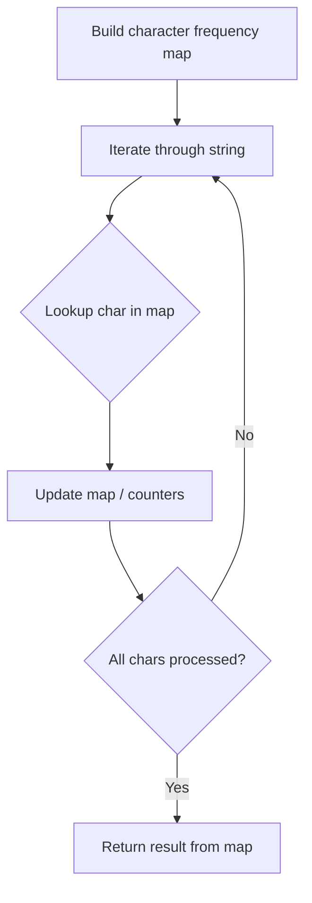

# Problem 2423: Remove Letter To Equalize Frequency

**Difficulty:** Easy  
**Tags:** Hash Table, String, Counting  
**Pattern:** Hash Map String Processing  
**Link:** [leetcode.com/problems/remove-letter-to-equalize-frequency](https://leetcode.com/problems/remove-letter-to-equalize-frequency/)

## Description

You are given a **0-indexed** string `word`, consisting of lowercase English letters. You need to select **one** index and **remove** the letter at that index from `word` so that the **frequency** of every letter present in `word` is equal.

Return* *`true`* if it is possible to remove one letter so that the frequency of all letters in *`word`* are equal, and *`false`* otherwise*.

**Note:**

	- The **frequency** of a letter `x` is the number of times it occurs in the string.
	- You **must** remove exactly one letter and cannot choose to do nothing.

 

Example 1:

```

**Input:** word = "abcc"
**Output:** true
**Explanation:** Select index 3 and delete it: word becomes "abc" and each character has a frequency of 1.

```

Example 2:

```

**Input:** word = "aazz"
**Output:** false
**Explanation:** We must delete a character, so either the frequency of "a" is 1 and the frequency of "z" is 2, or vice versa. It is impossible to make all present letters have equal frequency.

```

 

**Constraints:**

	- `2 <= word.length <= 100`
	- `word` consists of lowercase English letters only.

## Approach: Hash Map String Processing

Use a hash map to count character frequencies or map characters/strings for O(1) lookups. Process the string in one or two passes.

## Pseudocode

```
1. Build frequency map / char-to-index map
2. Iterate through string:
   a. Look up character in map
   b. Update counts or mappings
3. Return result based on map state
```

## Algorithm Flow



## Complexity Analysis

- **Time:** O(n)
- **Space:** O(n)

## Solution (Python3)

```python
class Solution:
    def equalFrequency(self, word: str) -> bool:
        # Hash map for string/character frequency - O(n) time
        freq = {}
        for ch in word:
            freq[ch] = freq.get(ch, 0) + 1
        # Process frequency map
        for ch, cnt in freq.items():
            if cnt == 1:
                return word.index(ch)
        return False
```

## Solution (C++)

```cpp
#include <string>
#include <unordered_map>
#include <vector>
using namespace std;

class Solution {
public:
    bool equalFrequency(string& word) {
        // Hash map for string/character frequency - O(n) time
        unordered_map<char, int> freq;
        for (char ch : word) {
            freq[ch]++;
        }
        // Process frequency map
        for (int i = 0; i < word.size(); i++) {
            if (freq[word[i]] == 1) return i;
        }
        return false;
    }
};
```
