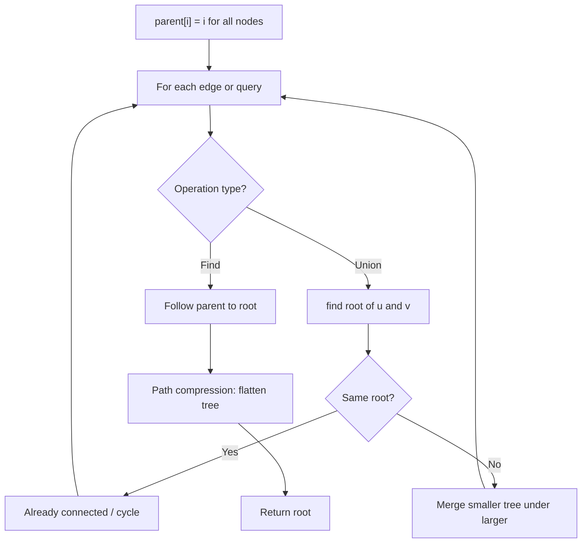
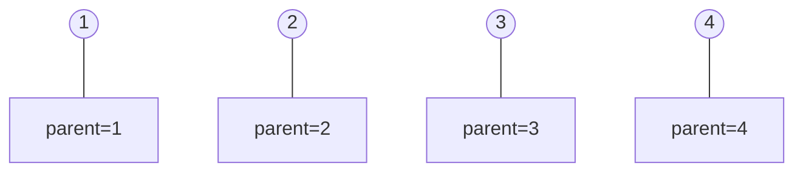
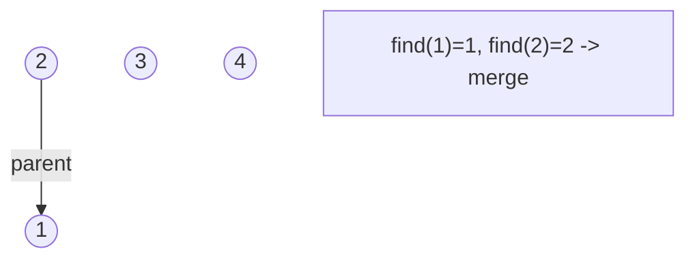
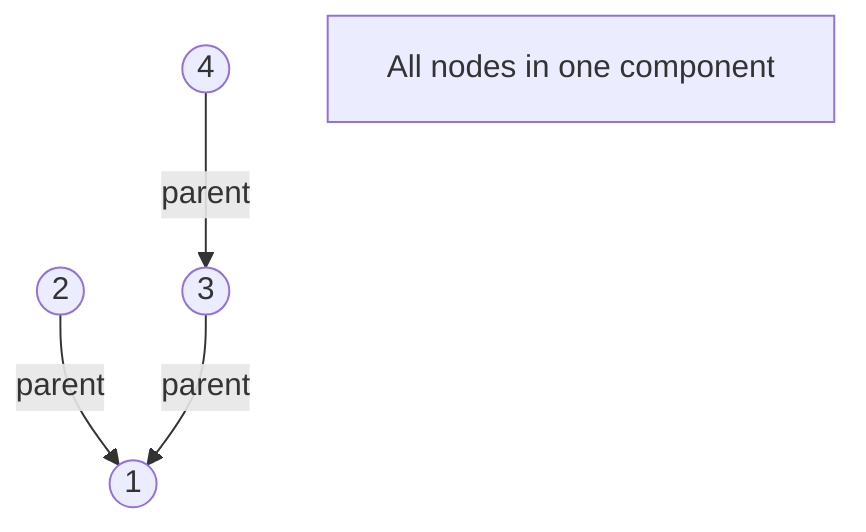
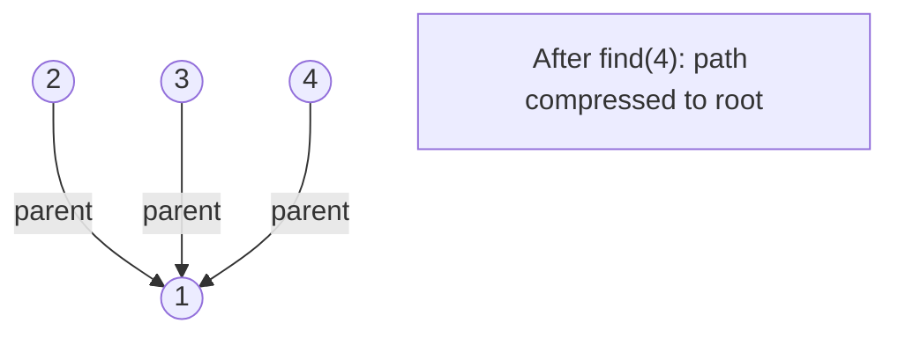

# Problem 2424: Longest Uploaded Prefix

**Difficulty:** Medium  
**Tags:** Hash Table, Binary Search, Union-Find, Design, Binary Indexed Tree, Segment Tree, Heap (Priority Queue), Ordered Set  
**Pattern:** Union-Find / Disjoint Set  
**Link:** [leetcode.com/problems/longest-uploaded-prefix](https://leetcode.com/problems/longest-uploaded-prefix/)

## Description

You are given a stream of `n` videos, each represented by a **distinct** number from `1` to `n` that you need to "upload" to a server. You need to implement a data structure that calculates the length of the **longest uploaded prefix** at various points in the upload process.

We consider `i` to be an uploaded prefix if all videos in the range `1` to `i` (**inclusive**) have been uploaded to the server. The longest uploaded prefix is the **maximum **value of `i` that satisfies this definition.

Implement the `LUPrefix `class:

	- `LUPrefix(int n)` Initializes the object for a stream of `n` videos.
	- `void upload(int video)` Uploads `video` to the server.
	- `int longest()` Returns the length of the **longest uploaded prefix** defined above.

 

Example 1:

```

**Input**
["LUPrefix", "upload", "longest", "upload", "longest", "upload", "longest"]
[[4], [3], [], [1], [], [2], []]
**Output**
[null, null, 0, null, 1, null, 3]

**Explanation**
LUPrefix server = new LUPrefix(4);   // Initialize a stream of 4 videos.
server.upload(3);                    // Upload video 3.
server.longest();                    // Since video 1 has not been uploaded yet, there is no prefix.
                                     // So, we return 0.
server.upload(1);                    // Upload video 1.
server.longest();                    // The prefix [1] is the longest uploaded prefix, so we return 1.
server.upload(2);                    // Upload video 2.
server.longest();                    // The prefix [1,2,3] is the longest uploaded prefix, so we return 3.

```

 

**Constraints:**

	- `1 <= n <= 10^5`
	- `1 <= video <= n`
	- All values of `video` are **distinct**.
	- At most `2 * 10^5` calls **in total** will be made to `upload` and `longest`.
	- At least one call will be made to `longest`.

## Approach: Union-Find / Disjoint Set

Use Union-Find with path compression and union by rank to efficiently manage connected components. Find(x) returns the root of x's component; Union(x,y) merges two components.

## Pseudocode

```
1. parent[i] = i for all nodes (each is its own set)
2. find(x): follow parent pointers to root (with path compression)
3. union(x, y): merge sets of x and y by rank
4. Process edges/operations:
   a. For each edge (u, v): union(u, v)
5. Answer queries using find()
```

## Algorithm Flow



## Visual State Transitions

**Union-Find Step-by-Step:**

**Frame 1: Initial - each node is own parent**


**Frame 2: Union(1,2) - merge components**


**Frame 3: Union(3,4) then Union(2,3)**


**Frame 4: Path compression on find(4)**



## Complexity Analysis

- **Time:** O(n * alpha(n))
- **Space:** O(n)

## Solution (Python3)

```python
class LUPrefix:
    def __init__(self, n: int):
        # Initialize data structure
        self.n = n

    def upload(self, video: int) -> None:
        return None

    def longest(self) -> int:
        return 0

```

## Solution (C++)

```cpp
#include <functional>
#include <numeric>
#include <string>
#include <vector>
using namespace std;

class LUPrefix {
public:
    LUPrefix(int n) {
        // Initialize
    }

    void upload(int video) {
        return ;
    }

    int longest() {
        return 0;
    }

};
```
