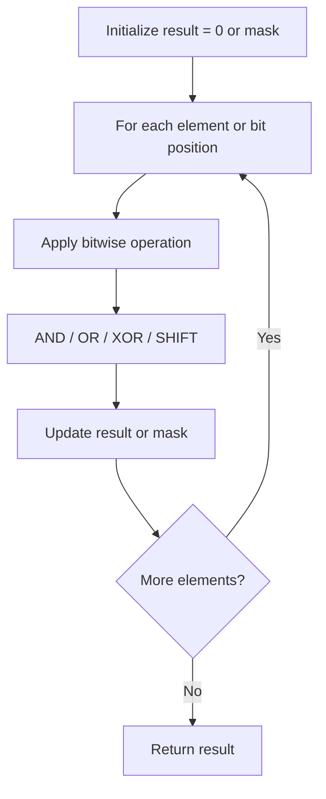

# Problem 2425: Bitwise XOR of All Pairings

**Difficulty:** Medium  
**Tags:** Array, Bit Manipulation, Brainteaser  
**Pattern:** Bit Manipulation  
**Link:** [leetcode.com/problems/bitwise-xor-of-all-pairings](https://leetcode.com/problems/bitwise-xor-of-all-pairings/)

## Description

You are given two **0-indexed** arrays, `nums1` and `nums2`, consisting of non-negative integers. Let there be another array, `nums3`, which contains the bitwise XOR of **all pairings** of integers between `nums1` and `nums2` (every integer in `nums1` is paired with every integer in `nums2` **exactly once**).

Return* the **bitwise XOR** of all integers in *`nums3`.

 

Example 1:

```

**Input:** nums1 = [2,1,3], nums2 = [10,2,5,0]
**Output:** 13
**Explanation:**
A possible nums3 array is [8,0,7,2,11,3,4,1,9,1,6,3].
The bitwise XOR of all these numbers is 13, so we return 13.

```

Example 2:

```

**Input:** nums1 = [1,2], nums2 = [3,4]
**Output:** 0
**Explanation:**
All possible pairs of bitwise XORs are nums1[0] ^ nums2[0], nums1[0] ^ nums2[1], nums1[1] ^ nums2[0],
and nums1[1] ^ nums2[1].
Thus, one possible nums3 array is [2,5,1,6].
2 ^ 5 ^ 1 ^ 6 = 0, so we return 0.

```

 

**Constraints:**

	- `1 <= nums1.length, nums2.length <= 10^5`
	- `0 <= nums1[i], nums2[j] <= 10^9`

## Approach: Bit Manipulation

Operate on individual bits using bitwise operators (AND, OR, XOR, shift). Common tricks: x & (x-1) removes lowest set bit, x ^ x = 0, XOR all elements to find unique.

## Pseudocode

```
1. Apply bitwise operations:
   - XOR all elements to cancel paired bits
   - Use bitmask to track state
   - Shift and mask to extract/set individual bits
2. Return result
```

## Algorithm Flow



## Complexity Analysis

- **Time:** O(n) or O(log n)
- **Space:** O(1)

## Solution (Python3)

```python
class Solution:
    def xorAllNums(self, nums1: List[int], nums2: List[int]) -> int:
        # Bit manipulation - O(n) time, O(1) space
        result = 0
        for val in nums1:
            result ^= val
        return result
```

## Solution (C++)

```cpp
#include <string>
#include <vector>
using namespace std;

class Solution {
public:
    int xorAllNums(vector<int>& nums1, vector<int>& nums2) {
        // Bit manipulation - O(n) time, O(1) space
        int result = 0;
        for (int val : nums1) {
            result ^= val;
        }
        return result;
    }
};
```
