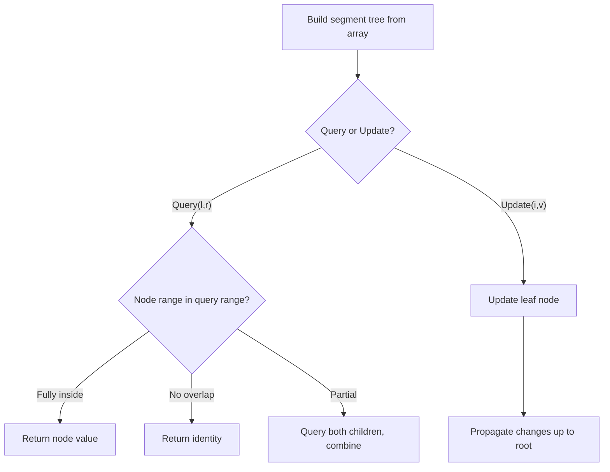

# Problem 2426: Number of Pairs Satisfying Inequality

**Difficulty:** Hard  
**Tags:** Array, Binary Search, Divide and Conquer, Binary Indexed Tree, Segment Tree, Merge Sort, Ordered Set  
**Pattern:** Segment Tree  
**Link:** [leetcode.com/problems/number-of-pairs-satisfying-inequality](https://leetcode.com/problems/number-of-pairs-satisfying-inequality/)

## Description

You are given two **0-indexed** integer arrays `nums1` and `nums2`, each of size `n`, and an integer `diff`. Find the number of **pairs** `(i, j)` such that:

	- `0 <= i < j <= n - 1` **and**
	- `nums1[i] - nums1[j] <= nums2[i] - nums2[j] + diff`.

Return* the **number of pairs** that satisfy the conditions.*

 

Example 1:

```

**Input:** nums1 = [3,2,5], nums2 = [2,2,1], diff = 1
**Output:** 3
**Explanation:**
There are 3 pairs that satisfy the conditions:
1. i = 0, j = 1: 3 - 2 <= 2 - 2 + 1. Since i < j and 1 <= 1, this pair satisfies the conditions.
2. i = 0, j = 2: 3 - 5 <= 2 - 1 + 1. Since i < j and -2 <= 2, this pair satisfies the conditions.
3. i = 1, j = 2: 2 - 5 <= 2 - 1 + 1. Since i < j and -3 <= 2, this pair satisfies the conditions.
Therefore, we return 3.

```

Example 2:

```

**Input:** nums1 = [3,-1], nums2 = [-2,2], diff = -1
**Output:** 0
**Explanation:**
Since there does not exist any pair that satisfies the conditions, we return 0.

```

 

**Constraints:**

	- `n == nums1.length == nums2.length`
	- `2 <= n <= 10^5`
	- `-10^4 <= nums1[i], nums2[i] <= 10^4`
	- `-10^4 <= diff <= 10^4`

## Approach: Segment Tree

Build a segment tree for range queries (sum, min, max) with point or range updates. Each node covers a range; queries are answered by combining relevant segments.

## Pseudocode

```
1. Build segment tree from array (O(n))
2. Query(l, r):
   - If node range within [l,r]: return node value
   - If no overlap: return identity
   - Else: combine query(left_child) and query(right_child)
3. Update(i, val): update leaf and propagate up
```

## Algorithm Flow



## Complexity Analysis

- **Time:** O(n log n) build, O(log n) query/update
- **Space:** O(n)

## Solution (Python3)

```python
class Solution:
    def numberOfPairs(self, nums1: List[int], nums2: List[int], diff: int) -> int:
        # Segment tree for range queries - O(n log n) build, O(log n) query
        n = len(nums1)
        tree = [0] * (4 * n)
        
        def build(node, start, end):
            if start == end:
                tree[node] = nums1[start]
                return
            mid = (start + end) // 2
            build(2*node, start, mid)
            build(2*node+1, mid+1, end)
            tree[node] = tree[2*node] + tree[2*node+1]
        
        def query(node, start, end, l, r):
            if r < start or end < l:
                return 0
            if l <= start and end <= r:
                return tree[node]
            mid = (start + end) // 2
            return query(2*node, start, mid, l, r) + query(2*node+1, mid+1, end, l, r)
        
        build(1, 0, n-1)
        return 0
```

## Solution (C++)

```cpp
#include <functional>
#include <string>
#include <vector>
using namespace std;

class Solution {
public:
    int numberOfPairs(vector<int>& nums1, vector<int>& nums2, int diff) {
        // Segment tree for range queries
        int n = nums1.size();
        vector<int> tree(4 * n, 0);
        function<void(int, int, int)> build = [&](int node, int s, int e) {
            if (s == e) { tree[node] = nums1[s]; return; }
            int mid = (s + e) / 2;
            build(2*node, s, mid);
            build(2*node+1, mid+1, e);
            tree[node] = tree[2*node] + tree[2*node+1];
        };
        function<int(int, int, int, int, int)> query = [&](int node, int s, int e, int l, int r) -> int {
            if (r < s || e < l) return 0;
            if (l <= s && e <= r) return tree[node];
            int mid = (s + e) / 2;
            return query(2*node, s, mid, l, r) + query(2*node+1, mid+1, e, l, r);
        };
        build(1, 0, n-1);
        return 0;
    }
};
```
