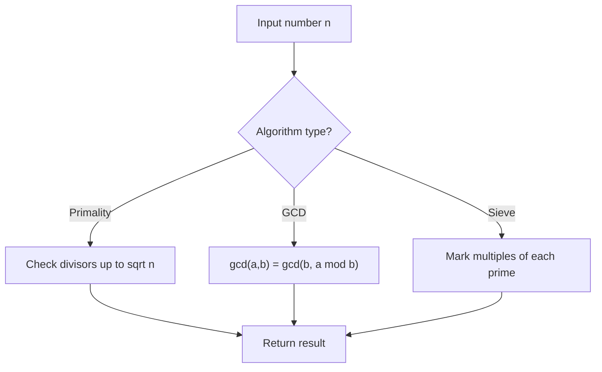

# Problem 2427: Number of Common Factors

**Difficulty:** Easy  
**Tags:** Math, Enumeration, Number Theory  
**Pattern:** Number Theory  
**Link:** [leetcode.com/problems/number-of-common-factors](https://leetcode.com/problems/number-of-common-factors/)

## Description

Given two positive integers `a` and `b`, return *the number of **common** factors of *`a`* and *`b`.

An integer `x` is a **common factor** of `a` and `b` if `x` divides both `a` and `b`.

 

Example 1:

```

**Input:** a = 12, b = 6
**Output:** 4
**Explanation:** The common factors of 12 and 6 are 1, 2, 3, 6.

```

Example 2:

```

**Input:** a = 25, b = 30
**Output:** 2
**Explanation:** The common factors of 25 and 30 are 1, 5.

```

 

**Constraints:**

	- `1 <= a, b <= 1000`

## Approach: Number Theory

Apply number theory: prime checking, factorization, GCD, modular exponentiation, sieve of Eratosthenes, or Euler's totient.

## Pseudocode

```
1. Apply number-theoretic algorithm:
   - Sieve for primes up to n
   - GCD via Euclidean algorithm
   - Modular exponentiation
2. Process results
3. Return answer
```

## Algorithm Flow



## Complexity Analysis

- **Time:** O(sqrt(n)) or O(n log log n)
- **Space:** O(n)

## Solution (Python3)

```python
class Solution:
    def commonFactors(self, a: int, b: int) -> int:
        # Number theory approach
        def gcd(a, b):
            while b:
                a, b = b, a % b
            return a
        
        result = a[0] if isinstance(a, list) else a
        if isinstance(a, list):
            for val in a[1:]:
                result = gcd(result, val)
        return result
```

## Solution (C++)

```cpp
#include <string>
#include <vector>
using namespace std;

class Solution {
public:
    int commonFactors(int a, int b) {
        // Number theory approach
        auto gcd_func = [](int a, int b) -> int {
            while (b) { int t = b; b = a % b; a = t; }
            return a;
        };
        int result = a[0];
        for (int i = 1; i < (int)a.size(); i++) {
            result = gcd_func(result, a[i]);
        }
        return result;
    }
};
```
