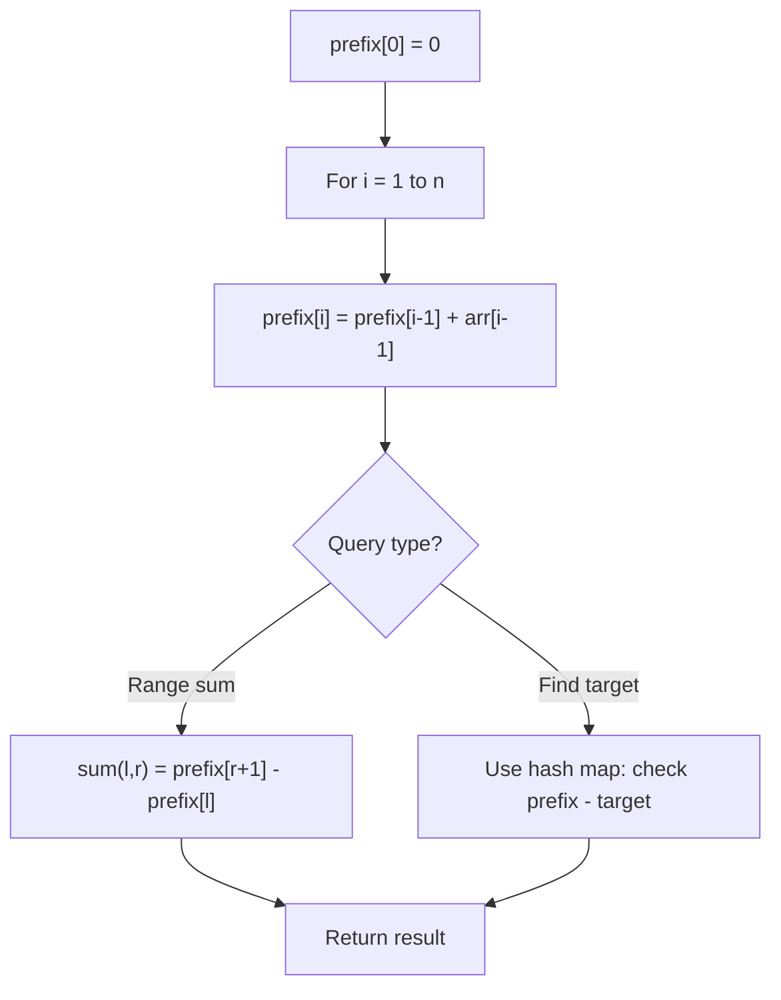

# Problem 2428: Maximum Sum of an Hourglass

**Difficulty:** Medium  
**Tags:** Array, Matrix, Prefix Sum  
**Pattern:** Prefix Sum  
**Link:** [leetcode.com/problems/maximum-sum-of-an-hourglass](https://leetcode.com/problems/maximum-sum-of-an-hourglass/)

## Description

You are given an `m x n` integer matrix `grid`.

We define an **hourglass** as a part of the matrix with the following form:

Return *the **maximum** sum of the elements of an hourglass*.

**Note** that an hourglass cannot be rotated and must be entirely contained within the matrix.

 

Example 1:

```

**Input:** grid = [[6,2,1,3],[4,2,1,5],[9,2,8,7],[4,1,2,9]]
**Output:** 30
**Explanation:** The cells shown above represent the hourglass with the maximum sum: 6 + 2 + 1 + 2 + 9 + 2 + 8 = 30.

```

Example 2:

```

**Input:** grid = [[1,2,3],[4,5,6],[7,8,9]]
**Output:** 35
**Explanation:** There is only one hourglass in the matrix, with the sum: 1 + 2 + 3 + 5 + 7 + 8 + 9 = 35.

```

 

**Constraints:**

	- `m == grid.length`
	- `n == grid[i].length`
	- `3 <= m, n <= 150`
	- `0 <= grid[i][j] <= 10^6`

## Approach: Prefix Sum

Build a prefix sum array where prefix[i] = sum of elements 0..i-1. Any subarray sum [l..r] = prefix[r+1] - prefix[l]. Combine with hash map for O(n) subarray sum queries.

## Pseudocode

```
1. Build prefix sum array: prefix[0]=0, prefix[i]=prefix[i-1]+arr[i-1]
2. Use prefix sums to answer queries:
   - Subarray sum [l..r] = prefix[r+1] - prefix[l]
   - Or use hash map to find prefix[j]-prefix[i] == target
3. Return result
```

## Algorithm Flow



## Complexity Analysis

- **Time:** O(n)
- **Space:** O(n)

## Solution (Python3)

```python
class Solution:
    def maxSum(self, grid: List[List[int]]) -> int:
        # Prefix sum approach - O(n) time, O(n) space
        prefix = {0: -1}
        curr_sum = 0
        result = 0
        target = grid if isinstance(grid, int) else 0
        for i, val in enumerate(grid):
            curr_sum += val
            if curr_sum - target in prefix:
                result = max(result, i - prefix[curr_sum - target])
            if curr_sum not in prefix:
                prefix[curr_sum] = i
        return result
```

## Solution (C++)

```cpp
#include <algorithm>
#include <string>
#include <unordered_map>
#include <vector>
using namespace std;

class Solution {
public:
    int maxSum(vector<vector<int>>& grid) {
        // Prefix sum approach - O(n) time, O(n) space
        unordered_map<int, int> prefix;
        prefix[0] = -1;
        int curr_sum = 0, result = 0;
        int target = grid;
        for (int i = 0; i < (int)grid.size(); i++) {
            curr_sum += grid[i];
            if (prefix.count(curr_sum - target)) {
                result = max(result, i - prefix[curr_sum - target]);
            }
            if (!prefix.count(curr_sum)) {
                prefix[curr_sum] = i;
            }
        }
        return result;
    }
};
```
