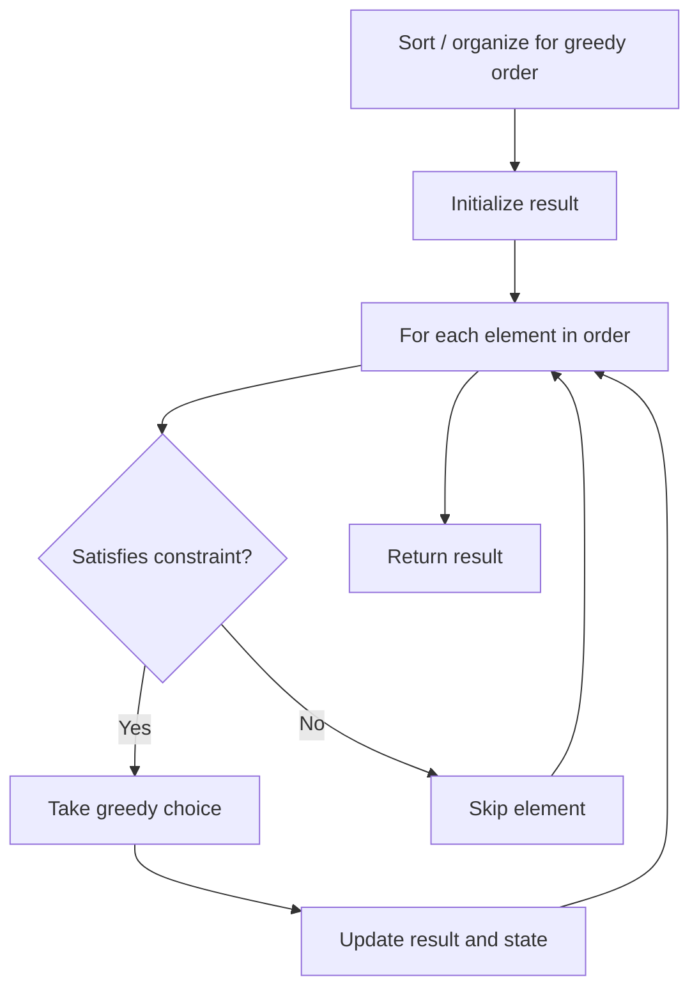

# Problem 2429: Minimize XOR

**Difficulty:** Medium  
**Tags:** Greedy, Bit Manipulation  
**Pattern:** Greedy  
**Link:** [leetcode.com/problems/minimize-xor](https://leetcode.com/problems/minimize-xor/)

## Description

Given two positive integers `num1` and `num2`, find the positive integer `x` such that:

	- `x` has the same number of set bits as `num2`, and
	- The value `x XOR num1` is **minimal**.

Note that `XOR` is the bitwise XOR operation.

Return *the integer *`x`. The test cases are generated such that `x` is **uniquely determined**.

The number of **set bits** of an integer is the number of `1`'s in its binary representation.

 

Example 1:

```

**Input:** num1 = 3, num2 = 5
**Output:** 3
**Explanation:**
The binary representations of num1 and num2 are 0011 and 0101, respectively.
The integer **3** has the same number of set bits as num2, and the value `3 XOR 3 = 0` is minimal.

```

Example 2:

```

**Input:** num1 = 1, num2 = 12
**Output:** 3
**Explanation:**
The binary representations of num1 and num2 are 0001 and 1100, respectively.
The integer **3** has the same number of set bits as num2, and the value `3 XOR 1 = 2` is minimal.

```

 

**Constraints:**

	- `1 <= num1, num2 <= 10^9`

## Approach: Greedy

Make the locally optimal choice at each step, trusting it leads to a global optimum. Greedy works when the problem has the greedy-choice property and optimal substructure.

## Pseudocode

```
1. Sort or organize data for greedy ordering
2. Initialize result
3. For each element in greedy order:
   a. If element satisfies constraint:
      - Take the greedy choice
      - Update result and state
4. Return result
```

## Algorithm Flow



## Complexity Analysis

- **Time:** O(n log n)
- **Space:** O(1)

## Solution (Python3)

```python
class Solution:
    def minimizeXor(self, num1: int, num2: int) -> int:
        # Greedy approach - O(n) time
        result = 0
        curr_max = 0
        for i in range(len(num1)):
            if isinstance(num1[i], int):
                curr_max = max(curr_max, num1[i])
                result = max(result, curr_max)
            else:
                result += 1
        return result
```

## Solution (C++)

```cpp
#include <algorithm>
#include <string>
#include <vector>
using namespace std;

class Solution {
public:
    int minimizeXor(int num1, int num2) {
        // Greedy approach - O(n) time
        int result = 0, curr_max = 0;
        for (int i = 0; i < (int)num1.size(); i++) {
            curr_max = max(curr_max, num1[i]);
            result = max(result, curr_max);
        }
        return result;
    }
};
```
