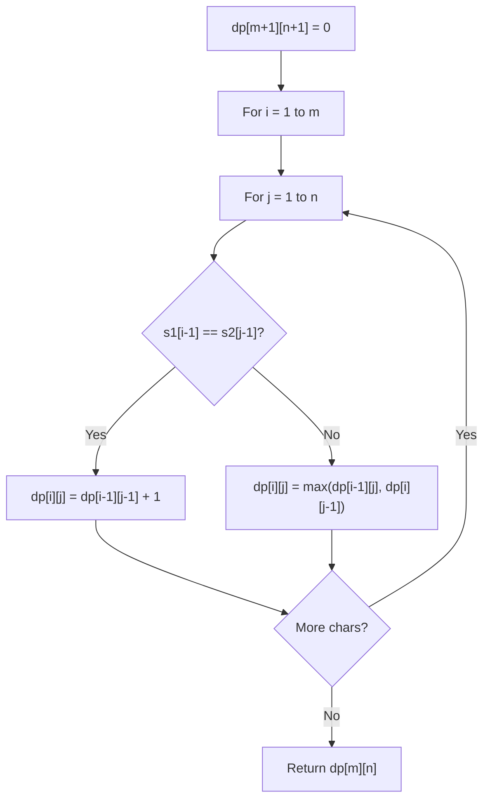

# Problem 2430: Maximum Deletions on a String

**Difficulty:** Hard  
**Tags:** String, Dynamic Programming, Rolling Hash, String Matching, Hash Function  
**Pattern:** Dynamic Programming (String)  
**Link:** [leetcode.com/problems/maximum-deletions-on-a-string](https://leetcode.com/problems/maximum-deletions-on-a-string/)

## Description

You are given a string `s` consisting of only lowercase English letters. In one operation, you can:

	- Delete **the entire string** `s`, or
	- Delete the **first** `i` letters of `s` if the first `i` letters of `s` are **equal** to the following `i` letters in `s`, for any `i` in the range `1 <= i <= s.length / 2`.

For example, if `s = "ababc"`, then in one operation, you could delete the first two letters of `s` to get `"abc"`, since the first two letters of `s` and the following two letters of `s` are both equal to `"ab"`.

Return *the **maximum** number of operations needed to delete all of *`s`.

 

Example 1:

```

**Input:** s = "abcabcdabc"
**Output:** 2
**Explanation:**
- Delete the first 3 letters ("abc") since the next 3 letters are equal. Now, s = "abcdabc".
- Delete all the letters.
We used 2 operations so return 2. It can be proven that 2 is the maximum number of operations needed.
Note that in the second operation we cannot delete "abc" again because the next occurrence of "abc" does not happen in the next 3 letters.

```

Example 2:

```

**Input:** s = "aaabaab"
**Output:** 4
**Explanation:**
- Delete the first letter ("a") since the next letter is equal. Now, s = "aabaab".
- Delete the first 3 letters ("aab") since the next 3 letters are equal. Now, s = "aab".
- Delete the first letter ("a") since the next letter is equal. Now, s = "ab".
- Delete all the letters.
We used 4 operations so return 4. It can be proven that 4 is the maximum number of operations needed.

```

Example 3:

```

**Input:** s = "aaaaa"
**Output:** 5
**Explanation:** In each operation, we can delete the first letter of s.

```

 

**Constraints:**

	- `1 <= s.length <= 4000`
	- `s` consists only of lowercase English letters.

## Approach: Dynamic Programming (String)

Compare or match two strings using a 2D DP table. dp[i][j] represents the answer for substrings s1[0..i-1] and s2[0..j-1]. Common patterns: LCS, edit distance, regex matching.

## Pseudocode

```
1. Create dp[m+1][n+1]
2. Initialize base cases
3. For i from 1 to m:
   For j from 1 to n:
     If s1[i-1] == s2[j-1]: dp[i][j] = dp[i-1][j-1] + 1
     Else: dp[i][j] = best of (dp[i-1][j], dp[i][j-1], dp[i-1][j-1])
4. Return dp[m][n]
```

## Algorithm Flow



## Complexity Analysis

- **Time:** O(m * n)
- **Space:** O(m * n)

## Solution (Python3)

```python
class Solution:
    def deleteString(self, s: str) -> int:
        # String DP - O(m*n) time and space
        m, n = len(s), len(s)
        dp = [[0] * (n + 1) for _ in range(m + 1)]
        for i in range(1, m + 1):
            for j in range(1, n + 1):
                if s[i-1] == s[j-1]:
                    dp[i][j] = dp[i-1][j-1] + 1
                else:
                    dp[i][j] = max(dp[i-1][j], dp[i][j-1])
        return dp[m][n]
```

## Solution (C++)

```cpp
#include <algorithm>
#include <string>
#include <vector>
using namespace std;

class Solution {
public:
    int deleteString(string& s) {
        // String DP - O(m*n) time and space
        int m = s.size(), n = s.size();
        vector<vector<int>> dp(m + 1, vector<int>(n + 1, 0));
        for (int i = 1; i <= m; i++) {
            for (int j = 1; j <= n; j++) {
                if (s[i-1] == s[j-1])
                    dp[i][j] = dp[i-1][j-1] + 1;
                else
                    dp[i][j] = max(dp[i-1][j], dp[i][j-1]);
            }
        }
        return dp[m][n];
    }
};
```
