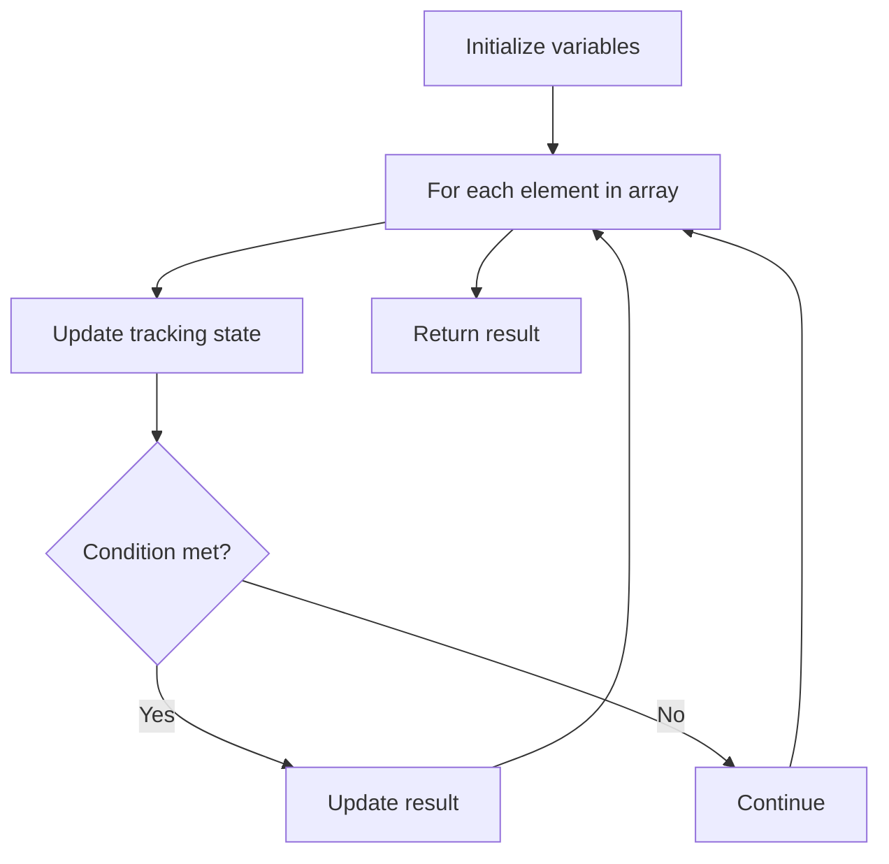

# Problem 2432: The Employee That Worked on the Longest Task

**Difficulty:** Easy  
**Tags:** Array  
**Pattern:** Array Processing  
**Link:** [leetcode.com/problems/the-employee-that-worked-on-the-longest-task](https://leetcode.com/problems/the-employee-that-worked-on-the-longest-task/)

## Description

There are `n` employees, each with a unique id from `0` to `n - 1`.

You are given a 2D integer array `logs` where `logs[i] = [idi, leaveTimei]` where:

	- `idi` is the id of the employee that worked on the `i^th` task, and
	- `leaveTimei` is the time at which the employee finished the `i^th` task. All the values `leaveTimei` are **unique**.

Note that the `i^th` task starts the moment right after the `(i - 1)^th` task ends, and the `0^th` task starts at time `0`.

Return *the id of the employee that worked the task with the longest time.* If there is a tie between two or more employees, return* the **smallest** id among them*.

 

Example 1:

```

**Input:** n = 10, logs = [[0,3],[2,5],[0,9],[1,15]]
**Output:** 1
**Explanation:** 
Task 0 started at 0 and ended at 3 with 3 units of times.
Task 1 started at 3 and ended at 5 with 2 units of times.
Task 2 started at 5 and ended at 9 with 4 units of times.
Task 3 started at 9 and ended at 15 with 6 units of times.
The task with the longest time is task 3 and the employee with id 1 is the one that worked on it, so we return 1.

```

Example 2:

```

**Input:** n = 26, logs = [[1,1],[3,7],[2,12],[7,17]]
**Output:** 3
**Explanation:** 
Task 0 started at 0 and ended at 1 with 1 unit of times.
Task 1 started at 1 and ended at 7 with 6 units of times.
Task 2 started at 7 and ended at 12 with 5 units of times.
Task 3 started at 12 and ended at 17 with 5 units of times.
The tasks with the longest time is task 1. The employee that worked on it is 3, so we return 3.

```

Example 3:

```

**Input:** n = 2, logs = [[0,10],[1,20]]
**Output:** 0
**Explanation:** 
Task 0 started at 0 and ended at 10 with 10 units of times.
Task 1 started at 10 and ended at 20 with 10 units of times.
The tasks with the longest time are tasks 0 and 1. The employees that worked on them are 0 and 1, so we return the smallest id 0.

```

 

**Constraints:**

	- `2 <= n <= 500`
	- `1 <= logs.length <= 500`
	- `logs[i].length == 2`
	- `0 <= idi <= n - 1`
	- `1 <= leaveTimei <= 500`
	- `idi != idi+1`
	- `leaveTimei` are sorted in a strictly increasing order.

## Approach: Array Processing

Process the array with a linear scan, tracking state variables. Look for patterns: running maximum/minimum, counting, or transformations.

## Pseudocode

```
1. Initialize tracking variables
2. Iterate through array:
   a. Update tracking state
   b. Check conditions
   c. Update result
3. Return result
```

## Algorithm Flow



## Complexity Analysis

- **Time:** O(n)
- **Space:** O(1)

## Solution (Python3)

```python
class Solution:
    def hardestWorker(self, n: int, logs: List[List[int]]) -> int:
        # Array processing - O(n) time
        result = 0
        for i in range(len(n)):
            # Process element
            pass
        return result
```

## Solution (C++)

```cpp
#include <string>
#include <vector>
using namespace std;

class Solution {
public:
    int hardestWorker(int n, vector<vector<int>>& logs) {
        // Array processing - O(n) time
        for (int i = 0; i < (int)n.size(); i++) {
            // Process element
        }
        return 0;
    }
};
```
