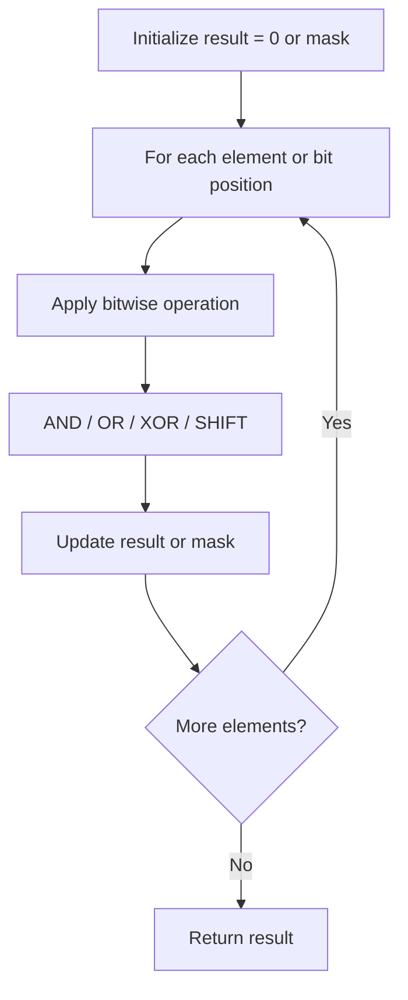

# Problem 2433: Find The Original Array of Prefix Xor

**Difficulty:** Medium  
**Tags:** Array, Bit Manipulation  
**Pattern:** Bit Manipulation  
**Link:** [leetcode.com/problems/find-the-original-array-of-prefix-xor](https://leetcode.com/problems/find-the-original-array-of-prefix-xor/)

## Description

You are given an **integer** array `pref` of size `n`. Find and return *the array *`arr`* of size *`n`* that satisfies*:

	- `pref[i] = arr[0] ^ arr[1] ^ ... ^ arr[i]`.

Note that `^` denotes the **bitwise-xor** operation.

It can be proven that the answer is **unique**.

 

Example 1:

```

**Input:** pref = [5,2,0,3,1]
**Output:** [5,7,2,3,2]
**Explanation:** From the array [5,7,2,3,2] we have the following:
- pref[0] = 5.
- pref[1] = 5 ^ 7 = 2.
- pref[2] = 5 ^ 7 ^ 2 = 0.
- pref[3] = 5 ^ 7 ^ 2 ^ 3 = 3.
- pref[4] = 5 ^ 7 ^ 2 ^ 3 ^ 2 = 1.

```

Example 2:

```

**Input:** pref = [13]
**Output:** [13]
**Explanation:** We have pref[0] = arr[0] = 13.

```

 

**Constraints:**

	- `1 <= pref.length <= 10^5`
	- `0 <= pref[i] <= 10^6`

## Approach: Bit Manipulation

Operate on individual bits using bitwise operators (AND, OR, XOR, shift). Common tricks: x & (x-1) removes lowest set bit, x ^ x = 0, XOR all elements to find unique.

## Pseudocode

```
1. Apply bitwise operations:
   - XOR all elements to cancel paired bits
   - Use bitmask to track state
   - Shift and mask to extract/set individual bits
2. Return result
```

## Algorithm Flow



## Complexity Analysis

- **Time:** O(n) or O(log n)
- **Space:** O(1)

## Solution (Python3)

```python
class Solution:
    def findArray(self, pref: List[int]) -> List[int]:
        # Bit manipulation - O(n) time, O(1) space
        result = 0
        for val in pref:
            result ^= val
        return result
```

## Solution (C++)

```cpp
#include <string>
#include <vector>
using namespace std;

class Solution {
public:
    vector<int> findArray(vector<int>& pref) {
        // Bit manipulation - O(n) time, O(1) space
        int result = 0;
        for (int val : pref) {
            result ^= val;
        }
        return result;
    }
};
```
