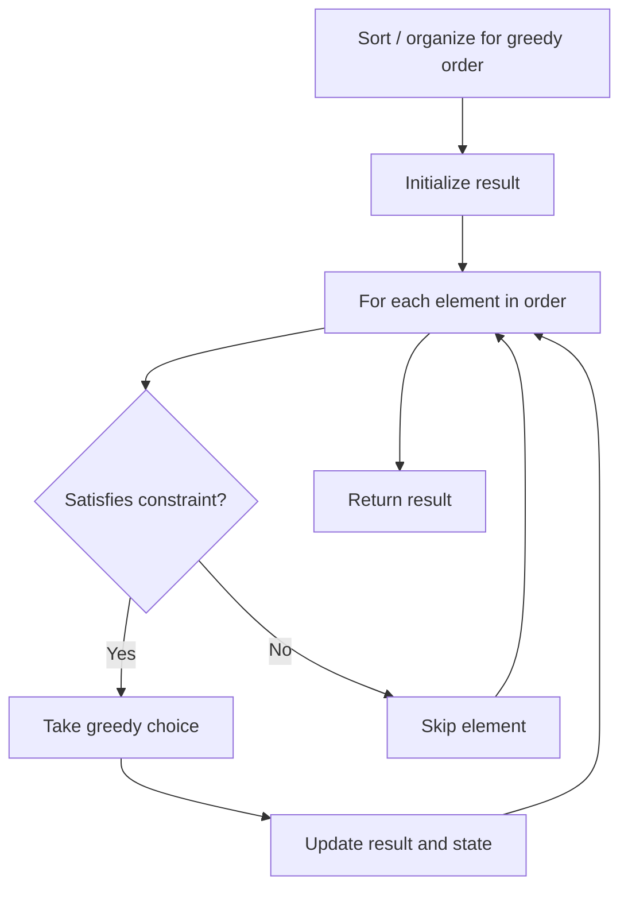

# Problem 2434: Using a Robot to Print the Lexicographically Smallest String

**Difficulty:** Medium  
**Tags:** Hash Table, String, Stack, Greedy  
**Pattern:** Greedy  
**Link:** [leetcode.com/problems/using-a-robot-to-print-the-lexicographically-smallest-string](https://leetcode.com/problems/using-a-robot-to-print-the-lexicographically-smallest-string/)

## Description

You are given a string `s` and a robot that currently holds an empty string `t`. Apply one of the following operations until `s` and `t` **are both empty**:

	- Remove the **first** character of a string `s` and give it to the robot. The robot will append this character to the string `t`.
	- Remove the **last** character of a string `t` and give it to the robot. The robot will write this character on paper.

Return *the lexicographically smallest string that can be written on the paper.*

 

Example 1:

```

**Input:** s = "zza"
**Output:** "azz"
**Explanation:** Let p denote the written string.
Initially p="", s="zza", t="".
Perform first operation three times p="", s="", t="zza".
Perform second operation three times p="azz", s="", t="".

```

Example 2:

```

**Input:** s = "bac"
**Output:** "abc"
**Explanation:** Let p denote the written string.
Perform first operation twice p="", s="c", t="ba". 
Perform second operation twice p="ab", s="c", t="". 
Perform first operation p="ab", s="", t="c". 
Perform second operation p="abc", s="", t="".

```

Example 3:

```

**Input:** s = "bdda"
**Output:** "addb"
**Explanation:** Let p denote the written string.
Initially p="", s="bdda", t="".
Perform first operation four times p="", s="", t="bdda".
Perform second operation four times p="addb", s="", t="".

```

 

**Constraints:**

	- `1 <= s.length <= 10^5`
	- `s` consists of only English lowercase letters.

## Approach: Greedy

Make the locally optimal choice at each step, trusting it leads to a global optimum. Greedy works when the problem has the greedy-choice property and optimal substructure.

## Pseudocode

```
1. Sort or organize data for greedy ordering
2. Initialize result
3. For each element in greedy order:
   a. If element satisfies constraint:
      - Take the greedy choice
      - Update result and state
4. Return result
```

## Algorithm Flow



## Complexity Analysis

- **Time:** O(n log n)
- **Space:** O(1)

## Solution (Python3)

```python
class Solution:
    def robotWithString(self, s: str) -> str:
        # Greedy approach - O(n) time
        result = 0
        curr_max = 0
        for i in range(len(s)):
            if isinstance(s[i], int):
                curr_max = max(curr_max, s[i])
                result = max(result, curr_max)
            else:
                result += 1
        return result
```

## Solution (C++)

```cpp
#include <algorithm>
#include <string>
#include <vector>
using namespace std;

class Solution {
public:
    string robotWithString(string& s) {
        // Greedy approach - O(n) time
        int result = 0, curr_max = 0;
        for (int i = 0; i < (int)s.size(); i++) {
            curr_max = max(curr_max, s[i]);
            result = max(result, curr_max);
        }
        return result;
    }
};
```
