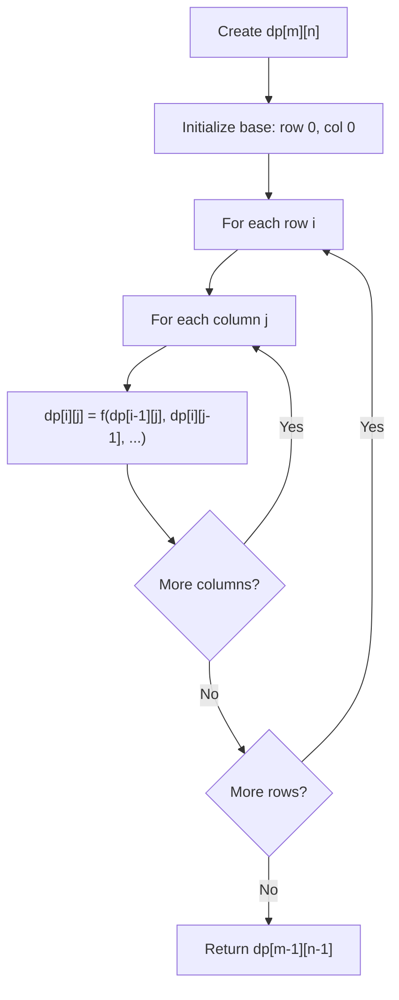
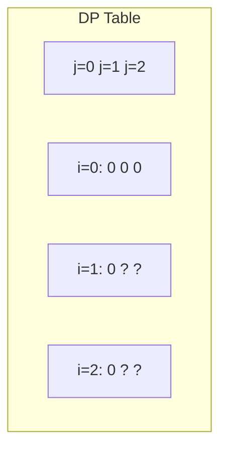
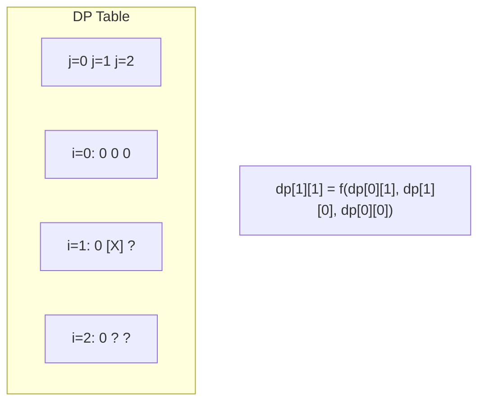
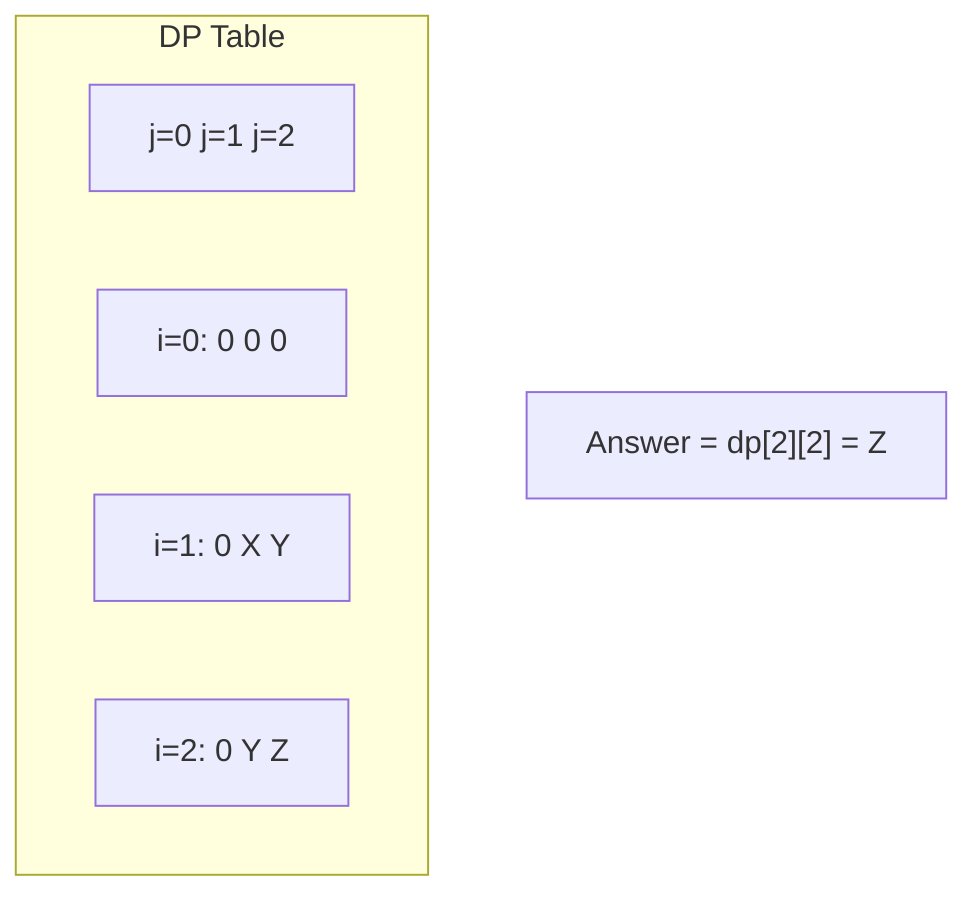

# Problem 2435: Paths in Matrix Whose Sum Is Divisible by K

**Difficulty:** Hard  
**Tags:** Array, Dynamic Programming, Matrix  
**Pattern:** Dynamic Programming (2D Grid/Matrix)  
**Link:** [leetcode.com/problems/paths-in-matrix-whose-sum-is-divisible-by-k](https://leetcode.com/problems/paths-in-matrix-whose-sum-is-divisible-by-k/)

## Description

You are given a **0-indexed** `m x n` integer matrix `grid` and an integer `k`. You are currently at position `(0, 0)` and you want to reach position `(m - 1, n - 1)` moving only **down** or **right**.

Return* the number of paths where the sum of the elements on the path is divisible by *`k`. Since the answer may be very large, return it **modulo** `10^9 + 7`.

 

Example 1:

```

**Input:** grid = [[5,2,4],[3,0,5],[0,7,2]], k = 3
**Output:** 2
**Explanation:** There are two paths where the sum of the elements on the path is divisible by k.
The first path highlighted in red has a sum of 5 + 2 + 4 + 5 + 2 = 18 which is divisible by 3.
The second path highlighted in blue has a sum of 5 + 3 + 0 + 5 + 2 = 15 which is divisible by 3.

```

Example 2:

```

**Input:** grid = [[0,0]], k = 5
**Output:** 1
**Explanation:** The path highlighted in red has a sum of 0 + 0 = 0 which is divisible by 5.

```

Example 3:

```

**Input:** grid = [[7,3,4,9],[2,3,6,2],[2,3,7,0]], k = 1
**Output:** 10
**Explanation:** Every integer is divisible by 1 so the sum of the elements on every possible path is divisible by k.

```

 

**Constraints:**

	- `m == grid.length`
	- `n == grid[i].length`
	- `1 <= m, n <= 5 * 10^4`
	- `1 <= m * n <= 5 * 10^4`
	- `0 <= grid[i][j] <= 100`
	- `1 <= k <= 50`

## Approach: Dynamic Programming (2D Grid/Matrix)

Use a 2D DP table where dp[i][j] represents the optimal value for the subproblem defined by rows 0..i and columns 0..j. Fill row by row or column by column.

## Pseudocode

```
1. Create dp[m][n] table
2. Initialize base cases (first row, first column)
3. For i from 1 to m-1:
   For j from 1 to n-1:
     dp[i][j] = recurrence(dp[i-1][j], dp[i][j-1], dp[i-1][j-1])
4. Return dp[m-1][n-1]
```

## Algorithm Flow



## Visual State Transitions

**2D DP Table Build:**

**Frame 1: Initialize borders**


**Frame 2: Fill cell by cell**


**Frame 3: Table complete**



## Complexity Analysis

- **Time:** O(m * n)
- **Space:** O(m * n)

## Solution (Python3)

```python
class Solution:
    def numberOfPaths(self, grid: List[List[int]], k: int) -> int:
        # Dynamic programming (2D) - O(m*n) time and space
        if not grid:
            return 0
        m, n = len(grid), len(grid[0])
        dp = [[0] * (n + 1) for _ in range(m + 1)]
        for i in range(1, m + 1):
            for j in range(1, n + 1):
                dp[i][j] = max(dp[i-1][j], dp[i][j-1])
                # Add problem-specific transition
        return dp[m][n]
```

## Solution (C++)

```cpp
#include <algorithm>
#include <string>
#include <vector>
using namespace std;

class Solution {
public:
    int numberOfPaths(vector<vector<int>>& grid, int k) {
        // Dynamic programming (2D) - O(m*n) time and space
        if (grid.empty()) return 0;
        int m = grid.size(), n = grid[0].size();
        vector<vector<int>> dp(m + 1, vector<int>(n + 1, 0));
        for (int i = 1; i <= m; i++) {
            for (int j = 1; j <= n; j++) {
                dp[i][j] = max(dp[i-1][j], dp[i][j-1]);
            }
        }
        return dp[m][n];
    }
};
```
