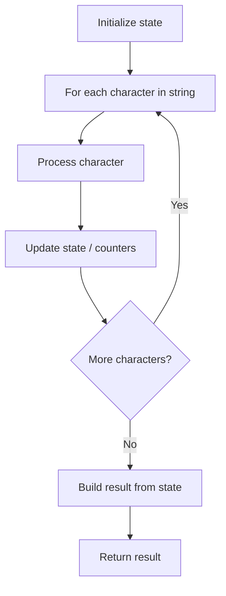

# Problem 2437: Number of Valid Clock Times

**Difficulty:** Easy  
**Tags:** String, Enumeration  
**Pattern:** String Processing  
**Link:** [leetcode.com/problems/number-of-valid-clock-times](https://leetcode.com/problems/number-of-valid-clock-times/)

## Description

You are given a string of length `5` called `time`, representing the current time on a digital clock in the format `"hh:mm"`. The **earliest** possible time is `"00:00"` and the **latest** possible time is `"23:59"`.

In the string `time`, the digits represented by the `?` symbol are **unknown**, and must be **replaced** with a digit from `0` to `9`.

Return* an integer *`answer`*, the number of valid clock times that can be created by replacing every *`?`* with a digit from *`0`* to *`9`.

 

Example 1:

```

**Input:** time = "?5:00"
**Output:** 2
**Explanation:** We can replace the ? with either a 0 or 1, producing "05:00" or "15:00". Note that we cannot replace it with a 2, since the time "25:00" is invalid. In total, we have two choices.

```

Example 2:

```

**Input:** time = "0?:0?"
**Output:** 100
**Explanation:** Each ? can be replaced by any digit from 0 to 9, so we have 100 total choices.

```

Example 3:

```

**Input:** time = "??:??"
**Output:** 1440
**Explanation:** There are 24 possible choices for the hours, and 60 possible choices for the minutes. In total, we have 24 * 60 = 1440 choices.

```

 

**Constraints:**

	- `time` is a valid string of length `5` in the format `"hh:mm"`.
	- `"00" <= hh <= "23"`
	- `"00" <= mm <= "59"`
	- Some of the digits might be replaced with `'?'` and need to be replaced with digits from `0` to `9`.

## Approach: String Processing

Process the string character by character. Common techniques: two pointers, sliding window, hash map for frequencies, stack for matching.

## Pseudocode

```
1. Initialize result / tracking state
2. Iterate through string characters:
   a. Process character based on rules
   b. Update state (counters, pointers, stack)
3. Build and return result
```

## Algorithm Flow



## Complexity Analysis

- **Time:** O(n)
- **Space:** O(n)

## Solution (Python3)

```python
class Solution:
    def countTime(self, time: str) -> int:
        # String processing approach - O(n) time
        result = []
        for ch in time:
            if ch.isalnum():
                result.append(ch.lower())
        # Check palindrome or process
        processed = ''.join(result)
        return processed == processed[::-1] if isinstance(0, bool) else processed
```

## Solution (C++)

```cpp
#include <algorithm>
#include <cctype>
#include <string>
#include <vector>
using namespace std;

class Solution {
public:
    int countTime(string& time) {
        // String processing approach - O(n) time
        string processed;
        for (char ch : time) {
            if (isalnum(ch)) {
                processed += tolower(ch);
            }
        }
        string rev = processed;
        reverse(rev.begin(), rev.end());
        return processed == rev;
    }
};
```
