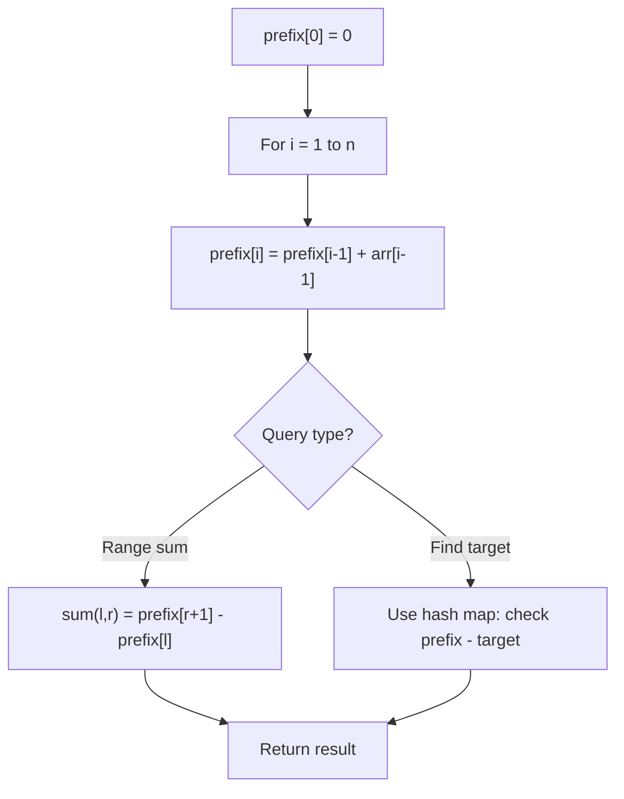

# Problem 2438: Range Product Queries of Powers

**Difficulty:** Medium  
**Tags:** Array, Bit Manipulation, Prefix Sum  
**Pattern:** Prefix Sum  
**Link:** [leetcode.com/problems/range-product-queries-of-powers](https://leetcode.com/problems/range-product-queries-of-powers/)

## Description

Given a positive integer `n`, there exists a **0-indexed** array called `powers`, composed of the **minimum** number of powers of `2` that sum to `n`. The array is sorted in **non-decreasing** order, and there is **only one** way to form the array.

You are also given a **0-indexed** 2D integer array `queries`, where `queries[i] = [lefti, righti]`. Each `queries[i]` represents a query where you have to find the product of all `powers[j]` with `lefti <= j <= righti`.

Return* an array *`answers`*, equal in length to *`queries`*, where *`answers[i]`* is the answer to the *`i^th`* query*. Since the answer to the `i^th` query may be too large, each `answers[i]` should be returned **modulo** `10^9 + 7`.

 

Example 1:

```

**Input:** n = 15, queries = [[0,1],[2,2],[0,3]]
**Output:** [2,4,64]
**Explanation:**
For n = 15, powers = [1,2,4,8]. It can be shown that powers cannot be a smaller size.
Answer to 1st query: powers[0] * powers[1] = 1 * 2 = 2.
Answer to 2nd query: powers[2] = 4.
Answer to 3rd query: powers[0] * powers[1] * powers[2] * powers[3] = 1 * 2 * 4 * 8 = 64.
Each answer modulo 109 + 7 yields the same answer, so [2,4,64] is returned.

```

Example 2:

```

**Input:** n = 2, queries = [[0,0]]
**Output:** [2]
**Explanation:**
For n = 2, powers = [2].
The answer to the only query is powers[0] = 2. The answer modulo 109 + 7 is the same, so [2] is returned.

```

 

**Constraints:**

	- `1 <= n <= 10^9`
	- `1 <= queries.length <= 10^5`
	- `0 <= starti <= endi < powers.length`

## Approach: Prefix Sum

Build a prefix sum array where prefix[i] = sum of elements 0..i-1. Any subarray sum [l..r] = prefix[r+1] - prefix[l]. Combine with hash map for O(n) subarray sum queries.

## Pseudocode

```
1. Build prefix sum array: prefix[0]=0, prefix[i]=prefix[i-1]+arr[i-1]
2. Use prefix sums to answer queries:
   - Subarray sum [l..r] = prefix[r+1] - prefix[l]
   - Or use hash map to find prefix[j]-prefix[i] == target
3. Return result
```

## Algorithm Flow



## Complexity Analysis

- **Time:** O(n)
- **Space:** O(n)

## Solution (Python3)

```python
class Solution:
    def productQueries(self, n: int, queries: List[List[int]]) -> List[int]:
        # Prefix sum approach - O(n) time, O(n) space
        prefix = {0: -1}
        curr_sum = 0
        result = 0
        target = queries if isinstance(queries, int) else 0
        for i, val in enumerate(n):
            curr_sum += val
            if curr_sum - target in prefix:
                result = max(result, i - prefix[curr_sum - target])
            if curr_sum not in prefix:
                prefix[curr_sum] = i
        return result
```

## Solution (C++)

```cpp
#include <algorithm>
#include <string>
#include <unordered_map>
#include <vector>
using namespace std;

class Solution {
public:
    vector<int> productQueries(int n, vector<vector<int>>& queries) {
        // Prefix sum approach - O(n) time, O(n) space
        unordered_map<int, int> prefix;
        prefix[0] = -1;
        int curr_sum = 0, result = 0;
        int target = queries;
        for (int i = 0; i < (int)n.size(); i++) {
            curr_sum += n[i];
            if (prefix.count(curr_sum - target)) {
                result = max(result, i - prefix[curr_sum - target]);
            }
            if (!prefix.count(curr_sum)) {
                prefix[curr_sum] = i;
            }
        }
        return result;
    }
};
```
