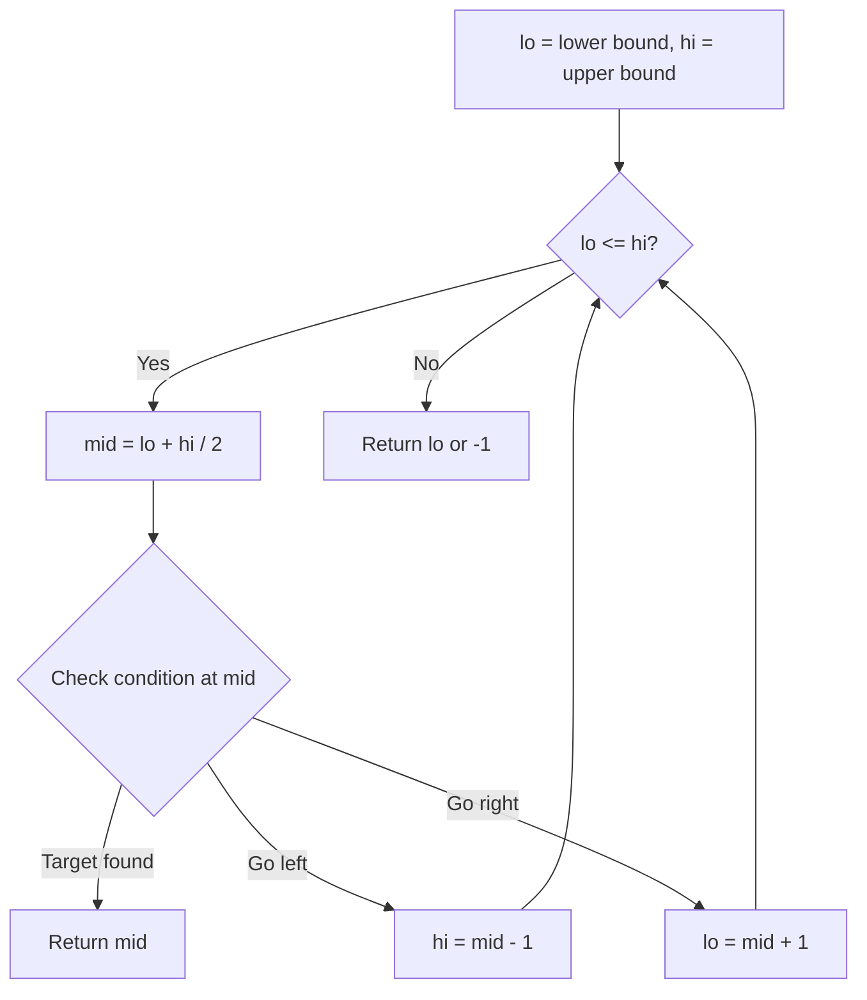
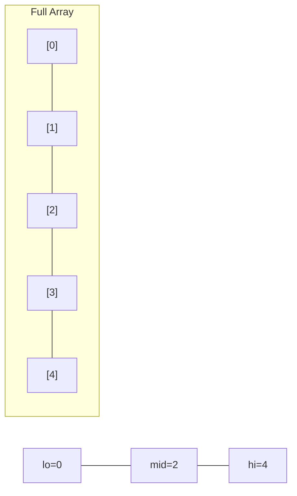
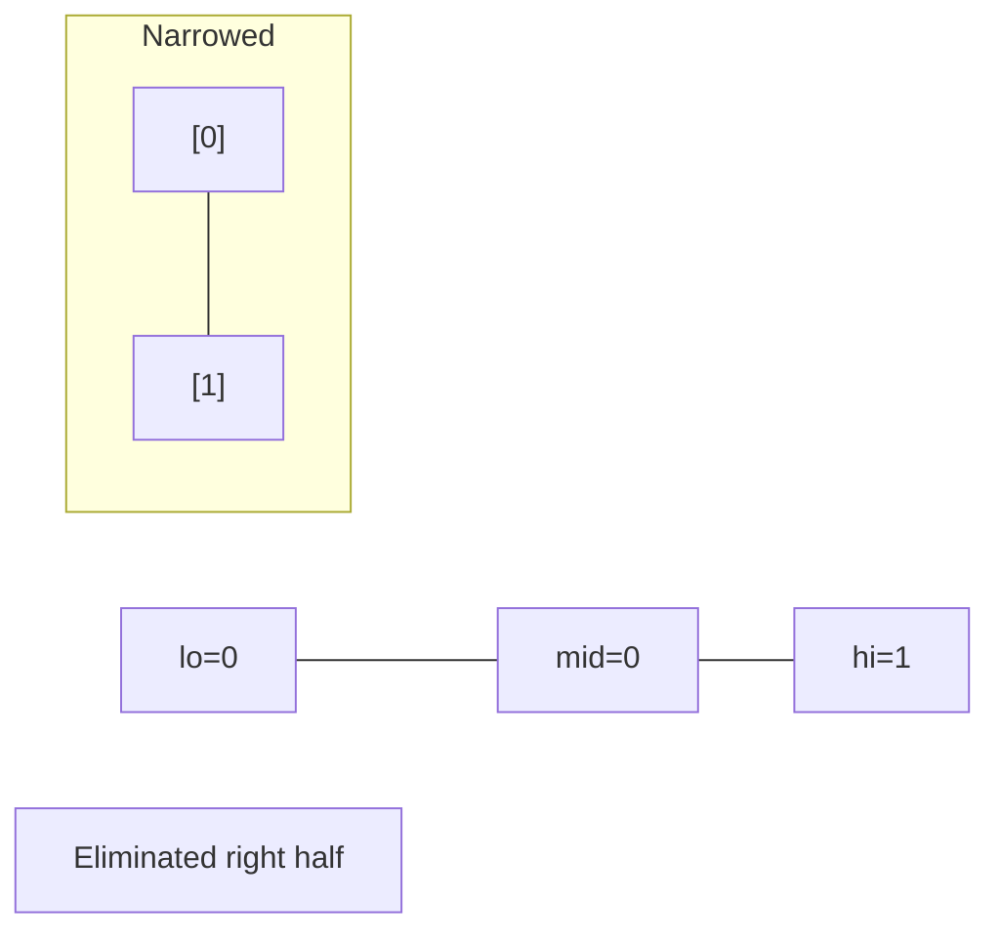
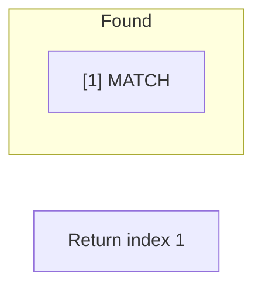

# Problem 2439: Minimize Maximum of Array

**Difficulty:** Medium  
**Tags:** Array, Binary Search, Dynamic Programming, Greedy, Prefix Sum  
**Pattern:** Binary Search  
**Link:** [leetcode.com/problems/minimize-maximum-of-array](https://leetcode.com/problems/minimize-maximum-of-array/)

## Description

You are given a **0-indexed** array `nums` comprising of `n` non-negative integers.

In one operation, you must:

	- Choose an integer `i` such that `1 <= i < n` and `nums[i] > 0`.
	- Decrease `nums[i]` by 1.
	- Increase `nums[i - 1]` by 1.

Return* the **minimum** possible value of the **maximum** integer of *`nums`* after performing **any** number of operations*.

 

Example 1:

```

**Input:** nums = [3,7,1,6]
**Output:** 5
**Explanation:**
One set of optimal operations is as follows:
1. Choose i = 1, and nums becomes [4,6,1,6].
2. Choose i = 3, and nums becomes [4,6,2,5].
3. Choose i = 1, and nums becomes [5,5,2,5].
The maximum integer of nums is 5. It can be shown that the maximum number cannot be less than 5.
Therefore, we return 5.

```

Example 2:

```

**Input:** nums = [10,1]
**Output:** 10
**Explanation:**
It is optimal to leave nums as is, and since 10 is the maximum value, we return 10.

```

 

**Constraints:**

	- `n == nums.length`
	- `2 <= n <= 10^5`
	- `0 <= nums[i] <= 10^9`

## Approach: Binary Search

Use binary search to halve the search space each iteration. Define the search range [lo, hi], compute mid, and decide which half to keep based on the problem's monotonic condition.

## Pseudocode

```
1. lo = lower_bound, hi = upper_bound
2. While lo <= hi (or lo < hi):
   a. mid = (lo + hi) // 2
   b. If condition(mid) is satisfied: record answer, search left half
   c. Else: search right half
3. Return answer
```

## Algorithm Flow



## Visual State Transitions

**Binary Search Step-by-Step:**

**Frame 1: Initial search space**


**Frame 2: Compare mid, narrow search**


**Frame 3: Found target**



## Complexity Analysis

- **Time:** O(log n)
- **Space:** O(1)

## Solution (Python3)

```python
class Solution:
    def minimizeArrayValue(self, nums: List[int]) -> int:
        # Binary search - O(log n) time, O(1) space
        lo, hi = 0, len(nums) - 1
        while lo <= hi:
            mid = lo + (hi - lo) // 2
            if nums[mid] == nums:
                return mid
            elif nums[mid] < nums:
                lo = mid + 1
            else:
                hi = mid - 1
        return 0
```

## Solution (C++)

```cpp
#include <string>
#include <vector>
using namespace std;

class Solution {
public:
    int minimizeArrayValue(vector<int>& nums) {
        // Binary search - O(log n) time, O(1) space
        int lo = 0, hi = nums.size() - 1;
        while (lo <= hi) {
            int mid = lo + (hi - lo) / 2;
            if (nums[mid] == nums) {
                return mid;
            } else if (nums[mid] < nums) {
                lo = mid + 1;
            } else {
                hi = mid - 1;
            }
        }
        return 0;
    }
};
```
