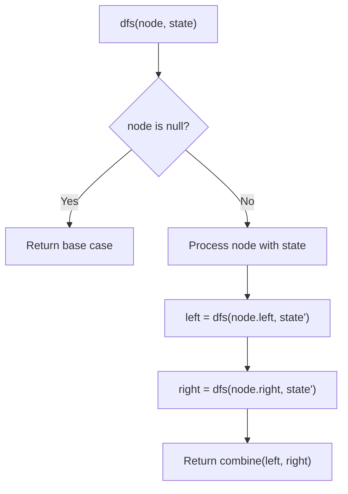
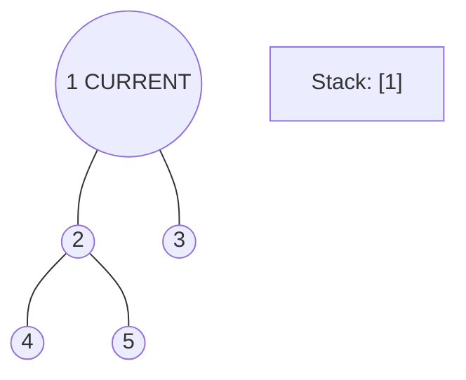
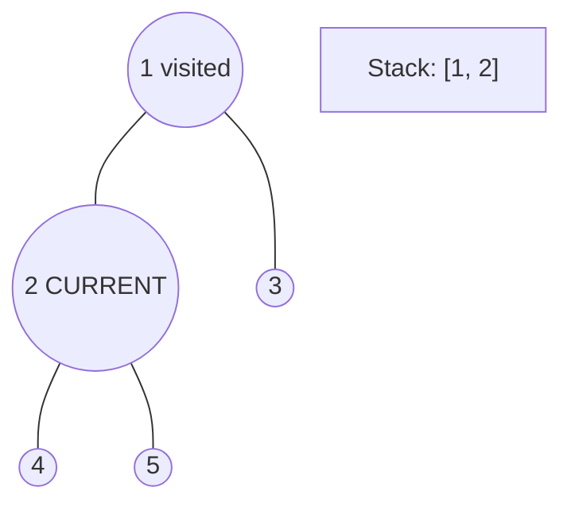
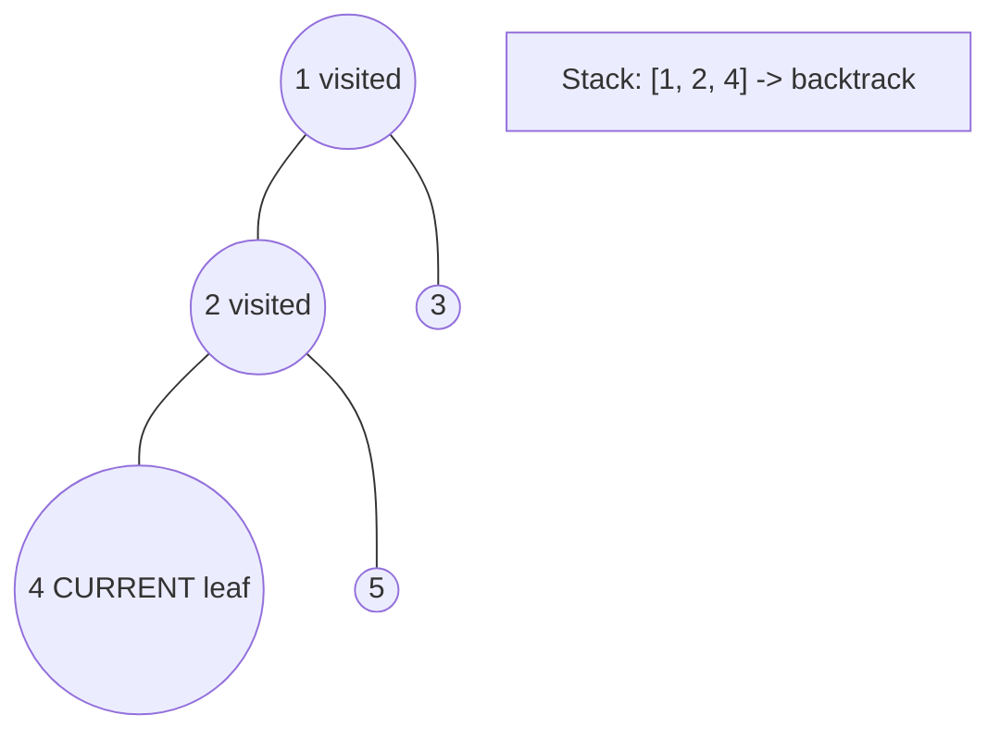
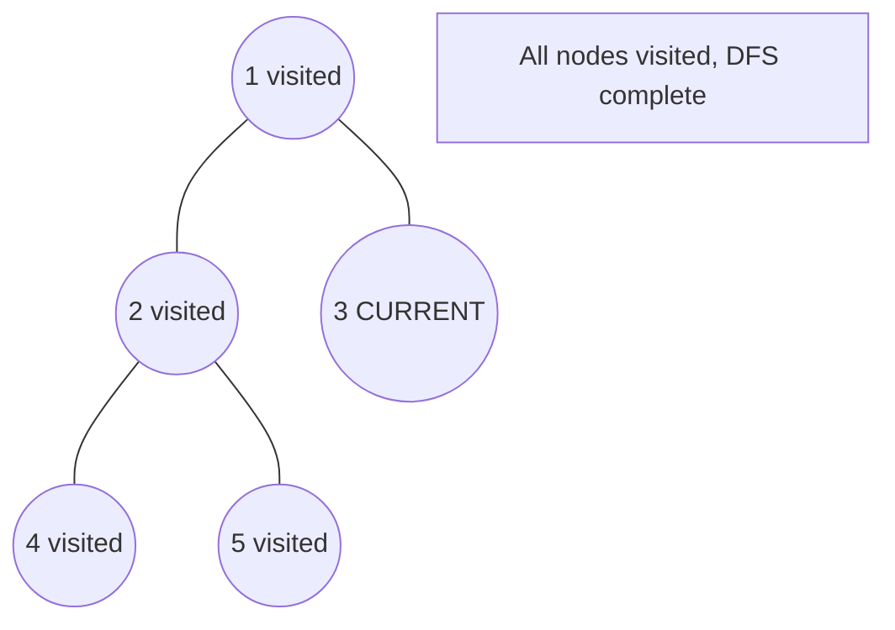

# Problem 2440: Create Components With Same Value

**Difficulty:** Hard  
**Tags:** Array, Math, Tree, Depth-First Search, Enumeration  
**Pattern:** DFS Tree Traversal  
**Link:** [leetcode.com/problems/create-components-with-same-value](https://leetcode.com/problems/create-components-with-same-value/)

## Description

There is an undirected tree with `n` nodes labeled from `0` to `n - 1`.

You are given a **0-indexed** integer array `nums` of length `n` where `nums[i]` represents the value of the `i^th` node. You are also given a 2D integer array `edges` of length `n - 1` where `edges[i] = [ai, bi]` indicates that there is an edge between nodes `ai` and `bi` in the tree.

You are allowed to **delete** some edges, splitting the tree into multiple connected components. Let the **value** of a component be the sum of **all** `nums[i]` for which node `i` is in the component.

Return* the **maximum** number of edges you can delete, such that every connected component in the tree has the same value.*

 

Example 1:

```

**Input:** nums = [6,2,2,2,6], edges = [[0,1],[1,2],[1,3],[3,4]] 
**Output:** 2 
**Explanation:** The above figure shows how we can delete the edges [0,1] and [3,4]. The created components are nodes [0], [1,2,3] and [4]. The sum of the values in each component equals 6. It can be proven that no better deletion exists, so the answer is 2.

```

Example 2:

```

**Input:** nums = [2], edges = []
**Output:** 0
**Explanation:** There are no edges to be deleted.

```

 

**Constraints:**

	- `1 <= n <= 2 * 10^4`
	- `nums.length == n`
	- `1 <= nums[i] <= 50`
	- `edges.length == n - 1`
	- `edges[i].length == 2`
	- `0 <= edges[i][0], edges[i][1] <= n - 1`
	- `edges` represents a valid tree.

## Approach: DFS Tree Traversal

Perform depth-first search on the tree. Recurse on left and right subtrees, combining results bottom-up. Track state (path, depth, sum) during traversal.

## Pseudocode

```
1. Define dfs(node, state):
   a. Base case: if null, return default
   b. Process node with current state
   c. left_result = dfs(node.left, updated_state)
   d. right_result = dfs(node.right, updated_state)
   e. Return combine(left_result, right_result)
2. Return dfs(root, initial_state)
```

## Algorithm Flow



## Visual State Transitions

**DFS Tree Traversal Step-by-Step:**

**Frame 1: Start at root**


**Frame 2: Go left - visit node 2**


**Frame 3: Go left - visit node 4 (leaf)**


**Frame 4: Backtrack, visit node 5, then node 3**



## Complexity Analysis

- **Time:** O(n)
- **Space:** O(h)

## Solution (Python3)

```python
class Solution:
    def componentValue(self, nums: List[int], edges: List[List[int]]) -> int:
        # DFS on binary tree - O(n) time, O(h) space
        def dfs(node):
            if not node:
                return 0
            left = dfs(node.left)
            right = dfs(node.right)
            return 1 + max(left, right)
        
        result = dfs(nums)
        return result
```

## Solution (C++)

```cpp
#include <algorithm>
#include <functional>
#include <string>
#include <vector>
using namespace std;

class Solution {
public:
    int componentValue(vector<int>& nums, vector<vector<int>>& edges) {
        // DFS on binary tree - O(n) time, O(h) space
        function<int(TreeNode*)> dfs = [&](TreeNode* node) -> int {
            if (!node) return 0;
            int left = dfs(node->left);
            int right = dfs(node->right);
            return 1 + max(left, right);
        };
        return dfs(nums);
    }
};
```
