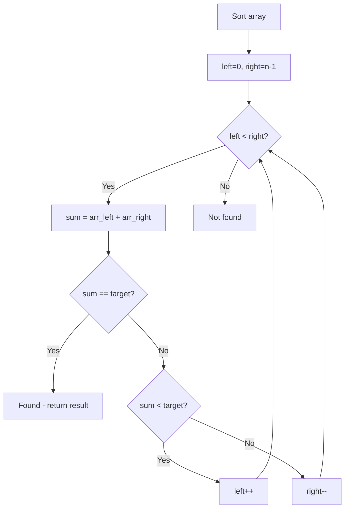

# Problem 2441: Largest Positive Integer That Exists With Its Negative

**Difficulty:** Easy  
**Tags:** Array, Hash Table, Two Pointers, Sorting  
**Pattern:** Two Pointers on Sorted Array  
**Link:** [leetcode.com/problems/largest-positive-integer-that-exists-with-its-negative](https://leetcode.com/problems/largest-positive-integer-that-exists-with-its-negative/)

## Description

Given an integer array `nums` that **does not contain** any zeros, find **the largest positive** integer `k` such that `-k` also exists in the array.

Return *the positive integer *`k`. If there is no such integer, return `-1`.

 

Example 1:

```

**Input:** nums = [-1,2,-3,3]
**Output:** 3
**Explanation:** 3 is the only valid k we can find in the array.

```

Example 2:

```

**Input:** nums = [-1,10,6,7,-7,1]
**Output:** 7
**Explanation:** Both 1 and 7 have their corresponding negative values in the array. 7 has a larger value.

```

Example 3:

```

**Input:** nums = [-10,8,6,7,-2,-3]
**Output:** -1
**Explanation:** There is no a single valid k, we return -1.

```

 

**Constraints:**

	- `1 <= nums.length <= 1000`
	- `-1000 <= nums[i] <= 1000`
	- `nums[i] != 0`

## Approach: Two Pointers on Sorted Array

Sort the array first, then use two pointers converging from both ends. Move the left pointer right to increase the sum, or the right pointer left to decrease it.

## Pseudocode

```
1. Sort the array
2. left = 0, right = n-1
3. While left < right:
   a. Compute current = arr[left] + arr[right]
   b. If current == target: found
   c. If current < target: left++
   d. If current > target: right--
4. Return result
```

## Algorithm Flow



## Complexity Analysis

- **Time:** O(n log n)
- **Space:** O(1)

## Solution (Python3)

```python
class Solution:
    def findMaxK(self, nums: List[int]) -> int:
        # Sort + two pointers - O(n log n) time
        nums.sort()
        left, right = 0, len(nums) - 1
        result = 0
        while left < right:
            curr_sum = nums[left] + nums[right]
            if curr_sum < nums if isinstance(nums, int) else 0:
                left += 1
            else:
                right -= 1
        return result
```

## Solution (C++)

```cpp
#include <algorithm>
#include <string>
#include <vector>
using namespace std;

class Solution {
public:
    int findMaxK(vector<int>& nums) {
        // Sort + two pointers - O(n log n) time
        sort(nums.begin(), nums.end());
        int left = 0, right = nums.size() - 1;
        while (left < right) {
            int curr = nums[left] + nums[right];
            if (curr < nums) {
                left++;
            } else {
                right--;
            }
        }
        return 0;
    }
};
```
