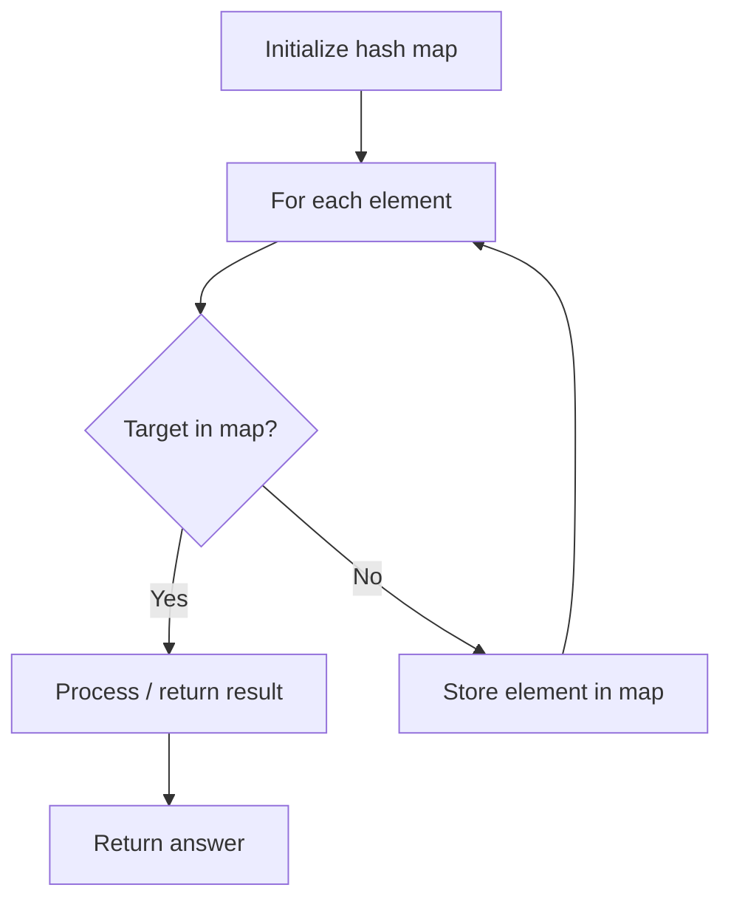

# Problem 2442: Count Number of Distinct Integers After Reverse Operations

**Difficulty:** Medium  
**Tags:** Array, Hash Table, Math, Counting  
**Pattern:** Hash Map Lookup  
**Link:** [leetcode.com/problems/count-number-of-distinct-integers-after-reverse-operations](https://leetcode.com/problems/count-number-of-distinct-integers-after-reverse-operations/)

## Description

You are given an array `nums` consisting of **positive** integers.

You have to take each integer in the array, **reverse its digits**, and add it to the end of the array. You should apply this operation to the original integers in `nums`.

Return *the number of **distinct** integers in the final array*.

 

Example 1:

```

**Input:** nums = [1,13,10,12,31]
**Output:** 6
**Explanation:** After including the reverse of each number, the resulting array is [1,13,10,12,31,1,31,1,21,13].
The reversed integers that were added to the end of the array are underlined. Note that for the integer 10, after reversing it, it becomes 01 which is just 1.
The number of distinct integers in this array is 6 (The numbers 1, 10, 12, 13, 21, and 31).
```

Example 2:

```

**Input:** nums = [2,2,2]
**Output:** 1
**Explanation:** After including the reverse of each number, the resulting array is [2,2,2,2,2,2].
The number of distinct integers in this array is 1 (The number 2).

```

 

**Constraints:**

	- `1 <= nums.length <= 10^5`
	- `1 <= nums[i] <= 10^6`

## Approach: Hash Map Lookup

Use a hash map (dictionary) to store elements for O(1) lookup. Iterate through the input, checking membership or counting frequencies in the map.

## Pseudocode

```
1. Initialize hash map
2. Iterate through elements:
   a. Check if target/complement exists in map
   b. If found: process result
   c. Otherwise: store element in map
3. Return result
```

## Algorithm Flow



## Complexity Analysis

- **Time:** O(n)
- **Space:** O(n)

## Solution (Python3)

```python
class Solution:
    def countDistinctIntegers(self, nums: List[int]) -> int:
        # Hash map approach - O(n) time, O(n) space
        seen = {}
        for i, val in enumerate(nums):
            complement = nums - val
            if complement in seen:
                return [seen[complement], i]
            seen[val] = i
        return 0
```

## Solution (C++)

```cpp
#include <string>
#include <unordered_map>
#include <vector>
using namespace std;

class Solution {
public:
    int countDistinctIntegers(vector<int>& nums) {
        // Hash map approach - O(n) time, O(n) space
        unordered_map<int, int> seen;
        for (int i = 0; i < nums.size(); i++) {
            int complement = nums - nums[i];
            if (seen.count(complement)) {
                return {seen[complement], i};
            }
            seen[nums[i]] = i;
        }
        return 0;
    }
};
```
