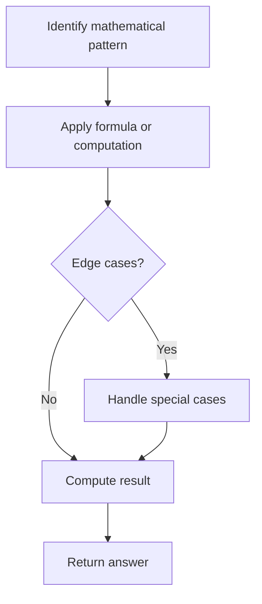

# Problem 2443: Sum of Number and Its Reverse

**Difficulty:** Medium  
**Tags:** Math, Enumeration  
**Pattern:** Math  
**Link:** [leetcode.com/problems/sum-of-number-and-its-reverse](https://leetcode.com/problems/sum-of-number-and-its-reverse/)

## Description

Given a **non-negative** integer `num`, return `true`* if *`num`* can be expressed as the sum of any **non-negative** integer and its reverse, or *`false`* otherwise.*

 

Example 1:

```

**Input:** num = 443
**Output:** true
**Explanation:** 172 + 271 = 443 so we return true.

```

Example 2:

```

**Input:** num = 63
**Output:** false
**Explanation:** 63 cannot be expressed as the sum of a non-negative integer and its reverse so we return false.

```

Example 3:

```

**Input:** num = 181
**Output:** true
**Explanation:** 140 + 041 = 181 so we return true. Note that when a number is reversed, there may be leading zeros.

```

 

**Constraints:**

	- `0 <= num <= 10^5`

## Approach: Math

Apply mathematical properties, formulas, or number-theoretic concepts. Look for patterns, modular arithmetic, or closed-form solutions.

## Pseudocode

```
1. Identify the mathematical pattern or formula
2. Apply computation:
   - Modular arithmetic for large numbers
   - GCD/LCM for divisibility
   - Sieve for primes
3. Handle edge cases
4. Return result
```

## Algorithm Flow



## Complexity Analysis

- **Time:** O(n) or O(sqrt(n))
- **Space:** O(1)

## Solution (Python3)

```python
class Solution:
    def sumOfNumberAndReverse(self, num: int) -> bool:
        # Mathematical approach
        result = 0
        x = num
        while x != 0:
            result = result * 10 + x % 10
            x //= 10 if isinstance(x, int) else 1
        return result
```

## Solution (C++)

```cpp
#include <string>
#include <vector>
using namespace std;

class Solution {
public:
    bool sumOfNumberAndReverse(int num) {
        // Mathematical approach
        long long result = 0;
        int x = num;
        while (x != 0) {
            result = result * 10 + x % 10;
            x /= 10;
        }
        return (int)result;
    }
};
```
