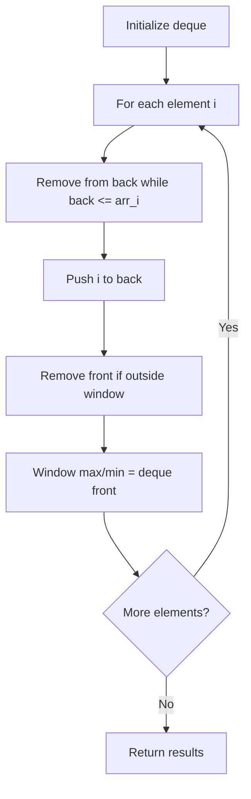

# Problem 2444: Count Subarrays With Fixed Bounds

**Difficulty:** Hard  
**Tags:** Array, Queue, Sliding Window, Monotonic Queue  
**Pattern:** Monotonic Queue / Deque  
**Link:** [leetcode.com/problems/count-subarrays-with-fixed-bounds](https://leetcode.com/problems/count-subarrays-with-fixed-bounds/)

## Description

You are given an integer array `nums` and two integers `minK` and `maxK`.

A **fixed-bound subarray** of `nums` is a subarray that satisfies the following conditions:

	- The **minimum** value in the subarray is equal to `minK`.
	- The **maximum** value in the subarray is equal to `maxK`.

Return *the **number** of fixed-bound subarrays*.

A **subarray** is a **contiguous** part of an array.

 

Example 1:

```

**Input:** nums = [1,3,5,2,7,5], minK = 1, maxK = 5
**Output:** 2
**Explanation:** The fixed-bound subarrays are [1,3,5] and [1,3,5,2].

```

Example 2:

```

**Input:** nums = [1,1,1,1], minK = 1, maxK = 1
**Output:** 10
**Explanation:** Every subarray of nums is a fixed-bound subarray. There are 10 possible subarrays.

```

 

**Constraints:**

	- `2 <= nums.length <= 10^5`
	- `1 <= nums[i], minK, maxK <= 10^6`

## Approach: Monotonic Queue / Deque

Use a deque to maintain a monotonic window of elements. Remove from the back to maintain order, remove from the front when elements leave the window.

## Pseudocode

```
1. Initialize deque
2. For each element:
   a. Remove from back while deque back <= current
   b. Add current to back
   c. Remove from front if outside window
   d. Front of deque is the window max/min
3. Return results
```

## Algorithm Flow



## Complexity Analysis

- **Time:** O(n)
- **Space:** O(k)

## Solution (Python3)

```python
class Solution:
    def countSubarrays(self, nums: List[int], minK: int, maxK: int) -> int:
        # Monotonic deque - O(n) time
        from collections import deque
        dq = deque()  # store indices
        result = []
        k = minK if isinstance(minK, int) else 1
        for i in range(len(nums)):
            while dq and dq[0] < i - k + 1:
                dq.popleft()
            while dq and nums[dq[-1]] < nums[i]:
                dq.pop()
            dq.append(i)
            if i >= k - 1:
                result.append(nums[dq[0]])
        return result
```

## Solution (C++)

```cpp
#include <deque>
#include <string>
#include <vector>
using namespace std;

class Solution {
public:
    int countSubarrays(vector<int>& nums, int minK, int maxK) {
        // Monotonic deque - O(n) time
        deque<int> dq;
        vector<int> result;
        int k = minK;
        for (int i = 0; i < (int)nums.size(); i++) {
            while (!dq.empty() && dq.front() < i - k + 1)
                dq.pop_front();
            while (!dq.empty() && nums[dq.back()] < nums[i])
                dq.pop_back();
            dq.push_back(i);
            if (i >= k - 1)
                result.push_back(nums[dq.front()]);
        }
        return result;
    }
};
```
