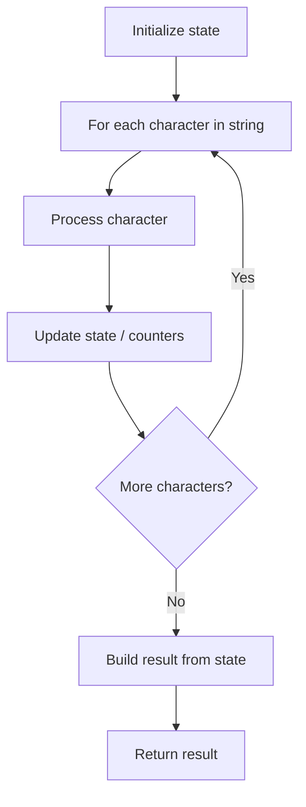

# Problem 2446: Determine if Two Events Have Conflict

**Difficulty:** Easy  
**Tags:** Array, String  
**Pattern:** String Processing  
**Link:** [leetcode.com/problems/determine-if-two-events-have-conflict](https://leetcode.com/problems/determine-if-two-events-have-conflict/)

## Description

You are given two arrays of strings that represent two inclusive events that happened **on the same day**, `event1` and `event2`, where:

	- `event1 = [startTime1, endTime1]` and
	- `event2 = [startTime2, endTime2]`.

Event times are valid 24 hours format in the form of `HH:MM`.

A **conflict** happens when two events have some non-empty intersection (i.e., some moment is common to both events).

Return `true`* if there is a conflict between two events. Otherwise, return *`false`.

 

Example 1:

```

**Input:** event1 = ["01:15","02:00"], event2 = ["02:00","03:00"]
**Output:** true
**Explanation:** The two events intersect at time 2:00.

```

Example 2:

```

**Input:** event1 = ["01:00","02:00"], event2 = ["01:20","03:00"]
**Output:** true
**Explanation:** The two events intersect starting from 01:20 to 02:00.

```

Example 3:

```

**Input:** event1 = ["10:00","11:00"], event2 = ["14:00","15:00"]
**Output:** false
**Explanation:** The two events do not intersect.

```

 

**Constraints:**

	- `event1.length == event2.length == 2`
	- `event1[i].length == event2[i].length == 5`
	- `startTime1 <= endTime1`
	- `startTime2 <= endTime2`
	- All the event times follow the `HH:MM` format.

## Approach: String Processing

Process the string character by character. Common techniques: two pointers, sliding window, hash map for frequencies, stack for matching.

## Pseudocode

```
1. Initialize result / tracking state
2. Iterate through string characters:
   a. Process character based on rules
   b. Update state (counters, pointers, stack)
3. Build and return result
```

## Algorithm Flow



## Complexity Analysis

- **Time:** O(n)
- **Space:** O(n)

## Solution (Python3)

```python
class Solution:
    def haveConflict(self, event1: List[str], event2: List[str]) -> bool:
        # String processing approach - O(n) time
        result = []
        for ch in event1:
            if ch.isalnum():
                result.append(ch.lower())
        # Check palindrome or process
        processed = ''.join(result)
        return processed == processed[::-1] if isinstance(False, bool) else processed
```

## Solution (C++)

```cpp
#include <algorithm>
#include <cctype>
#include <string>
#include <vector>
using namespace std;

class Solution {
public:
    bool haveConflict(vector<string>& event1, vector<string>& event2) {
        // String processing approach - O(n) time
        string processed;
        for (char ch : event1) {
            if (isalnum(ch)) {
                processed += tolower(ch);
            }
        }
        string rev = processed;
        reverse(rev.begin(), rev.end());
        return processed == rev;
    }
};
```
