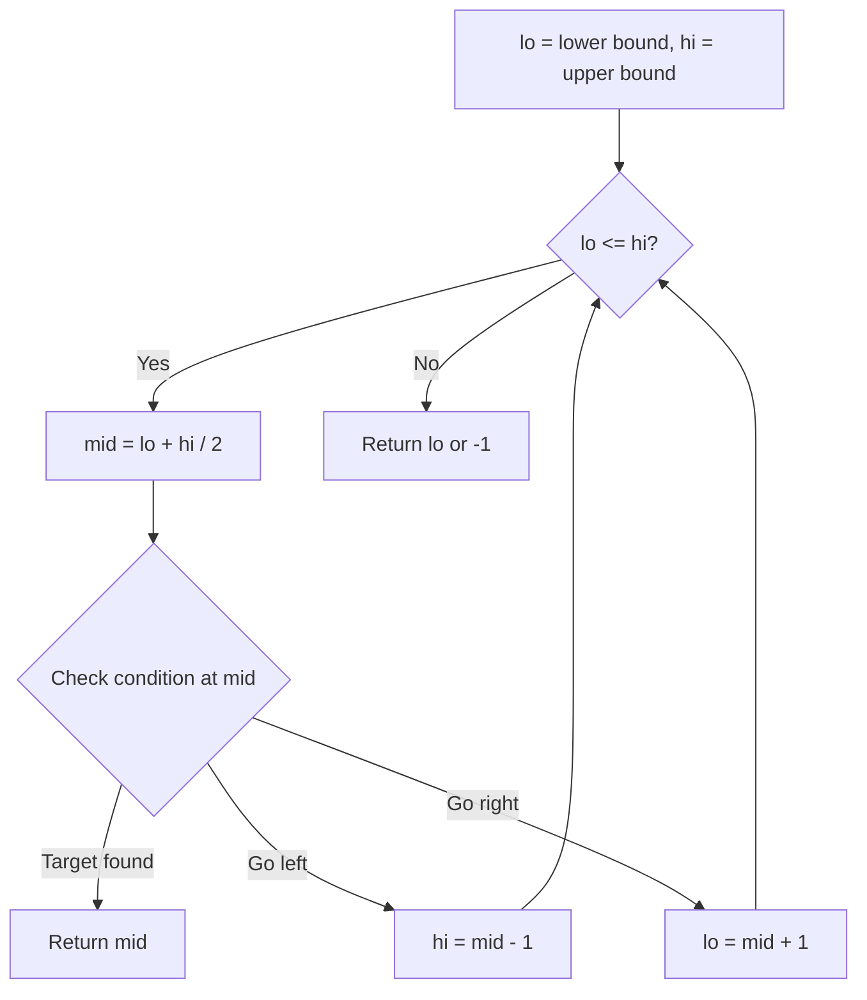
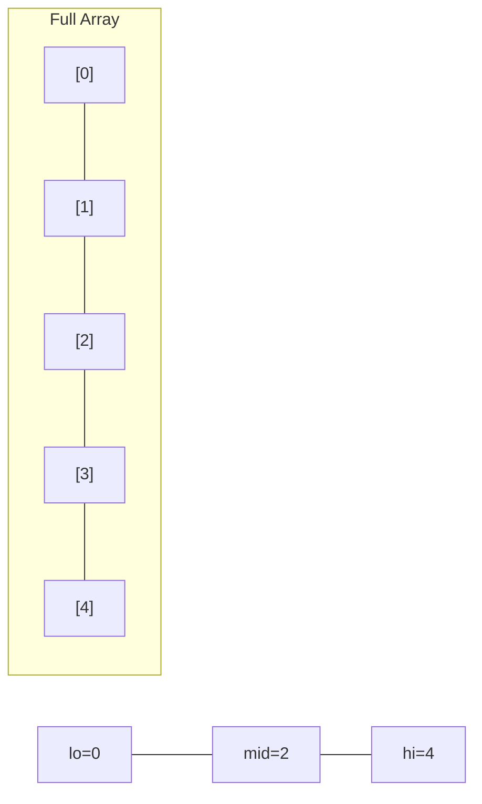
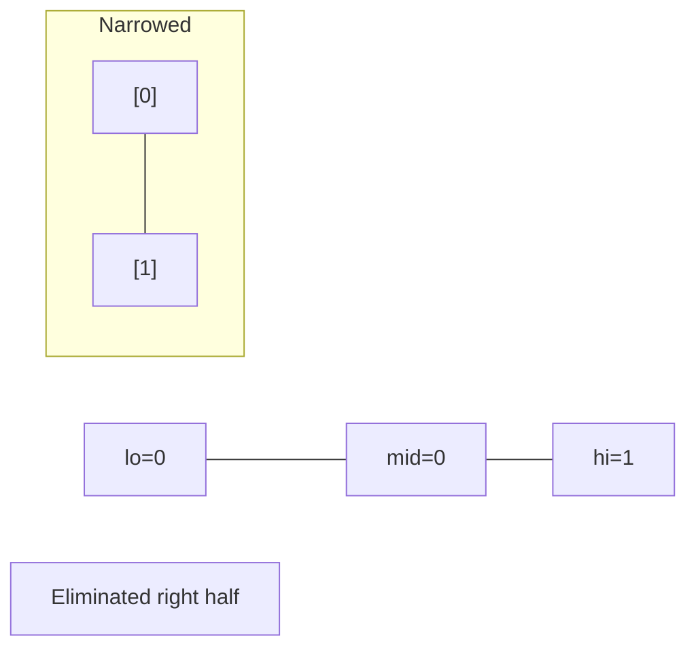
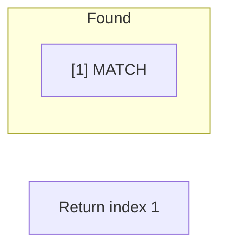

# Problem 2448: Minimum Cost to Make Array Equal

**Difficulty:** Hard  
**Tags:** Array, Binary Search, Greedy, Sorting, Prefix Sum  
**Pattern:** Binary Search  
**Link:** [leetcode.com/problems/minimum-cost-to-make-array-equal](https://leetcode.com/problems/minimum-cost-to-make-array-equal/)

## Description

You are given two **0-indexed** arrays `nums` and `cost` consisting each of `n` **positive** integers.

You can do the following operation **any** number of times:

	- Increase or decrease **any** element of the array `nums` by `1`.

The cost of doing one operation on the `i^th` element is `cost[i]`.

Return *the **minimum** total cost such that all the elements of the array *`nums`* become **equal***.

 

Example 1:

```

**Input:** nums = [1,3,5,2], cost = [2,3,1,14]
**Output:** 8
**Explanation:** We can make all the elements equal to 2 in the following way:
- Increase the 0th element one time. The cost is 2.
- Decrease the 1st element one time. The cost is 3.
- Decrease the 2nd element three times. The cost is 1 + 1 + 1 = 3.
The total cost is 2 + 3 + 3 = 8.
It can be shown that we cannot make the array equal with a smaller cost.

```

Example 2:

```

**Input:** nums = [2,2,2,2,2], cost = [4,2,8,1,3]
**Output:** 0
**Explanation:** All the elements are already equal, so no operations are needed.

```

 

**Constraints:**

	- `n == nums.length == cost.length`
	- `1 <= n <= 10^5`
	- `1 <= nums[i], cost[i] <= 10^6`
	- Test cases are generated in a way that the output doesn't exceed 2^53-1

## Approach: Binary Search

Use binary search to halve the search space each iteration. Define the search range [lo, hi], compute mid, and decide which half to keep based on the problem's monotonic condition.

## Pseudocode

```
1. lo = lower_bound, hi = upper_bound
2. While lo <= hi (or lo < hi):
   a. mid = (lo + hi) // 2
   b. If condition(mid) is satisfied: record answer, search left half
   c. Else: search right half
3. Return answer
```

## Algorithm Flow



## Visual State Transitions

**Binary Search Step-by-Step:**

**Frame 1: Initial search space**


**Frame 2: Compare mid, narrow search**


**Frame 3: Found target**



## Complexity Analysis

- **Time:** O(log n)
- **Space:** O(1)

## Solution (Python3)

```python
class Solution:
    def minCost(self, nums: List[int], cost: List[int]) -> int:
        # Binary search - O(log n) time, O(1) space
        lo, hi = 0, len(nums) - 1
        while lo <= hi:
            mid = lo + (hi - lo) // 2
            if nums[mid] == cost:
                return mid
            elif nums[mid] < cost:
                lo = mid + 1
            else:
                hi = mid - 1
        return 0
```

## Solution (C++)

```cpp
#include <string>
#include <vector>
using namespace std;

class Solution {
public:
    int minCost(vector<int>& nums, vector<int>& cost) {
        // Binary search - O(log n) time, O(1) space
        int lo = 0, hi = nums.size() - 1;
        while (lo <= hi) {
            int mid = lo + (hi - lo) / 2;
            if (nums[mid] == cost) {
                return mid;
            } else if (nums[mid] < cost) {
                lo = mid + 1;
            } else {
                hi = mid - 1;
            }
        }
        return 0;
    }
};
```
