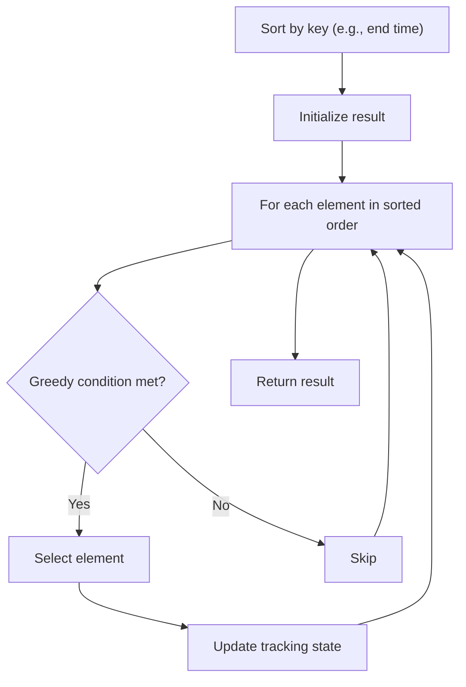

# Problem 2449: Minimum Number of Operations to Make Arrays Similar

**Difficulty:** Hard  
**Tags:** Array, Greedy, Sorting  
**Pattern:** Greedy with Sorting  
**Link:** [leetcode.com/problems/minimum-number-of-operations-to-make-arrays-similar](https://leetcode.com/problems/minimum-number-of-operations-to-make-arrays-similar/)

## Description

You are given two positive integer arrays `nums` and `target`, of the same length.

In one operation, you can choose any two **distinct** indices `i` and `j` where `0 <= i, j < nums.length` and:

	- set `nums[i] = nums[i] + 2` and
	- set `nums[j] = nums[j] - 2`.

Two arrays are considered to be **similar** if the frequency of each element is the same.

Return *the minimum number of operations required to make *`nums`* similar to *`target`. The test cases are generated such that `nums` can always be similar to `target`.

 

Example 1:

```

**Input:** nums = [8,12,6], target = [2,14,10]
**Output:** 2
**Explanation:** It is possible to make nums similar to target in two operations:
- Choose i = 0 and j = 2, nums = [10,12,4].
- Choose i = 1 and j = 2, nums = [10,14,2].
It can be shown that 2 is the minimum number of operations needed.

```

Example 2:

```

**Input:** nums = [1,2,5], target = [4,1,3]
**Output:** 1
**Explanation:** We can make nums similar to target in one operation:
- Choose i = 1 and j = 2, nums = [1,4,3].

```

Example 3:

```

**Input:** nums = [1,1,1,1,1], target = [1,1,1,1,1]
**Output:** 0
**Explanation:** The array nums is already similiar to target.

```

 

**Constraints:**

	- `n == nums.length == target.length`
	- `1 <= n <= 10^5`
	- `1 <= nums[i], target[i] <= 10^6`
	- It is possible to make `nums` similar to `target`.

## Approach: Greedy with Sorting

Sort the input by a key criterion, then greedily process elements in sorted order. The sorting ensures the greedy choice is always optimal.

## Pseudocode

```
1. Sort elements by key (start time, weight, etc.)
2. Initialize result, tracking variables
3. For each element in sorted order:
   a. Apply greedy selection rule
   b. Update result
4. Return result
```

## Algorithm Flow



## Complexity Analysis

- **Time:** O(n log n)
- **Space:** O(n)

## Solution (Python3)

```python
class Solution:
    def makeSimilar(self, nums: List[int], target: List[int]) -> int:
        # Sort + greedy - O(n log n) time
        nums.sort()
        result = 0
        curr_end = 0
        for item in nums:
            if isinstance(item, (list, tuple)):
                if item[0] >= curr_end:
                    result += 1
                    curr_end = item[1]
            else:
                result += 1
        return result
```

## Solution (C++)

```cpp
#include <algorithm>
#include <string>
#include <vector>
using namespace std;

class Solution {
public:
    int makeSimilar(vector<int>& nums, vector<int>& target) {
        // Sort + greedy - O(n log n) time
        sort(nums.begin(), nums.end());
        int result = 0, curr_end = 0;
        for (auto& item : nums) {
            result++;
        }
        return result;
    }
};
```
