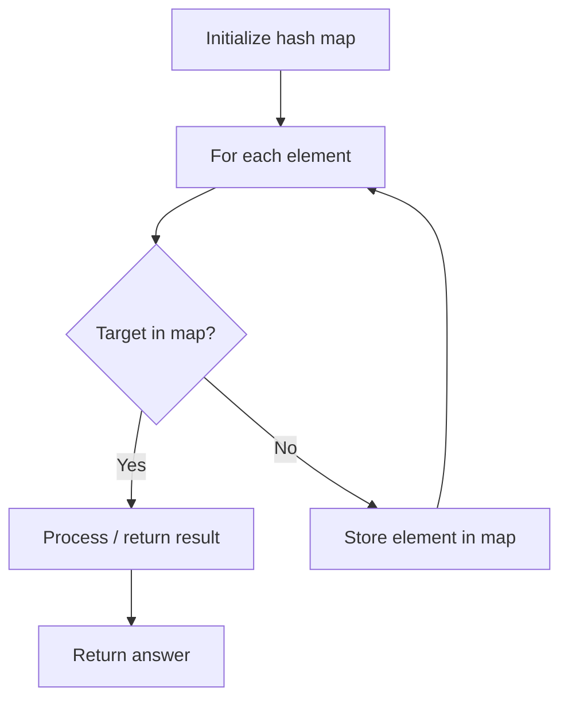

# Problem 2451: Odd String Difference

**Difficulty:** Easy  
**Tags:** Array, Hash Table, String  
**Pattern:** Hash Map Lookup  
**Link:** [leetcode.com/problems/odd-string-difference](https://leetcode.com/problems/odd-string-difference/)

## Description

You are given an array of equal-length strings `words`. Assume that the length of each string is `n`.

Each string `words[i]` can be converted into a **difference integer array** `difference[i]` of length `n - 1` where `difference[i][j] = words[i][j+1] - words[i][j]` where `0 <= j <= n - 2`. Note that the difference between two letters is the difference between their **positions** in the alphabet i.e. the position of `'a'` is `0`, `'b'` is `1`, and `'z'` is `25`.

	- For example, for the string `"acb"`, the difference integer array is `[2 - 0, 1 - 2] = [2, -1]`.

All the strings in words have the same difference integer array, **except one**. You should find that string.

Return* the string in *`words`* that has different **difference integer array**.*

 

Example 1:

```

**Input:** words = ["adc","wzy","abc"]
**Output:** "abc"
**Explanation:** 
- The difference integer array of "adc" is [3 - 0, 2 - 3] = [3, -1].
- The difference integer array of "wzy" is [25 - 22, 24 - 25]= [3, -1].
- The difference integer array of "abc" is [1 - 0, 2 - 1] = [1, 1]. 
The odd array out is [1, 1], so we return the corresponding string, "abc".

```

Example 2:

```

**Input:** words = ["aaa","bob","ccc","ddd"]
**Output:** "bob"
**Explanation:** All the integer arrays are [0, 0] except for "bob", which corresponds to [13, -13].

```

 

**Constraints:**

	- `3 <= words.length <= 100`
	- `n == words[i].length`
	- `2 <= n <= 20`
	- `words[i]` consists of lowercase English letters.

## Approach: Hash Map Lookup

Use a hash map (dictionary) to store elements for O(1) lookup. Iterate through the input, checking membership or counting frequencies in the map.

## Pseudocode

```
1. Initialize hash map
2. Iterate through elements:
   a. Check if target/complement exists in map
   b. If found: process result
   c. Otherwise: store element in map
3. Return result
```

## Algorithm Flow



## Complexity Analysis

- **Time:** O(n)
- **Space:** O(n)

## Solution (Python3)

```python
class Solution:
    def oddString(self, words: List[str]) -> str:
        # Hash map approach - O(n) time, O(n) space
        seen = {}
        for i, val in enumerate(words):
            complement = words - val
            if complement in seen:
                return [seen[complement], i]
            seen[val] = i
        return ""
```

## Solution (C++)

```cpp
#include <string>
#include <unordered_map>
#include <vector>
using namespace std;

class Solution {
public:
    string oddString(vector<string>& words) {
        // Hash map approach - O(n) time, O(n) space
        unordered_map<int, int> seen;
        for (int i = 0; i < words.size(); i++) {
            int complement = words - words[i];
            if (seen.count(complement)) {
                return {seen[complement], i};
            }
            seen[words[i]] = i;
        }
        return "";
    }
};
```
