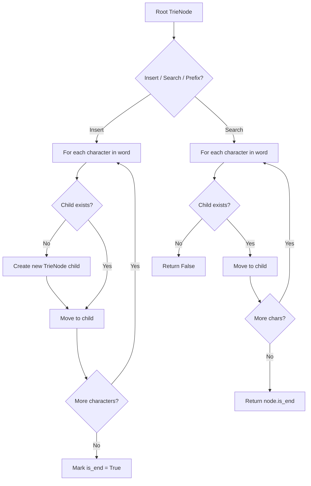
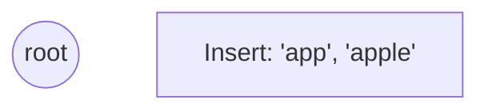
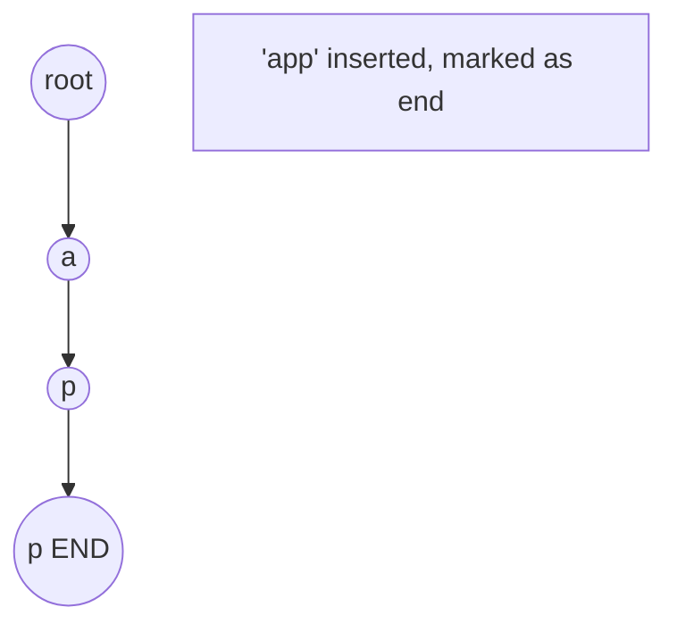
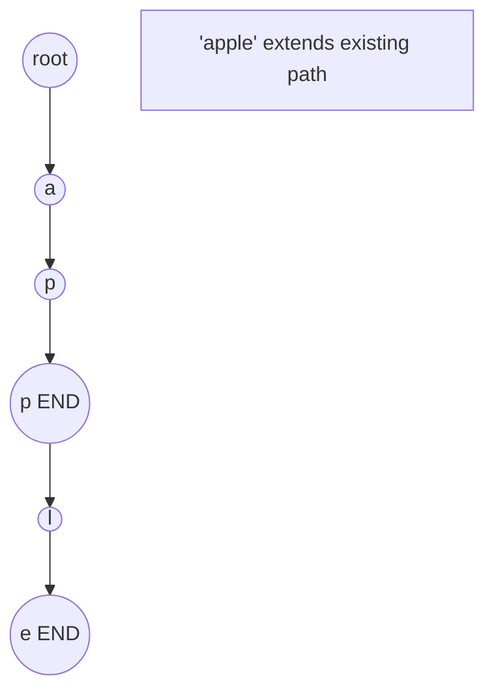
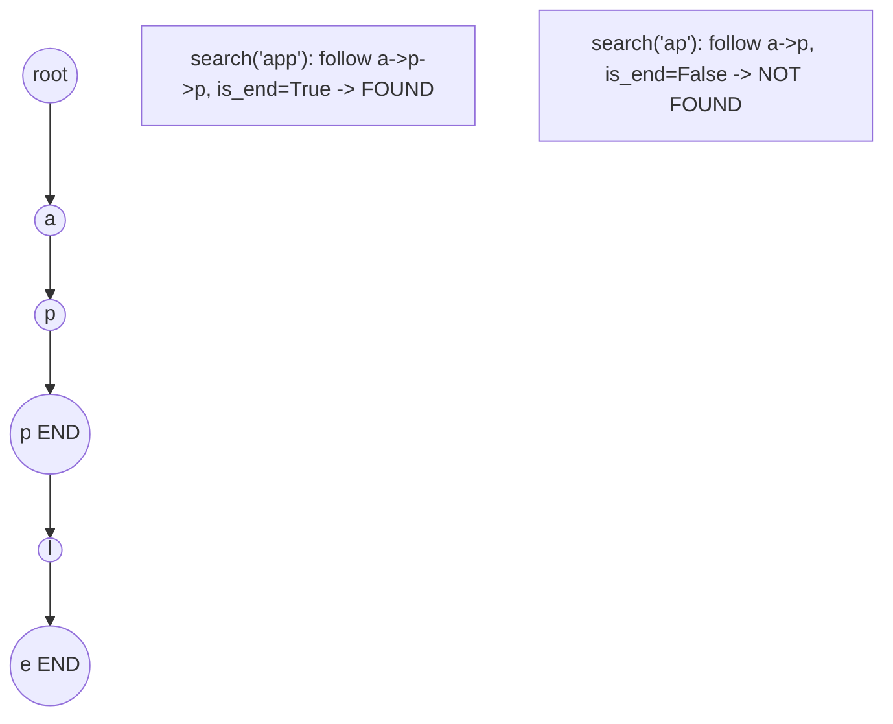

# Problem 2452: Words Within Two Edits of Dictionary

**Difficulty:** Medium  
**Tags:** Array, String, Trie  
**Pattern:** Trie / Prefix Tree  
**Link:** [leetcode.com/problems/words-within-two-edits-of-dictionary](https://leetcode.com/problems/words-within-two-edits-of-dictionary/)

## Description

You are given two string arrays, `queries` and `dictionary`. All words in each array comprise of lowercase English letters and have the same length.

In one **edit** you can take a word from `queries`, and change any letter in it to any other letter. Find all words from `queries` that, after a **maximum** of two edits, equal some word from `dictionary`.

Return* a list of all words from *`queries`*, **that match with some word from *`dictionary`* after a maximum of **two edits***. Return the words in the **same order** they appear in `queries`.

 

Example 1:

```

**Input:** queries = ["word","note","ants","wood"], dictionary = ["wood","joke","moat"]
**Output:** ["word","note","wood"]
**Explanation:**
- Changing the 'r' in "word" to 'o' allows it to equal the dictionary word "wood".
- Changing the 'n' to 'j' and the 't' to 'k' in "note" changes it to "joke".
- It would take more than 2 edits for "ants" to equal a dictionary word.
- "wood" can remain unchanged (0 edits) and match the corresponding dictionary word.
Thus, we return ["word","note","wood"].

```

Example 2:

```

**Input:** queries = ["yes"], dictionary = ["not"]
**Output:** []
**Explanation:**
Applying any two edits to "yes" cannot make it equal to "not". Thus, we return an empty array.

```

 

**Constraints:**

	- `1 <= queries.length, dictionary.length <= 100`
	- `n == queries[i].length == dictionary[j].length`
	- `1 <= n <= 100`
	- All `queries[i]` and `dictionary[j]` are composed of lowercase English letters.

## Approach: Trie / Prefix Tree

Build a trie (prefix tree) where each node represents a character. Insert words character by character, and search by following child pointers. Supports efficient prefix matching.

## Pseudocode

```
1. TrieNode: children = {}, is_end = False
2. Insert(word):
   - For each char: create child if absent, move to child
   - Mark last node as end
3. Search(word):
   - For each char: if child absent return False, move to child
   - Return node.is_end
4. StartsWith(prefix): same as search but return True at end
```

## Algorithm Flow



## Visual State Transitions

**Trie Insert and Search:**

**Frame 1: Empty trie**


**Frame 2: Insert 'app'**


**Frame 3: Insert 'apple'**


**Frame 4: Search 'app' = True, 'ap' = False**



## Complexity Analysis

- **Time:** O(L) per operation
- **Space:** O(N * L)

## Solution (Python3)

```python
class Solution:
    def twoEditWords(self, queries: List[str], dictionary: List[str]) -> List[str]:
        # Trie-based approach
        trie = {}
        # Build trie from word list
        words = queries if isinstance(queries, list) else [queries]
        for word in words:
            node = trie
            for ch in word:
                if ch not in node:
                    node[ch] = {}
                node = node[ch]
            node['#'] = True
        
        # Search in trie
        def search(word):
            node = trie
            for ch in word:
                if ch not in node:
                    return False
                node = node[ch]
            return '#' in node
        
        return []
```

## Solution (C++)

```cpp
#include <string>
#include <vector>
using namespace std;

class Solution {
public:
    vector<string> twoEditWords(vector<string>& queries, vector<string>& dictionary) {
        // Trie-based approach
        struct TrieNode {
            TrieNode* children[26] = {};
            bool isEnd = false;
        };
        TrieNode* root = new TrieNode();
        // Build trie
        for (auto& word : queries) {
            TrieNode* node = root;
            for (char ch : word) {
                int idx = ch - 'a';
                if (!node->children[idx])
                    node->children[idx] = new TrieNode();
                node = node->children[idx];
            }
            node->isEnd = true;
        }
        return {};
    }
};
```
